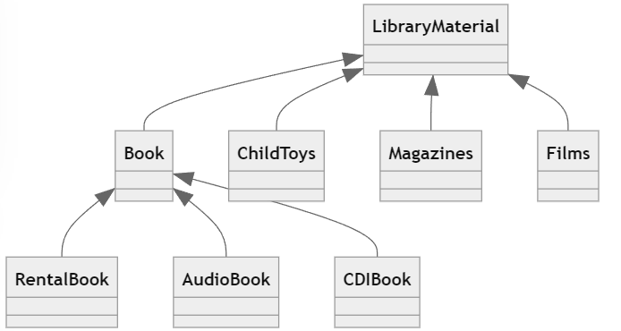
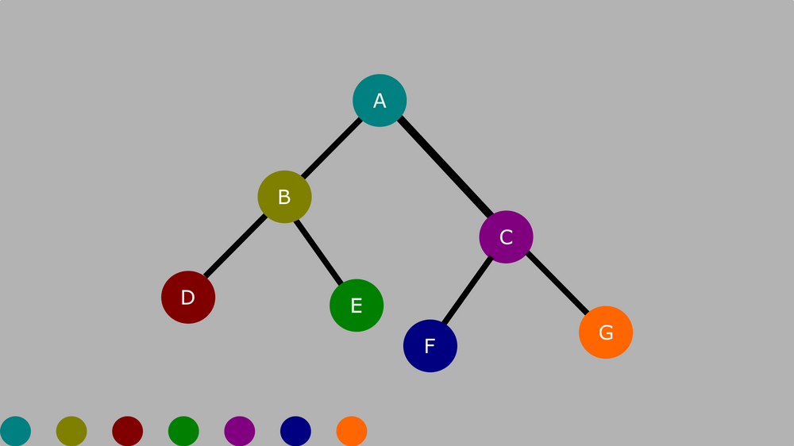
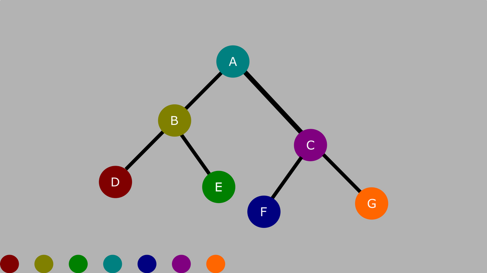
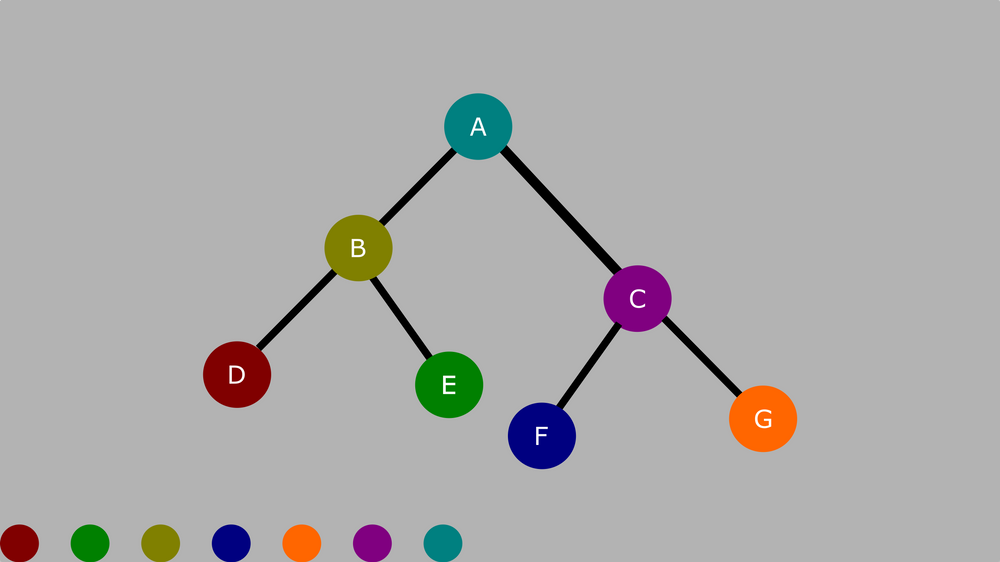

# Chapter 1. Basic C++ Programming

**📌Composition of a C++ Class**

- A *header* file that provides a declaration of the operation supported by the class
- A *program text file* that contains the implementation of those operations


**📌<u>Common Initialization Syntax</u> VS <u>Constructor Syntax</u>**

- common:

```c++
int number = 0;
```

- constructor syntax:

```c++
int number(10);
```


**📌Constructor Syntax**

The reason behind this syntax refers to multiple parameter initialization.(very common in Class) 

But the primitive type can also be initialized like so.


**📌Initialize an array**

1️⃣:

```c++
int seq_size = 6;
int elem_seq[seq_size] = {
    1, 2, 3,
    4, 5, 6
};
```

2️⃣:

```c++
int elem_seq[] = {
  1, 2, 3,
  4, 5, 6
};
```


**📌Initialize a vector**

1️⃣:

```c++
int seq_size = 3;
vector<int> elem_seq(seq_size);
elem_seq[0] = 1;
elem_seq[1] = 2;
elem_seq[2] = 3;
```

2️⃣:

```c++
int seq_size = 3;
int elem_val[seq_size] = {1, 2, 3};
vector<int> elem_seq(elem_val, elem_val + seq_size);
```

`elem_val` is actually the address passed in the vector. The `+ seq_size` indicates how long the array should be.

3️⃣:

```c++
vector<int> elem_seq{1, 2, 3};
```

The preceding is very much similar to C# `List<>` initialization.


**📌Why pointer?**

A *pointer* introduces a level of indirection to a program. Rather than <u>manipulate an object directly</u>😑, we <u>**manipulate a pointer that holds the address of an object**</u>😍.


📌**How to use a pointer?**

```c++
int ival = 1024;
int* pi;             // pi is a pointer to an object of type int
&ival;               // evaluates to the address of ival by using `&`
pi = &ival;          // pass the address of ival to pi
```


**📌Different Style of Pointer**

```c++
int* pi = &ival;
int *pi = &ival;
```

The preceding are both correct. If you prefer the first one, please take into account the following:

```c++
int* pi, pi2;
```

`pi` is a pointer, `pi2` is just an integer. If you want both of them are pointer, you should:

```c++
int* pi, * pi2;
```


📌**Dereference a pointer**

You can take the value of the pointer points to by using `*`.

```c++
if (*pi != 1024)
{
    *pi = 1024;
}
```


**📌Be patient when you are learning pointer**

The initial **complexity** of using a pointer comes from its <u>***confusing syntax***</u>.🤣


**📌Caution using pointer!**⚠

A pointer can possibly points to no object!

```c++
// initialize a pointer to address no object
int *pi = 0;
```

Therefore, to guard against dereferencing a null pointer, we must assure if its address value is zero before using...

```c++
// safe check
if (pi && *pi!=1024)
{
    *pi = 1024;
}
```

The `if (pi && ...)` assure the pointer `pi` is not empty.


**📌Complex Example of Pointers**

We have 6 vector sequence objects:

```c++
vector<int> fibonacci, lucas, pell, triangular, square, pentagonal;
```

Suppose we have a pointer points to `fibonacci`:

```c++
vector<int> *fib_ptr = &fibonacci;
```

Or more than that, an array of pointers whose type is `vector<int>*`...

```c++
vector<int>* ptrs[6] = {
    &fibonacci, &lucas, &pell, &triangular, &square, &pentagonal
};
```


**📌Function using `->()` and `.()`**

In C#, a function can be called like this:

```c#
number.ToString();
```

But in C++, you may see 2 ways of invoking a function:

```c++
xxx.DoSomething();
xxx->DoSomething();
```

The difference is that:

When `xxx` is an **object** of a class, it uses `xxx.Function();`

When `xxx` is a **pointer** to an object, it uses `xxx->Function();`


# Chapter 2. Procedural Programming

**📌Definition of Function**

It is composed of:

1️⃣ the **return type** of a function.

2️⃣ the **name** of the function.

3️⃣ the **parameter list** of the function.

4️⃣ the **body** of the function.

```c++
// a function calculate a fibonacci number
int fibon_elem(int pos)
{
    int elem = 1;
    int n_2 = 1, n_1 = 1;
    for(int ix = 3; ix <= pos; ++ix)
    {
        elem = n_2 + n_1;
        n_2 = n_1; n_1 = elem;
    }
    return elem;
}
```


## 2.3. Providing Default Parameter Values

**📌No Duplicate Default Parameter in Function Definition**

We are all familiar with default parameter values in either C# or C++. But in C++, there is something interesting:

```c++
/********LIFO_Stack.h********/
class LIFO_Stack : public Stack
{
private:
        // ...
public:
        virtual ostream& print(ostream &os = cout) const;
        // ...
};


/********LIFO_Stack.cpp********/

// ❌following is WRONG, no need to specify the default value again in .cpp
ostream& LIFO_Stack::print(ostream &os = cout) const
{
        // ...
}

// ✅following is CORRECT
ostream& LIFO_Stack::print(ostream &os) const
{
        // ...
}
```


**📌The `&` in front of a parameter in a function**

The `&` in front of a variable is to take its address.

```c++
int num = 10;
int* ptr = &num;
```

The `&` in front of a parameter is to indicate that modifying the original:

```c++
// pass by reference
void IncrementA(int &num)
{
    num++;
}
// pass by value
void IncrementB(int num)
{
    num++;
}
```

Apparently, the `IncrementA` does increment the number, because it modifies the origin by using `&`.


**📌⚠Warning on `&` Pass By Reference of a parameter in a function**

The `&` in the declaration only declares THE parameter.

```c++
// ❌ Although the values is passed by reference.
// The `values` does not change since it takes out the
// elem as value, and increment the elem
void func1(vector<int> &values)
{
        for(int elem : values)
        {
                elem++;
        }
}

// ✅ It does change! Since it is sliced with `int &elem`
// to indicate we slice the reference out of `values`
void func2(vector<int> &values)
{
        for(int &elem : values)
        {
                elem++;
        }
}

// ✅ It does change! Since `values` is passed by reference,
// and we are modifying the `values` itself
void func3(vector<int> &values)
{
        for(int i = 0; i < values.size(); i++)
        {
                values[i]++;
        }
}
```


📌**`&` in C++ and `ref` in C#**

`&` in a function declaration is very much the same as `ref` in a function declaration.

```c#
// pass by reference
static void IncrementA(ref int num)
{
    num++;
}
// pass by value
static void IncrementB(int num)
{
    num++;
}
```

Apparently, `IncrementA` does increment.


**📌Things behind invoking a function**

When we invoke a function, a special area of memory is set up on ***stack***. Within this special area of memory there is a space to hold the value of each function parameter and variables inside the scope(local variables). 

```c++
void SomeFunction(int param)
{
    ======================
    ||                  ||
    ||                  ||
    ||      STACK       ||
    ||                  ||
    ||                  ||
    ======================
}
```

When the function completes, this area of memory is discarded.(***popped*** from the program stack)

By default, an object is passed to a function, its value is copied to the local definition. That is called ***pass by value***.

```c++
// pass by value
void SomeFunction(int num);
```

If we want to modify the original value, it is called ***pass by reference***.

```c++
// pass by reference
void SomeFunction(int &num);
```

 

**📌Can't return pointer/reference inside the stack**

Due to the preceding mechanism, returning the address of one of these *local* objects results in serious run-time program errors❌.

```c++
// This is WRONG!!!
int* GetAnInteger()
{
	int num = 10;
	return &num;
}

int main()
{
	int* ptr;
	ptr = GetAnInteger();	
	return 0;
}
```

However, if you do want to return something inside the stack. You have to declare it as `static`. This is very special in C++(compared to C#).

```c++
// This is OK...
int* GetAnInteger()
{
	static int num = 10;
	return &num;
}

int main()
{
	int* ptr;
	ptr = GetAnInteger();	
	cout << *ptr << endl;
	return 0;
}
```


**📌MAIN DIFFERENCE in pass by reference between C++ and C#!!**⭐⚠

In C#:

```c#
void SortA(List<int> numbers)
{
    //...
}

void SortB(ref List<int> numbers)
{
    //...
}

// the invoking are different
SortA(number_list);
SortB(ref number_list);
```

The preceding 2 declarations are the **same**. Because in C#, `List<T>` is passed by reference by **default**.


In C++:

```c++
void IncrementA(vector<int> numbers)
{
	//...
}

void IncrementB(vector<int> &numbers)
{
	//...
}

// the invoking are the same
IncrementA(numbers_vector);
IncrementB(numbers_vector);
```

The preceding 2 declarations are **different**. Because in C++, everything is passed by value by **default**. You have to explicitly assure whether is passed by reference or passed by value.


**📌Pass by Reference  Semantics**

The `&` mark has 3️⃣ meaning and usage:

1️⃣: retrieve the address of a variable

```c++
int ival = 10;
int *pi = &ival;
```

2️⃣: indicate a function is pass by reference

```c++
void IncrementB(vector<int> &numbers);
```

3️⃣: Set up a reference between objects.

```c++
int ival = 1024;
int &rval = ival;
rval = 10;        // then ival is now 10 as well.
                  // the mechanism behind is that ival and rval are with same address.
```


**📌Benefit Using Pass by Reference**🌟

The following 3 functions do the same thing which merely `cout` the value. But he **difference** is that the former one is much **FASTER**.

```c++
void DisplayA(const vector<int> &numbers)  //FAST!!
{
	for(int i = 0; i<numbers.size(); i++)
	{
		cout << numbers[i] << endl;
	}
}

void DisplayB(const vector<int> numbers)
{
	for(int i = 0; i<numbers.size(); i++)
	{
		cout << numbers[i] << endl;
	}
}

void DisplayC(const vector<int>* numbers)  //FAST!!
{
	if (!numbers)
	{
		cout << "The pointer is null"  << endl;
		return;
	}
	for(int i = 0; i<numbers->size(); i++)
	{
		cout << (*numbers)[i] << endl;
	}
}
```

The `const` keyword indicates that the function **will not modify the input**.🌟


**📌Difference between reference parameter and pointer parameter**

Before we dereference a pointer, we **MUST** always <u>make sure</u> the pointer is <u>not set to 0</u>. 

A reference always refers to some objects and therefore the <u>check for 0</u> is **unnecessary**.


**📌👍Lippman's advice on passing by reference**

> ​	"I recommend *not* passing built-in types by reference. The reference mechanism is primarily intended to support the passing of class objects as parameters to functions."


**📌What is Storage Duration(extent)?**

It refers to the period of time for which memory is allocated for an object is called its <u>*storage duration*</u> or *<u>extent</u>*.


**📌Categories of Extent**

There are **3** extents:

1️⃣Local extent

- easy to understand, e.g. the local variable

- managed <u>automatically</u>

2️⃣File extent(static extent)

- the variables in file scope, which are outside of `main()` function. Its memory is allocated before the beginning of `main()` and remains allocated until the program is terminated.

- managed <u>automatically</u>

3️⃣Dynamic extent

- The memory comes from the ***heap***.
- managed by programmer <u>explicitly</u> with `new` and `delete`.


**📌Example of Dynamic Memory Allocation**

The syntax is:

```
new Type(initial value);
```

Declare, but not initialized:

```c++
int *pi;
pi = new int;
```

Declare, also initialized:

```c++
int *pi;
pi = new int(1024);
```

Allocate an array of heap elements:

```c++
int *pia = new int[24];
```

Delete an object:

```c++
delete pi;
```

Delete an array:

```c++
delete [] pia;
```


**📌Dangerous! Memory Leak⚠**

If you don't remember to `delete` something, in the end it will cause ***memory leak***.


**📌Lippman' advice on designing a function**👍

> ​	"It is better to communicate between functions using parameters rather than use objects defined at file scope. Since function dependent on file scope is harder to reuse in a different context."

```c++
void SomeFunction()
{
    // here use some value in file scope
    // therefore it is hard to check
}
```


**📌`inline` Functions**

- What is it?

An `inline` function represents a request to the compiler to expand the function at each call point. With an `inline` function, the compiler replaces the function call with a copy of the code to be executed.


- Why use it?

To reduce the function call overhead[^1].


- When to use it?

`inline` function only suits to **small** function. 


- What is its analogy?

The analogy of C++ `inline` function in C# are `Action<>` and `Func<>`.


**📌Template Functions**

```c++
template <typename T>
void ReverseVector(vector<T> &vec)
{
	stack<T> sta;

	for (size_t i = 0; i < vec.size(); i++)
	{
		sta.push(vec[i]);
	}
	for (size_t i = 0; i < vec.size(); i++)
	{
		vec[i] = sta.top();
		sta.pop();
	}
}
```


**📌Pointers to Functions**

God damn it. This is really really hard...

//TODO well explained next time...


**📌Header Files**

- use ".h" as suffix by convention
- ok to multiple declarations
- only one definition of a function in a program
- usually no definition in header files
- `inline` functions definition and `template` class definition should be in header files


**📌What is `extern`?**

Suppose we have something in the header file:

```c++
const int seq_cnt = 6;
const vector<int>* (*seq_array[seq_cnt])(int);
```

It is not right... Since the `seq_cnt` as 6 will be passed in the function declaration. While the declaration is merely declaration. Therefore we could use:

```c++
const int seq_cnt = 6;
extern const vector<int>* (*seq_array[seq_cnt])(int);
```

The `extern` means the following is just declaration, please ignore the parameter name. It does not have any relationships with others.


**📌Different `include`**

You might see:

```c++
#include <iostream>
#include "igl_mesh"
```

The short answer is:

Use `" "`, if the header file is in the same directory as the program text file including it.

Use `< >`, if the header file is anywhere else.


# Chapter 3. Generic Programming

In this chapter, the word "generic" refers to be independent of both the type of element they are operating on and the type of container within which the elements are held.

## 3.1. The Arithmetic of Pointers

**📌Find specific value in a vector**

```c++
int* find(const vector<int> &vec, int value)
{
    for (int ix = 0; ix < vec.size(); ++ix)
    {
        if(vec[ix]==value)
        {
            return &vec[ix];
        }
    }
    return 0;
}
```


**📌(Generic Version)Find specific value in a vector**

```c++
template <typename T>
T* find(const vector<T> &vec, const T &value)
{
    for (int ix = 0; ix < vec.size(); ++ix)
    {
        if(vec[ix] == value)
        {
            return &vec[ix];
        }
    }
    return 0;
}
```


**📌The magic and fun fact of pointer**

Do you know in C++, an array is also a pointer? This is so much fun. The followings are the same!

```c++
array[2]
*(array + 2)
```

If you are a C# programmer, you would say what the heck?? 😨😨

That's because an <u>array is a pointer which records the 1st address of that array</u>. Therefore, they are the same.


**📌Find specific value in an array(Normal Version)**

```c++
template <typename T>
T* find(const T *array, int size, const T &value)
{
    // the difference between vector and array is that
    // array(pointer) could not be empty
    // therefore you should check it first
    if(!array || size < 1)
    {
        return 0;
    }
    for (int ix = 0; ix < size; ix++)
    {
        if(array[ix]==value)
        {
            return &array[ix];
        }
    }
    return 0;
}
```


**📌Find specific value in an array(Pointer Version)**

```c++
template <typename T>
T* find(const T *array, int size, const T &value)
{
    if(!array || size < 1)
    {
        return 0;
    }
    // Please take a look here!! The pointer arithmetic!
    // rather shifting the index, here increment the address
    for(int ix = 0; ix < size; ix++, array++)
    {
        // dereference the pointer, so can be compared with value
        if(*array == value)
        {
            return array;
        }
    }
    return 0;
}
```

//TODO , here 🤔, in Qt, the function declaration should remove `const` from `const T *array`. Is it because the new standard of C++?


**📌Find specific value in an array(Pointer Version with sentinel)**

In this version, we use the address of last element of the array as sentinel[^2] address.

```c++
template <typename T>
T* find( T *first, const T *last, const T &value)
{
    if(!first || !last)
    {
        return 0;
    }
    // here the last address served as sentinel address
    for(; first!=last; first++)
    {
        if(*first == value)
        {
            return first;
        }
    }
    return 0;
}
```

You can use it as the following:

```c++
int main()
{
    int arr_int[5] = {1,2,3,4,5};
    int* ptr = find(arr_int,arr_int+5, 3);
    cout << "Integer value: " << endl;
    cout << "ptr: " << ptr 
         << "*ptr: "<< *ptr<< endl;
    
    double arr_double[] = {1.1,2.3,1.6};
    double* ptr_double = find(arr_double, arr_double+3, 1.1);
    cout << "ptr_double: " << ptr_double 
         << "*ptr_double: "<< *ptr_double<< endl;
    
    return 0;
}
```


**📌Behind the `vec.begin()`**

Since a `vector` could be empty, therefore, it may cause error if we directly query like `vec[0]`. A safer way would be like this:

```c++
template <typename T>
inline T* begin(vector<T> &vec)
{
    // check if it is empty
    return vec.empty()? 0 : &vec[0];
}
```


## 3.2. Iterators

The iterators here are very similar to the `IEnumerable` in C#. In short, iterator is a set of classes that are programmed using the same syntax as that of a pointer to collection in STL. For example, the `++` for vector is to query the next element, so as `++` for linked list. But the next address of a linked list cannot be just incremented. Therefore, we can override their operator.

```
// a pseudo code could be like this
for(iter = numbers.begin(); iter!=numbers.end(); iter++)
{

}
```


**📌What is an iterator?**

`iter` is defined to be an iterator for vectors of `T` elements. It is initialized to address the first element of a `vector`.

```c++
vector<int> ivec;
// normal iterator
vector<int>::iterator iter = ivec.begin();
// const iterator(you can loop them but not modify them)
vector<int>::const_iterator cst_iter = ivec.begin();
```

The double colon `::` indicates that iterator is a type nested within the `T` vector definition.


**📌Example Function using iterator**

//TODO currently this is compiled with error

The display function can be implemented like so:

`T` could be saw as the element type of that container.

```c++
template <typename T>
void display(const vector<T> &vec, ostream &os)
{
    vector<T>::const_iterator iter = vec.begin();
    vector<T>::const_iterator end_it = vec.end();

    for(; iter!=end_it; iter++)
    {
        os << *iter << ' ';
    }
    os << endl;
}
```


//TODO why in the end return `last` but not `0`?

The find function can be implemented like so:

`T` could be saw as the iterator type, while `S` could be saw as the element type.

```c++
template <typename T, typename S>
S find(T first, T last, const S &value)
{
    for(; first!=last; first++)
    {
        if(*first==value)
        {
            return first;
        }
    }
    return last;
}
```


You can use **1** 

```c++
// arrange data
const int asize = 8;

// array, vector, and linked list
int ia[asize] {1,1,2,3,5,8,13,21};
vector<int> i_vec (ia, ia+asize);
list<int> i_list(ia, ia+asize);

// find in array
int* pia = find(ia, ia+asize, 1024);
if(pia != ia+asize)
{
    cout << "1024 found in ia..." << endl;
}

// find in vector
vector<int>::iterator it;
it = find(i_vec.begin(), ivec.end(), 1024);
if(it != ivec.end())
{
    cout << "1024 found in ivec..." << endl;
}

// find in linked list
list<int>::iterator it_list;
it_list = find(i_list.begin(), i_list.end(), 1024);
if(it_list!=i_list.end())
{
    cout << "1024 found in ilist..." << endl;
}
```


**📌Frequently Used Method**

- **search algorithms**: `find()`, `count()`, `adjacent_find()`, `find_if()`, `count_if()`, `binary_search()`, and `find_first_of()`
- **sorting and general ordering algorithms**: `merge()`, `partial_sort()`, `partition()`, `random_shuffle()`, `reverse()`, `rotate()`, and `sort()`
- **copy, deletion, and substitution and algorithms**: `copy()`, `remove()`, `remove_if()`, `replace()`, `replace_if()`, `swap()`, and `unique()`
- **relational algorithms:** `equal()`, `includes()`, and `mismatch()`
- **generation and mutation algorithms:** `fill()`, `for_each()`, `generate()`, and `transform()`
- **numeric algorithms**: `accumulate()`, `adjacent_difference()`, `partial_sum()`, and `inner_product()`
- **set algorithms**: `set_union()` and `set_difference()`


## 3.3. Operations Common to All Containers

**📌A Function Definition Cover All Common Functions of Containers**

```c++
void compare(vector<int> &vec1, vector<int> &vec2)
{
    // equality
    if(vec1 == vec2) return;

    // isEmpty?
    if(vec1.empty() || vec2.empty()) return;

    // the size
    if(vec1.size() != vec2.size()) return;

    // clear all the data
    vec1.clear();

    // begin and end
    for(auto iter = vec1.begin(); iter!= vec2.end(); iter++)
    {
        cout << "+";
    }

    // insert and erase
    vec1.insert(vec1.begin()+1, 2);
    vec2.erase(vec2.end()-3);
}
```


## 3.4. Using the Sequential Containers

**📌Initialization of Container**

The following are the common ways of initialized the containers.

```c++
// 1.Create an empty container
list<string> slist;
deque<int> ideque;

// 2.Create a container of some size
list<int> ilist(1024);
vector<double> dvec(32);

// 3.Create a container of a given size specified with initial value
vector<char> chvec(10, 'X');
list<string> slist1(16, "unassigned");
deque<double> dd(10, 3.2);

// 4.Create a container with iterator
bool barr[3] = {true, false, true};
vector<bool> bvec(barr, barr+3);

// 5.Create a container by full copy another
list<string> slist2(slist);
```


**📌Operations supported per container**

|                                               | `vector` | `list` | `deque` |
| --------------------------------------------- | -------- | ------ | ------- |
| `front()`                                     | ✔        | ✔      | ✔       |
| `push_front()`➕                               | ❌        | ✔      | ✔       |
| `pop_front()`➖                                | ❌        | ✔      | ✔       |
| `[0]`<br>`[1]`<br>`...`<br>`[n-2]`<br>`[n-1]` |          |        |         |
| `pop_back()`➖                                 | ✔        | ✔      | ✔       |
| `push_back()`➕                                | ✔        | ✔      | ✔       |
| `back()`                                      | ✔        | ✔      | ✔       |


**📌Different Ways Using `insert()`**

1️⃣the `insert()` is like: `iterator insert(iterator position, elemType value)`

```c++
// arrange
int ival = 6;
int ia[3] = {1, 2, 9};  // make a linked list with contiguous order
list<int> ilist(ia, ia+3);
list<int>::iterator it = ilist.begin();

// loop over the linked list
while(it != ilist.end())
{
    // if a specific value is > such value
    if(*it >= ival)
    {
        // insert
        ilist.insert(it, ival);
        break;
    }
    it++;
}
// if iterator is at the end(a.k.a. no value in the linked list > such value)
// the value should be at the end of linked list
if(it == ilist.end())
{
    ilist.push_back(ival);
}
// display it
for(int ix:ilist )
{
    cout << ix;
}
```


2️⃣`void insert(iterator position, int count, elemType value)` inserts <u>"count" elements</u> of `value` before `position`.

The following

```c++
// arrage
list<string> slist(3, string("Hello"));
list<string>::iterator it = slist.begin();

// iterator as the 2nd position
it++;

// insert after that position
slist.insert(it, 5, string("dummy"));

// display
for(auto val : slist)
{
    cout << val << "  ";
}
```


There are many other overloaded version. Please refer to docs.


**📌`erase` in STL**

```c++
// arrage
list<string> slist(6, string("Hello"));
list<string>::iterator it = slist.begin();
// iterator as the 2nd position
it++;
list<string>::iterator first = slist.begin();
list<string>::iterator last = slist.end();
last--;

// before erase
for(auto v : slist)
{
    cout << v << "  ";
}
cout << endl;

// since I decrement last once
// then erase will be 0 to n-2
slist.erase(first, last);
// after erase
for(auto v : slist)
{
    cout << v << "  ";
}
```


**📌Linked list does not support offset arithmetic**

```c++
list<string> slist(6, string("Hello"));
list<string>::iterator it = slist.begin();

// ERROR
it = it + 2; //failed to offset 2 position
// OK
it++;        //succeed because the ++ has overloaded version
```

Because the addresses of Linked List are not contiguous! Please refer to [my Algorithm Repo](https://github.com/XingxinHE/Algorithms/blob/main/README.md#232-linked-list-sequence).


## 3.5. Using the Generic Algorithm

**📌Prerequisite**

```c++
#include <algorithm>
```


**📌Generic Search Algorithm**

| Function          | Description                                                  | Return                                                       |
| ----------------- | ------------------------------------------------------------ | ------------------------------------------------------------ |
| `find()`          | searches **unordered** collection                            | `true` found, `false` not found                              |
| `binary_search()` | searches **ordered** collection, more efficient than `find()` | `true` found, `false` not found                              |
| `count()`         | count the number of that container                           | `int` represents the number                                  |
| `search()`        | matches a subsequence, e.g. find `{5,7}` in `{1,3,5,7,2,9}`  | the iterator of at the beginning of subsequence if found, the end if not found |


**📌Implement search element in Fibonacci sequence using generic algorithm**

```c++
#include <algorithm>
// function to grow the vector if element is bigger than current array
extern bool grow_vec(vector<int> &vec, int elem);

// query if an element inside the vector
bool is_elem(vector<int> &vec, int elem)
{
    // find the max value first
    int max_value = max_element(vec.begin(), vec.end());
    // if the query element is outside of max
    if(max_value < elem)
    {
        //grow it
        return grow_vec(vec, elem);
    }
    if(max_value == elem)
    {
        return true;
    }

    // search it 
    return binary_search(vec.begin(), vec.end(), elem);
}
```


**📌`binary_seach()` only works for sorted container**

It is left to the programmer to guarantee the preceding requirement! What if we are not sure?

```c++
// unsure vector
vector<int> vec;
// duplicate vector with same size
vector<int> vec_copy(vec.size());
// copy from start to end
copy(vec.begin(), vec.end(), vec_copy.begin());
// sort that copy vector
sort(vec_copy.begin(), vec_copy.end());

// query...
int query_num = 13;
bool is_found = binary_search(
    vec_copy.begin(),
    vec_copy.end(),
    query_num);
```


## 3.6. Design a Generic Algorithm

**📌A filer function**

Suppose we have a function to filter out numbers less than 10:

```c++
vector<int> less_than_10(const vector<int> &vec)
{
    vector<int> nvec;
    for(int ix = 0; ix < vec.size(); ix++)
    {
        if(vec[ix] < 10)
        {
            nvec.push_back(vec[ix]);
        }
    }
    return nvec;
}
```

It is just a very simple `for` loop to filter out the `vector`. But the constraints❌ are:

- cannot specify the value for filtering
- cannot specify $>$ or $<$

Therefore, we could implement something like this:

```c++
//  a function compared is bigger
bool is_bigger(int lhs, int rhs)
{
    return lhs > rhs? true : false;
}
//  a function compared is smaller
bool is_smaller(int lhs, int rhs)
{
    return lhs < rhs? true : false;
}

//  filter with some value
//  the last argument is a pointer to function
vector<int> filter_with_value(vector<int> &vec, int value, bool (*flag)(int, int))
{
    vector<int> nvec;
    for(int ix = 0; ix < vec.size(); ix++)
    {
        if(flag(vec[ix], value))
        {
            nvec.push_back(vec[ix]);
        }
    }
    return nvec;
}

// how to use it
void prog_6()
{
    int arr[5] = {12,13,20,100, 5};
    vector<int> ivec(arr, arr+5);
    vector<int> vec_bigger_10 = filter_with_value(ivec, 13, is_bigger);

    for(auto v : vec_bigger_10)
    {
        cout << v << "  ";
    }
}
```

 

**📌Function Objects**

Definition: A ***function object*** is an instance of a class that provides an overloaded instance of the function call operator.

Analogy: Delegate in C#, Pointer to Function in C++

Example:

Suppose we have a sequence of numbers:
$$
S_1 = \{s_1,s_2,\cdots,s_n\}
$$
Do the element wise addition:
$$
S_1 = \{s_1+s_1,s_2+s_2,\cdots,s_n+s_n\}
$$
Do the element wise multiplication:
$$
S_1 = \{s_1*s_1,s_2*s_2,\cdots,s_n*s_n\}
$$
Then add to another sequence:
$$
S_1 = \{s_1,s_2,\cdots,s_n\}\\
S_2 = \{s^1,s^2,\cdots,s^n\}\\
S_F = \{s^1+s_1,s^2+s_2,\cdots,s^n+s_n\}\\
$$


We can use `transform()` function to do element-wise operation. It takes 5 arguments:

1️⃣  start of elements range to transform

2️⃣  end of elements range to transform

3️⃣  start position fetching data  (iterator points to the beginning of container which fetch data)

4️⃣  start position apply those data  (iterator points to the beginning of the container where apply those transformation)

5️⃣  function object (delegate / pointer to function) to apply those changes

```c++
#include <functional>
void func_obj_example()
{
    int s1[5] = {1, 2, 3, 6, 9};
    int s2[5] = {2, 3, 5, 6, 9};
    vector<int> vec_s1(s1, s1+5);
    vector<int> vec_s2(s2, s2+5);
    vector<int> vec_sf(5);

    transform(vec_s1.begin(),       // 1.
              vec_s1.end(),         // 2.
              vec_s1.begin(),       // 3.
              vec_s1.begin(),       // 4.
              plus<int>());         // 5.

    transform(vec_s1.begin(),       // 1.
              vec_s1.end(),         // 2.
              vec_s1.begin(),       // 3.
              vec_s1.begin(),       // 4.
              multiplies<int>());   // 5.

    transform(vec_s1.begin(),       // 1.
              vec_s1.end(),         // 2.
              vec_s2.begin(),       // 3.
              vec_s1.begin(),       // 4.
              plus<int>());         // 5.
}
```


**📌Function Object Adapter**

In short, the <u>function object adapter</u> **modifies** a <u>function object</u> by specifying lhs/rhs as input. For example, 

`bind1st` binds the 1st operand. `bind2nd` binds the 2nd operand.

```c++
vector<int> filter(const vector<int> &vec, int val, less<int> &lt)
{
    vector<int> nvec;
    vector<int>::const_iterator iter = vec.begin();

    // bind2nd(less<int>, val) binds val to the second value of less<int>
    // less<int> now compares each value against val
    while( (iter =
            find_if(iter,
                    vec.end(),
                    bind2nd(lt, val))
            ) != vec.end())
    {
        // each time iter != vec.end(),
        // iter addresses an element less than val
        nvec.push_back(*iter);
        iter++;
    }
    return nvec;
}
```


**📌More General Version**

The following is a really excellent example. Please digest!

```c++
template <typename InputIterator,
          typename OutputIterator,
          typename ElemType,
          typename Comp>
OutputIterator filter (InputIterator first,
                       InputIterator last,
                       OutputIterator at,
                       const ElemType &val,
                       Comp pred)
{
    while( (first = find_if(first, last, bind2nd(pred, val)))
           != last)
    {
        // just to see what is going on ...
        cout << "found value: " << *first << endl;
        // assign value, then advance both iterators
        *at++ = *first++;
    }
    return at;
}
```

The `*at++ = *first++;` is just the following:

```c++
*at = *first;
at++;
first++;
```


**📌A Subdivision method on `vector`**

The following function is kind of similar to C# (`where x => x< ???`)

```c++
vector<int> sub_vec(vector<int> &vec, int val)
{
    // clone a vector
    vector<int> nvec(vec);
    // sort it first
    sort(nvec.begin(), nvec.end());

    vector<int>::iterator iter;
    // find the pos marked > val
    iter =  find_if(nvec.begin(), nvec.end(), bind2nd(greater<int>(), val));

    // delete the part
    nvec.erase(iter, nvec.end());

    return nvec;
}
```


## 3.7. Using a Map

**📌Regular Operation with `map`**

The analogy of `map` in C++ in C# is `Dict< , >`.

```c++
#include <map>
#include <fstream>

// Declare a map with key:string, value:int
map<string, int> words;

// Add a key-value pair:
words["Torso"] = 1;

ifstream infile("./material/serenity_prayer.txt");
if(infile)
{
    // Suppose we want to analyze the word occurence:
    string tword;
    while(infile >> tword)
    {
        words[tword]++;
    }
}

// check the occurence
map<string, int>::iterator iter = words.begin();
for(; iter!=words.end(); iter++)
{
    cout << "key: " << iter->first
        << "value: " << iter->second << endl;
}
```

Taking into account that the syntax query a `key-value` pair, `first` refers to `key`, `second` refers to `value`.


**📌Appropriate Way Finding a Value**

Suppose you want to find out if a value is in that `map`, you may do something like this:

```c++
// NOT APPROPRIATE

map<string, int> words;

if(words["vermeer"])
{
    cout << "Exist." << endl;
}
else
{
    cout << "Not exist." << endl;
}
```

It can work but it is not appropriate❌. First, `words["vermeer"]` return some value, if it is `0`, then it is `false` as well. Therefore it could work. But the point is if there is no such key before, using statement like this will add the `key-value` pair to the `map`! 


```c++
// APPROPRIATE

map<string, int> words;
string query_word("vermeer");

if(words.count(query_word))
{
    cout << "Found. ";
    cout << "Value: " << words[query_word] << endl;
}
else
{
    cout << "Not found.";
}
```

The preceding method using `map.count()` will return the occurrence but it will not add an empty key.✔


```c++
// APPROPRIATE

map<string, int> words;
map<string, int>::const_iterator iterator;
// Find such word,
// if found=> that iterator
// if not found => the end() iterator
iterator = words.find("vermeer");
if(iterator!=words.end())
{
    cout << "Found.";
    cout << "Value: " << iterator->second << endl;
}
else
{
    cout << "Not found." << endl;
}
```

The preceding method using `map.find()` will return the iterator at such position.✔


## 3.8. Using a Set

You know what set is...

**📌Turn a vector to set**

```c++
// init words vector
string words_array[5] = {"Daniel", "Haley", "Daniel", "Bob", "Maria"};
vector<string> words(words_array, words_array+5);
// turn vector to set
set<string> words_set(words.begin(), words.end());

for(auto w : words)
{
    cout << w << " ";
}
cout << endl;
for(auto w: words_set)
{
    cout << w << " ";
}

// OUTPUT
// Daniel Haley Daniel Bob Maria 
// Bob Daniel Haley Maria
```


**📌Insert value to set**

```c++
// arrange
string words_array[5] = {"Daniel", "Haley", "Daniel", "Bob", "Maria"};
vector<string> words(words_array, words_array+5);
string some_words[3] = {"Roma", "Milano", "Torino"};
// init set
set<string> words_set;

// insert range of array
words_set.insert(some_words, some_words+3);
// insert vector
words_set.insert(words.begin(), words.end());
// insert single element
words_set.insert("Fendi");

for(auto w : words_set)
{
    cout << w << " ";
}

// OUTPUT
// Bob Daniel Fendi Haley Maria Milano Roma Torino
```


**📌Iteration over a set**

```c++
// arrange
string words_array[7] = {"Daniel", "Haley", "Daniel", "Bob", "Maria", "Fendi", "Armani"};
set<string> words_set(words_array, words_array+7);
// loop over a set
set<string>::const_iterator iter = words_set.begin();
for(; iter!=words_set.end(); iter++)
{
    cout << *iter << " ";
}
```


## 3.9. Iterator Inserters

**📌Why should we use iterator inserter?**

In short, for saving memory! Preceding methods are good but they must be required with sufficient size of such container(iterator pos). Therefore, here comes "inserter" which <u>does not require specific size of container</u>.


**📌Common Iterator Inserters**

Parallel to container operation, the inserter works as the following:

| Container Operation | Iterator Operation |
| ------------------- | ------------------ |
| `push_back()`       | `back_inserter()`  |
| `insert()`          | `inserter()`       |
| `push_front()`      | `front_inserter()` |


**📌add a range of elements into vector using inserter** 

I think this is the primary advantage of inserters.

```c++
// ERROR, you can't push back a range❌
vector<int> ivec{1, 2, 3};
vector<int> ivec2{4, 5, 6};
ivec.push_back(ivec2);
```

Instead, you can insert range like this:

```c++
vector<int> ivec{1, 2, 3};
vector<int> ivec2{4, 5, 6};

// OK✔
copy(ivec2.begin(), ivec2.end(), back_inserter(ivec));
for(auto v : ivec)
{
    cout << v << " ";
}
```


## 3.10. iostream Iterators

**📌Fancy Read something and Output something**

We are often required to 

1️⃣read something in, 

2️⃣sort it,

3️⃣output it.

```c++
// OLD SCHOOL

string word;
vector<string> texts;

// 1. read in
while(cin >> word)
{
    texts.push_back(word);
}
// 2. sort it
sort(texts.begin(), texts.end());
// 3. output it
for(int ix = 0; ix < texts.size(); ++ix)
{
    cout << texts[ix] << " ";
}
```

The preceding codes are not quite elegant. Please refer to the following:

```c++
// NEW SCHOOL cout👍

istream_iterator<string> start(cin);
istream_iterator<string> end;

vector<string> texts;

ostream_iterator<string> os(cout, " ");  // the 2nd argument is the seperator

// 1. read in
copy(start, end, back_inserter(texts));
// 2. sort
sort(texts.begin(), texts.end());
// 3. output it
copy(texts.begin(), texts.end(), os);
```

The following is to output to a file

```c++
// NEW SCHOOL ofstream👍
ifstream infile;
ofstream outfile;

infile.open("./moo_cat.txt");
outfile.open("./moo_cat_sorted.txt");

if(!infile || !outfile)
{
    cerr << "Cannot open moo_cat.txt OR moo_cat_sorted.txt" << endl;
    return;
}

istream_iterator<string> start(infile);
istream_iterator<string> end;

vector<string> texts;

ostream_iterator<string> os(outfile, " ");  // the 2nd argument is the seperator

// 1. read in
copy(start, end, back_inserter(texts));
// 2. sort
transform(texts.begin(), texts.end(), texts.begin(), ::tolower);
sort(texts.begin(), texts.end());
// 3. output it
copy(texts.begin(), texts.end(), os);

infile.close();
outfile.close();
```


# Chapter 4. Object-Based Programming

**📌What should a class consist of?**

A class consists of **2** parts:

- `public` set of operations and operators (also called *member functions* which represents the *public interface* of the class)
- `private` implementation


**📌Why Class is important to C++?**

Designing and implementing classes are the primary activities of C++ programmers.


## 4.1. Implement a Class

The following section will include some codes which mimic the behavior of stack(computer).

**📌Class definition in C++**

```c++
/********************************/
/************Stack.h*************/
/********************************/

#include <vector>
#include <string>

using namespace std;

class Stack
{
private:
        vector<string> _stack;
public:
        bool push(const string& );
        bool pop(string &elem);
        bool peek(string &elem);

        bool empty();
        bool full();

        int size() {return _stack.size()};
};

```

Things to noticed:

1️⃣ all functions must be declared inside `public` if you want to use with an instance.  e.g. `bool push/pop/peek/empty/full`

2️⃣ functions declared+defined inside the class definition is **`inline`** function.  e.g. `int size()`


**📌Implement Class Definition**

For those non-inline member functions, they are defined within a program text file. Normally suffix with `.cpp, .c, .cc` 

```c++
#include "Stack.h"

inline bool
Stack::empty()
{
        return _stack.empty();
}

bool
Stack::pop(string &elem)
{
        if(empty())
        {
                return false;
        }
        elem = _stack.back();
        _stack.pop_back();
        return true;
}

inline bool
Stack::full()
{
        return _stack.size() == _stack.max_size();
}

bool
Stack::peek(string &elem)
{
        if(empty())
        {
                return false;
        }
        elem = _stack.back();
        return true;
}

bool
Stack::push(const string &elem)
{
        if(full())
        {
                return false;
        }
        
        _stack.push_back(elem);
        return true;
}
```

The preceding syntax `::` is called the ***class scope operator***.


**📌Conclusion of `.h` and `.cpp`**

Header file `.h` contains:

- the definition of the class
- the declaration of `public` and `private` functions
- if the function is also defined here, it is `inline` function

Program text file `.cpp` contains:

- implement the function declare in `.h`
- use `inline` keyword the specify the function to be an `inline` function


## 4.2. Constructor and Destructor

**📌Regular Constructor in C++**

Suppose we have a `Person` class. (eheww... Again it is `Person` class🙂)

```c++
class Person
{
private:
    
public:
    int id;
    string name;
    Person();                       //default constructor
    Person(string _name);           //constructor with 1 variable
    Person(string _name, int _id);  //constructor with 2 variables
};
```


**📌Default Constructor**

From my perspective, I think there are **2** ways of default constructors.

1️⃣No arguments, pure pure pure default constructor.

2️⃣Constructor with arguments with default values

```c++
1️⃣
/*******Person.h*******/
Person();
/******Person.cpp******/
Person::Person()
{
    name = "Eric";
    id = 4;
}

2️⃣
/*******Person.h*******/
Person(string _name = "Ada", int _id = 0);
/******Person.cpp******/
Person::Person(string _name, int _id)
{
    id = _id;
    name = _name;
}
```


**📌Unusual Initialization**

For a C# programmer, the following initialization is kind of...🤣

```c++
/*******Person.h*******/
Person(int _id);
/******Person.cpp******/
Person::Person(int _id)
{
    id = _id;
}
/*******main.cpp******/
Person person5 = 9;                   //WTF!! 😲
cout << "Person 5 Id: " << person5.id << endl;

// OUTPUT: "Person 5 Id: 9"
```


**📌Member Initialization List**

Suppose you have the following:

```c++
class Triangle
{
private:
    string _name;
    int _id, _length;
public:
    Triangle(int len, int id);      // Here!✋
    Triangle(const Triangle &rhs);  // Here!✋
    ~Triangle();
};
```

You can use member initialization list to construct as followed:

```c++
//  version of assigning variable
Triangle::Triangle(int len, int id)
: _name("new"), _id(id), _length(len)
{
}

//  version of pass by reference
Triangle::Triangle(const Triangle &rhs)
: _name(rhs._name), _id(rhs._id), _length(rhs._length)
{
}
```


**📌Why do we need Member Initialization List?**

OK, now you can smell a bit about member initialization list. But **<u>why</u>** should we use it?🤔

```c++
// ver1
Triangle::Triangle(int len, int id)
: _name("new"), _id(id), _length(len)
{
}
// ver2
Triangle::Triangle(int len, int id)
{
    _name = "new";
    _length = len;
    _id = id;
}
```

What is the difference in the preceding codes??🤔😵

The difference is that `ver1` <u>**only initialize once**</u>!!! Therefore, you <u>**should use member initialization list**</u> for **performance** **benefits** sake!

```c++
/******License.cpp******/
License::License()
{
    cout << "Init a license..." << endl;
}
License::License(int _order)
{
    order = _order;
    cout << "Init a license with Id: " << order << endl;
}
```

The preceding code I make 2 constructors. And suppose `License` instance is a member of `Person`.

1️⃣Not using member initialization list❌

```c++
Person::Person(string _name, int _id)
{
    id = _id;
    name = _name;
    license = License(23);
}
```

The output:

```c++
Person person1("Tim", 3);

// OUTPUT 
// Init a license...
// Init a license with Id: 23
```

You see the `License` instance is init once in the member list and init second times in the `Person` constructor.

2️⃣Using member initialization list✔

```c++
Person::Person(string _name, int _id)
: license(License(23))
{
    id = _id;
    name = _name;
}
```

The output:

```c++
Person person1("Tim", 3);

// OUTPUT
// Init a license with Id: 23
```


**📌Use of Destructor**

The primary use of a destructor is to free resources. The destructor cannot be reloaded!

```c++
class Matrix
{
private:
    int _row, _col;
    double *_pmat;
public:
    Matrix(int row, int col);
    ~Matrix();
};

Matrix::Matrix(int row, int col)
    : _row(row), _col(col)
{
    // constructor allocates a resource
    _pmat = new double[row * col];
}

Matrix::~Matrix()
{
    // destructor frees the resource
    delete [] _pmat;
}
```


**📌When should we use destructor?**

When the data members are store by value, there is no need to use destructor.


**📌Difference of class between C++ and C#⭐**

Everything works fine here. But!⚠⚡ The class is so heck different from class in C#.

```c++
// class in C++ 🔵
Person person1("Tim", 3);
Person person2 = person1;  // here pass by value
person1.id = 13;

cout << "Person 2 ID: " << person2.id << endl;

// OUTPUT would be 3!!
```

The preceding code demonstrates that the `class` in C++ is **<u>not</u>** "*reference type*" in C#. The following is C#.

```c#
// Class in C# 🟣
Person person = new Person() { Name = "Tim", Id = 3 };
Person person1 = person;  // here pass by reference
person1.Id = 13;

Console.WriteLine(person.Id);

// OUTPUT would be 13!!
```


**📌The Mechanism Behind the Difference between C++ and C#**

In the preceding code, we are realized that the class is copy by value. (Yes and No...) The truth is that only the "value type" are pass by value!

```c++
// Taking the preceding Matrix class as example...

Matrix mat1(4, 4);
{
    // default constructor, member-wise copy here
    Matrix mat2 = mat1;

    // suppose you use mat2 here..

    // mat2 destructor applied here before leaving the bracket
    // destruct the pointer as well!!
}
// use mat1 here...

// mat1 destructor applied here...
```

The line `Matrix mat2 = mat2;` indicates that:

```c++
mat2._pmat = mat._pmat;  // 2 instance of _pmat address the same array in the heap memory
```

⚠⚠⚠!!! Serious shit happens here!!! When the destructor applied to `mat2`, the `_pmat` is deallocated and `mat1` can't use it!!


**📌Define a Full Copy Constructor**

```c++
Matrix::Matrix(const Matrix &rhs)
    : _row(rhs._row), _col(rhs._col)
{
    // create a "deep copy" of the array addressed by rhs._pmat
    int elem_cnt = _row * _col;
    _pmat = new double[elem_cnt];

    for (int ix = 0; ix < elem_cnt; ix++)
    {
        _pmat[ix] = rhs._pmat[ix];
    }
    
}
```


**📌No Absolute Correct Way Designing a C++ Class**

In the preceding, you see that C++ class are with more freedom to do so. While in C#, the instance is only reference type. When we design a class, we must ask ourselves <u>whether the default member-wise behavior is adequate for the class</u>?

- If yes🙂, we need not provide an explicit copy constructor.
- If not🙁, we MUST define an explicit instance and within it implement the correct initialization semantics.


## 4.3. `mutable` and `const`

**📌`const` in Function Declaration**

In short, a `const` function ensures the body code would NOT CHANGE the data member of the class.


**📌Example of `const` and non-`const` Function**

Suppose you have a class, the class is sort of storing data members. And you can maintain and read the data inside of it by `next`. (You know what it is..)

```c++
/**************Triangular.h**************/

#include <vector>
#include <string>

using namespace std;

class Triangular
{
private:
        int _length;                // number of elements
        int _begin_pos;             // beginning position of range
        int _next;                  // next element to iterate over
        static vector<int> _elems;  // static vector to store the elments
public:
        //✋ const member functions
        int length() const {return _length;}        // return the length of _elems
        int begin_pos() const {return _begin_pos;}  // return the _begin_pos
        int elem(int pos) const;                    // query the pos(th) element in _elems

        //✋ non-const member functions
        bool next(int &val);
        void next_reset() {_next = _begin_pos - 1};

        Triangular();
        ~Triangular();
};
```

OK, let's take a look here.


**📌How does the Compiler check if it ACTUALLY is `const`?**

In short, the <u>**compiler**</u> will look at the function which is <u>decorated with</u> `const`. And check every functions inside that function if it is decorated with `const`....


> ​	This is a `const` function and it can be compiled.✔ Because every member function here is `const`.

```c++
int sum(const Triangular &trian)
{
        int beg_pos = trian.begin_pos();
        int length = trian.length();
        int sum = 0;
        for (int ix = 0; ix < length; ix++)
        {
                sum += trian.elem(beg_pos + ix);
        }
        return sum;
}
```


> ​	This is NOT a `const` function and it cannot be compiled.❌Because it modifies the member.

```c++
bool Triangular::next(int &value) const
{
        if (_next < _begin_pos + _length - 1)
        {
                //ERROR: modifying _next
                value = _elems[next++];
                return true;
        }
        return false;
}
```


**📌Class Designer MUST consider the "constness"**

The class designer must tell the compiler by labeling as `const` each member function that does not modify the class object.


**📌`const` keyword should be both in <u>declaration</u> and <u>definition</u>**

Please notice that the `const` is appear in both `.h` and `.cpp` files.

```c++
/**************Triangular.h**************/
class Triangular
{
private:
		// data member
    	// .....
public:
        // const member functions
    	// ...

        int elem(int pos) const;
		
    	// non-const member functions
    	// ......
};


/*************Triangular.cpp*************/
int Triangular::elem(int pos) const
{
        return _elems[pos - 1];
}
```


**📌A Complicated Example**

The following code will be compiled with errors.

```c++
class val_class
{
private:
    BigClass _val;
public:
    val_class(const BigClass &v)
        : _val(v){}
    BigClass& val() const {return _val;}    // ERROR!!
};

class BigClass
{
};
```

TODO - Understand why.

The correct one should be this:

```c++
const BigClass& val() const {return _val;}
```


**📌What is `mutable`?**

In English, `mutable` is defined as:

> ​	mutable:  able or likely to change

In C++, we decorate member acted as iterator to `mutable`. For example, the `_next` variable. Therefore, the `Triangular` class can be modified as followed:

```c++
// OLD
int _next;

// NEW
mutable int _next;
```

With decorated `mutable`, the `const` function now can be compiled with no error!✔ (even though the `_next` is modified...)


## 4.4. `this` Pointer

**📌What is `this` keyword?**

In C#, `this` refer to the current instance of such class. There is no difference in C++. It also points to the current instance. Suppose we have a deep copy function to `copy` the `Triangular` object.

```c++
Triangular& Triangular::copy(const Triangular &rhs)
{
    	// ⭐ when you copy a class object with another, it is a good practice to
    	// first check that 2 objects are not the same
        if (this != &rhs)
        {
                this->_length = rhs._length;
                this->_begin_pos = rhs._length;
                this->_next = rhs._next;
        }       
    return *this;
}
```

Few things need to be noticed: **<u>different meanings of `&`</u>**

- 1️⃣`Triangular&` in the return type means the function is to return who else called this function.⭐⭐⭐ The `&` here means pass the object invoked by reference.[^3]

- 2️⃣`&rhs` in the function declaration means the `rhs` is pass by reference (speed up)
- 3️⃣`&rhs` in the control flow means taking the address of `rhs` and compared with `this`.


**📌Other Examples**

<u>1️⃣`this` cannot be assigned🙅‍♂️</u>

The following method is designed to change current object to point to `d` object. It is with ERROR.❌

```c++
void Dog::change(Dog &d)
{
    if (this != &d)
    {
        this = &d;      // ERROR!
    }
}
```

<u>2️⃣`this` cannot be used in `static` function</u>🙅‍♂️

The `this` can only exist in an instance.(class object)

```c++
static void fun2()
{
    cout << "Inside fun2()";
    this->fun1();            // ERROR!!
}
```

<u>3️⃣cannot use after `delete`🙅‍♂️</u>

You can release manually by calling a function.  (like `GC` in C#)

```c++
class Point
{
private:
public:
  void destroy()  { delete this; }
  void print() { cout << "Hello World!" << endl; }
};
  
int main()
{
  Point obj;
  obj.destroy();
  obj.print();    // ERROR!!
  return 0;
}
```

<u>4️⃣Don't forget to `&` return type if you want to modify itself</u>

The following is a bad example.

```c++
class Point
{
private:
  int x, y;
public:
  Point (int x = 0, int y = 0) { this->x = x; this->y = y; }
  Point setX(int a) { x = a; return *this; }
  Point setY(int b) { y = b; return *this; }
  void print() { cout << "x = " << x << " y = " << y << endl; }
};
  
int main()
{
  Point obj1;
  obj1.setX(10).setY(20);
  obj1.print();
  return 0;
}
```

The result is:

```
x = 10 y = 0
```

But if we modify the function to:

```c++
Point& setX(int a) { x = a; return *this; }
Point& setY(int b) { y = b; return *this; }
```

The output is correct:

```
x = 10 y = 20
```


## 4.5. `static` Class Member

**📌`static` in C++**

The <u>declaration</u> and <u>definition</u> of `static` functions and members(fields) are both **explicitly** and **separately**.

Suppose you have a member `static vector<int>` and a function `static bool is_elem(int)`: 

```c++
/******Triangular.h******/
class Triangular
{
private:
		// data member
    	static vector<int> _elems;
public:
    	// ...
    	static bool is_elem(int);
};
```

The preceding is just the declaration. You have to define it:

​              

1️⃣Either in `Triangular.h` like so:

```c++
// field
vector<int> Triangular::_elems;
// function
bool Triangular::is_elem(int ival)
{
    //.. here is the function body
}
```

2️⃣Or in `Triangular.cpp` like so:

```c++
// field
vector<int> Triangular::_elems;
// function
bool Triangular::is_elem(int ival)
{
    //.. here is the function body
}
```


**📌`static` stuffs example**

It's very much the same as with C#.

```c++
/******Triangular.h*****/
class Triangular
{
private:
        // ...other members
        static vector<int> _elems;
    	static int _start_pos;
public:
        // ...other functions
        
        static bool is_elem(int);

        // ...
    	Triangular();
        ~Triangular();
};

/*****Triangular.cpp*****/
vector<int> Triangular::_elems;
bool Triangular::is_elem(int pos)
{
    // definition
    // ...
}
```

You can use it as the following:

```c++
int ival;
cout << "Please enter a number: " << endl;
cin >> ival;

// example using static member
ival = ival > Triangular::start_pos ? ival : Triangular::start_pos;

// example using static function
bool is_elem = Triangular::is_elem(ival);
```


**📌`static` in C++ and C#**

It is interesting to see the common and difference between these 2 languages.

|                 | C++                                                          | C#                            |
| --------------- | ------------------------------------------------------------ | ----------------------------- |
| Declaration     | in class                                                     | in class                      |
| Definition      | must outside of class declaration(outside of the class `{}`) | can also in class declaration |
| Access Modifier | `::`                                                         | `.`                           |


## 4.6. Iterator Class

Finally! We are going to implement our own iterator class!


**📌User Story on Iterator**

Iterate the `Triangular` sequence using iterator.

```c++
Triangular trian(1, 8);
Triangular::iterator
    		it = trian.begin(),
			end_it = trian.end();

while( it != end_it)
{
    cout << *it << ' ';
    ++it;
}
```


**📌First Look on Iterator**

```c++
class Triangular_iterator
{
private:
        void check_integrity() const;
        int _index;
public:
        Triangular_iterator(int index)
                : _index(index - 1) {};  // set index - 1, therefore no need to -1 everytime using it
        
    	// operator overloading
        bool operator==(const Triangular_iterator&) const;
        bool operator!=(const Triangular_iterator&) const;

        int operator*() const;
        int& operator++();            // prefix version
        int operator++(int);          // postfix version

        ~Triangular_iterator();
};
```

//TODO What is `operator*` exactly?

**📌Equality and Inequality as an Example**

1️⃣ Let's implement the `==` operator first:

The `_index` is exactly for checking equality. Therefore, the code could be something like the following:

```c++
inline bool Triangular_iterator::operator==(const Triangular_iterator& rhs) const
{
        bool flag = this->_index == rhs._index;
        return flag;
}
```

For a better format and indentation:

```c++
inline bool Triangular_iterator::
operator==(const Triangular_iterator& rhs) const
{
        bool flag = this->_index == rhs._index;
        return flag;
}
```

The `this` pointer *implicitly* represents the left operand.

2️⃣ The following is the example of how to use it

```c++
// for class object
if (trian1_it == trian2_it) ...
    
// for pointer
if (*ptr1_it == *ptr2_it) ...
```

Why the pointers require dereference?🤔 Please take a <u>look at</u> the function <u>**declaration**</u>! It's because the type is `Triangular_iterator`!

```c++
inline bool Triangular_iterator::operator==(const Triangular_iterator& rhs) const;
```

3️⃣ Implement "inequality"

The complement of an operator is typically implemented with its associated operator[^4].

```c++
inline bool Triangular_iterator::
operator!=(const Triangular_iterator&rhs) const
{
        return !(*this == rhs);  // smart move
}
```

You see? It's so simple! 😍 Because in `*this == rhs` means:

- dereference current object pointer
- since lhs and rhs are both object
- apply `==` operator
- use `!` to take its complement


**📌Things to Notice when Overloading Operators**🙅‍♂️

1️⃣There are **4** operators that can't be overloaded:

- `.`
- `.*`
- `::`
- `?:.`

2️⃣The *arity* of existing operator can't be overloaded

For example, if you overloaded `==` operator, then you must put **2** operands.

3️⃣ At least *1* class type as argument

We cannot refine operators for nonclass types, e.g. pointers. 

4️⃣ The precedence can't be overwritten

e.g. `/` always takes precedence over `+`


**📌Difference between member operator and non-member operator**

Member operator function:

```c++
inline int Triangular_iterator::
operator*()const
{
        check_integrity();
        return Triangular::_elems[_index];
}
```

Nonmember operator function:

```c++
inline int
operator* (const Triangular_iterator &rhs)
{
        rhs.check_integrity();
        return Triangular::_elems[rhs._index];
}
```

//TODO - figure this out


**📌Overload prefix and postfix**

It means implementing:

- prefix - `++it`
- postfix - `it++`

**prefix**:

```c++
inline int& Triangular_iterator::
operator++()
{
        // prefix instance
        ++_index;
        check_integrity();
        return Triangular::_elem[_index];
}
```

**postfix**:

```c++
inline int Triangular_iterator::
operator++(int)
{
        // post instance
        check_integrity();
        return Triangular::_elems[_index++];
}
```

How does it work?

- For prefix, the `_index` is implemented <u>before</u> accessing the `_elem`
- For postfix, the `_index` is implemented <u>after</u> accessing the `_elem`


Please take a look the operator declaration:

```c++
operator++()     // prefix
operator++(int)  // postfix
```

The prefix has no parameter, postfix has parameter. Why?🤔 Because each overloaded operator <u>MUST have a unique parameter list</u>. The single `int` in postfix will be handled by the compiler. So no worries.

//TODO figure out why there should be a `int&` in prefix.


**📌Nested Types**

It uses `typedef`:

```c++
typedef existing_type new_name;
```

The `existing_type` can be built-in, compound, or class type. We can take advantage of this to implement the last piece of our `iterator`.

```c++
#include "Triangular_iterator.h"

using namespace std;

class Triangular
{
private:
        int _length;
        int _begin_pos;     
    	// ...
        
public:
    	// this shields users from having to know
    	// the actual name of the iterator class
		typedef Triangular_iterator iterator;
    	
        Triangular_iterator begin() const
        {
                return Triangular_iterator(_begin_pos);
        }

        Triangular_iterator end() const
        {
                return Triangular_iterator(_begin_pos + _length);
        }
		
    	// ...
};
```

With the preceding implementation, we could access `Triangular_iterator` of `Triangular` object simply by `iterator`.

✔

```c++
Triangular::iterator it = trian.begin();
```

❌

```c++
iterator it = trian.begin();  // ERROR!!
```

Because we `typedef` in `Triangular` class, therefore you have to use the class scope operator `::` to access it. And that's the reason and mechanism behind the container class.

```c++
Fibonacci::iterator fit = fib.begin();
vector<int>::iterator vit = _elem.begin();
```


## 4.7. `friend` in C++

**📌What is `friend`?**

In short, it makes the <u>collaboration between classes</u> available! Friendship is generally **required for performance reasons**, such as the multiplication of a Point and Matrix in a nonmember operator function.


**📌Friendship in Functions**

```c++
/******Triangular.h******/
class Triangular
{
    friend int operator*(const Triangular_iterator &rhs);
    // ...
};
/******Triangular_iterator.h******/
class Triangular_iterator
{
    friend int operator*(const Triangular_iterator &rhs);
    // ...
};
```

With the preceding declaration, you can have the following:

```c++
inline int operator*(const Triangular_iterator &rhs)
{
    rhs.check_integrity();
    return Triangular::_elems[rhs.index()];
}
```


**📌Friendship in Class**

Define `Triangular_iterator` as a friend in `Triangular` is more efficient.

```c++
class Triangular
{
    friend class Triangular_iterator;
    
    // ...
}
```


## 4.8. Copy Assignment Operator

**📌Use `=` to assign objectA to objectB**

In 4.2. we mentioned that the following class cannot be copied easily.

```c++
class Matrix
{
private:
    int _row, _col;
    double *_pmat;
public:
    Matrix(int row, int col);
    ~Matrix();
};

Matrix::Matrix(int row, int col)
    : _row(row), _col(col)
{
    // constructor allocates a resource
    _pmat = new double[row * col];
}

Matrix::~Matrix()
{
    // destructor frees the resource
    delete [] _pmat;
}
```

The problem may occur in the following block of code:

```c++
Matrix mat1(4, 4);
{
    Matrix mat2 = mat1;
}
// ERROR!! if we manipulate mat1, because _pmat was destroyed by mat2
```

While we can overload `=` operator to solve this problem.

```c++
Matrix& Matrix::
operator=(const Matrix &rhs)
{
    if (this != &rhs)
    {
        this->_col = rhs._col;
        this->_row = rhs._row;
        int elem_cnt = this->_col * this->_row;
        delete [] _pmat;
        _pmat = new double[elem_cnt];
        for (int ix = 0; ix < elem_cnt; ix++)
        {
            _pmat[ix] = rhs._pmat[ix];
        }
    }
    return *this;    
}
```

Few things to notice:

- 1️⃣ `this != &rhs` is to check the address are different
- 2️⃣ //TODO I don't quite understand why should we `delete [] _pmat`
- 3️⃣ In the end, return `*this` as itself to `Matrix&`
- 4️⃣ Warning! The preceding implementation is not exception-safe.


## 4.9. Implementing a Function Object

**📌What is Function Object?**

It is a class that provides an overloaded instance of the function call operator.


**📌Parameter List of Function Object**

The function call operator can take any number of parameters: none, one, two, and so on.


**📌Example: LessThan Function Class**

You can define as the following:

```c++
class LessThan
{
private:
        int _val;
public:
        LessThan(int val)
                : _val(val) {}
        
        int comp_val() const {return _val;}

        void comp_val(int nval) {_val = nval;}

        bool operator() (int value) const;
};
// Key Function!
inline bool LessThan::
operator() (int value) const 
{
        return value < _val;
}

```

You can use it like:

```c++
// Function to count the amount of elements less than `comp`
int count_less_than(const vector<int> &vec, int comp)
{
  LessThan less_than(comp);

  int count = 0;
  for (int ix = 0; ix < vec.size(); ix++)
  {
    if (less_than(vec[ix]))                // here invoke bool operator() (int value) const;
    {
      ++count;
    }
  }
  return count;  
}

// Function to print the element less than `comp`
void print_less_than(const vector<int> &vec, int comp, ostream &os = cout)
{
  LessThan less_than(comp);
  vector<int>::const_iterator iter = vec.begin();
  vector<int>::const_iterator it_end = vec.end();

  os << "elements less than " << less_than.comp_val() << endl;
  while ( (iter = find_if(iter, it_end, less_than)) != it_end)    // here invoke bool operator() (int value) const;
  {
    os << *iter << ' ';
    ++iter;
  }
}
```

The example code would be like:

```c++
int ia[16] = { 17, 12, 44, 9, 18, 45, 6, 
              14, 23, 67, 9, 0, 27, 55, 8, 16};
vector<int> vec(ia, ia+16);
int comp_val = 20;

cout << "Number of elements less than "
    << comp_val << " are "
    << count_less_than(vec, comp_val) << endl;

print_less_than(vec, comp_val);
```


## 4.10. `iostream` operator for Class instance

**📌`ostream` operator `<<`**

The `ostream` operator is very much like the <u>`.ToString()` member function in C#</u>.

```c++
ostream& operator<<(ostream &os, const Triangular &rhs)
{
    os << "(" << rhs.beg_pos() << ", "
       << rhs.length() << ") ";
    rhs.display(rhs.length(), rhs.beg_pos(), os);
    return os;
}
```

Few things to notice:

1️⃣ `rhs` is declared both with `const`  and `&`.  That is to speed up the process by pass by reference. And in the meantime, the `rhs` is not modified.

2️⃣ the return type `ostream&` is not declared with `const` since each output operation modifies the internal state of the `ostream` object.

3️⃣ the operator is not declared as member function. Why? Because a member function requires that its left operand be an object of that class.

```c++
// member function overloaded
// very confusing!! 😵
tri << cour << '\n';
```


**📌`istream` operator `>>`**

```c++
istream& operator>>(istream &is, Triangular &rhs)
{
    char ch1, ch2;
    int b_pos, len;

    // suppose the user write the input: "(3, 6) 6 10 15 121 28 36"
    // ch1=='(' , b_pos==3, ch2==',' , len==6
    is >> ch1 >> b_pos >> ch2 >> len;

    rhs.beg_pos(b_pos);
    rhs.length(len);
    rhs.next_reset();

    return is;
}
```

Input operators are more <u>complicated</u> to implement because of the possibility of invalid data being read!


## 4.11. Pointers to Class Member Functions

//TODO HARD ⭐⭐⭐


# Chapter 5. Object-Oriented Programming

The object-based programming model proves cumbersome when our application begins to be filled with class types that represent an *is-a-kind-of* instance of a type.


## 5.1. Object-Oriented Programming Concepts

**📌Primary Characteristics of Object-Oriented Programming**⭐

- <u>**Inheritance**</u>
- <u>**Polymorphism**</u>

*<u>Inheritance</u>* allows us to **group classes into families** of related types, allowing for the <u>sharing of common operations and data</u>.

*<u>Polymorphism</u>* allows us to **program these families as a unit** rather than as individual classes, giving us greater flexibility in adding or removing any particular class.


**📌Calling Convention**

The <u>parent</u> is called the **base** class.

The <u>child</u> is called the **derived** class.


**📌Abstract Base Class**

The root of the class hierarchy is an abstract base class.



[<u>**IMPORTANT!!!**</u>]⭐⭐⭐In an object-oriented program,  we indirectly manipulate the class objects of our application through a *pointer* or *reference* of an abstract base class rather than directly manipulate the actual derived class objects of our application.

```c++
void loan_check_in(LibraryMaterial &mat)
{
    // mat here actually refers to a derived class object
    // such as Book, RentalBook, Magazines, and so on...
    mat.check_in();
    
    if(mat.is_late())
    {
        mat.assess_fine();
    }
    
    if(mat.waiting_list())
    {
        mat.notify_available();
    }
}
```


**📌Key to Polymorphism and Dynamic Binding**

Polymorphism and Dynamic Binding are supported <u>**ONLY**</u> when we are using a **pointer** or **reference**.


## 5.2. A Tour of Object-Oriented Programming

**📌Example of `LibraryMaterial`**

Base class:

```c++
#ifndef LIBRARY_MATERIAL_H
#define LIBRARY_MATERIAL_H

#include <iostream>

using namespace std;

class LibraryMaterial
{
private:

public:
        LibraryMaterial();
        ~LibraryMaterial();
    	// 🤚 virual function
        virtual void print() const;
};

LibraryMaterial::LibraryMaterial()
{
        cout << "LibraryMaterial::LibraryMaterial() default constructor!" << endl;
}

LibraryMaterial::~LibraryMaterial()
{
        cout << "LibraryMaterial::~LibraryMaterial() default destructor!" << endl;
}

// 🤚 when implement virual function, 
// you don't need to address the `virtual` again
void LibraryMaterial::print() const
{
        cout << "LibraryMaterial::print() -- I am a LibraryMaterial Object." << endl;
}

#endif
```

Derived class:

```c++
#ifndef BOOK_H
#define BOOK_H

#include <iostream>
#include <string>
#include "LibraryMaterial.h"

using namespace std;

class Book : public LibraryMaterial
{
protected:
        string _author;
        string _title;        
public:
        Book(const string& title, const string& author);
        ~Book();
    	// 🤚virtual function here!
        virtual void print() const;
        const string& author() const {return _author;}
        const string& title() const {return _title;}
};

Book::Book(const string& title, const string& author)
        :_title(title), _author(author)
{
        cout << "Book::Book(" 
             << _title << ", " 
             << _author << ") constructor." << endl;
}

Book::~Book()
{
        cout << "Book::~Book() default destructor!" << endl;
}

// 🤚 when implement virual function, 
// you don't need to address the `virtual` again
void Book::print() const
{
        cout << "Book::print() -- I am a Book Object." << endl;
        cout << "My title is: " << _title << endl;
        cout << "My author is: " << _author << endl;
}

#endif
```

Derived class of derived class:

```c++
#ifndef AUDIO_BOOK_H
#define AUDIO_BOOK_H

#include <iostream>
#include <string>
#include "Book.h"

class AudioBook : public Book
{
private:
        string _narrator;
public:
        AudioBook(const string& title, const string& author, const string& narrator);
        ~AudioBook();
    
    	// 🤚virtual function here
        virtual void print() const;
        const string& narrator() const {return _narrator;}
};

// 🤚Take a look at the parameter list!!
// It can combine base class constructor and other member variables
AudioBook::AudioBook(const string& title, const string& author, const string& narrator)
        : Book(title, author), _narrator(narrator)
{
        cout << "AudioBook::AudioBook(" 
             << _title << ", " 
             << _author << ", "
             << _narrator << ") constructor." << endl;
}

AudioBook::~AudioBook()
{
        cout << "AudioBook::~AudioBook() default destructor!" << endl;
}

// 🤚 when implement virual function, 
// you don't need to address the `virtual` again
void AudioBook::print() const
{
        cout << "AudioBook::print() -- I am an AudioBook object!\n"
             << "My title is: " << _title << "\n"
             << "My author is: " << _author << "\n"
             << "My narrator is: " << _narrator << endl;
}

#endif
```

//TODO - for `const string& narrator() const {return _narrator;}`

why the return type is `const string&`, what is the 2nd `const`?


## 5.3. Polymorphism without Inheritance

**📌`static_cast<T>` to cast `A` to `B`**

```c++
enum Format
{
    TEXT = 0,
    PDF = 1000,
    OTHER = 2000
};

Format f = Format::PDF;

int a = f;                    // ❌ERROR! Cannot cast directly in C++
int b = static_cast<int>(f);  // ✅OK. Can cast to 1000.
```


## 5.4. Defining an Abstract Base Class

**📌Standard Procedure Design an Abstract Base Class**

> ​	1️⃣ The first step is to **<u>identify</u>** the set of <u>operations common to its children</u>.

Therefore, we can make the following:

```c++
class num_sequence
{
private:

public:
        // elem(pos): return element at pos
        // gen_elems(pos): generate the elements up to pos
        // what_am_i(): identify the actual sequence
        // print(os): write the element to os
        // check_integrity(pos): is pos a valid value?
        // mmax_elems(): returns maximum position supported
        int elem(int pos);
        void gen_elems(int pos);
        const char* what_am_i() const;
        ostream& print(ostream &os = cout) const;
        bool check_integrity(int pos);
        static int max_elems();
    
        // ...
        num_sequence();
        ~num_sequence();

};
```


> ​	2️⃣ The next step is to <u>**identify**</u> which <u>operations are type-dependent</u>[^6] -  that is, which operations require separate implementations based on the derived class type.

```c++
class num_sequence
{
private:

public:

        virtual int elem(int pos) const = 0;
        virtual void gen_elems(int pos) = 0;
        virtual const char* what_am_i() const = 0;
        virtual ostream& print(ostream &os = cout) const = 0;
        bool check_integrity(int pos) const;

        const static int _max_elems = 1024;
        static int max_elems() { return _max_elems; }

        // ...
        num_sequence();
        ~num_sequence();
};
```

Those operations required <u>separate implementation</u> must declare with `virtual`. What's more, if there is no meaningful implementation of that function at current base class, must be declared as a pure virtual function[^7]. e.g.

```c++
virtual void gen_elems(int pos) = 0;
```

For function that are common to all derived classes, no need to specify with `virtual`. e.g. The function which returns the maximum length of sequence.

```c++
static int max_elems() { return _max_elems; }
```

Also, please take into account that: "<u>A `static` member function cannot be declared as `virtual`</u>".


> ​	3️⃣ The third step is to **<u>identify</u>** the <u>access level of each operation</u>.

This is very similar to C# which has `private`, `protected`, and `public`.

```c++
class num_sequence
{
protected:
        virtual void gen_elems(int pos) const = 0;
        bool check_integrity(int pos) const;
        const static int _max_elems = 1024;

public:
        virtual ~num_sequence() {};

        virtual int elem(int pos) const = 0;
        virtual const char* what_am_i() const = 0;
        virtual ostream& print(ostream &os = cout) const = 0;

        static int max_elems() { return _max_elems; }

        // ...
};
```

The derived class of `num_sequence` can access members declared with `protected`. While you cannot access them outside of this class.


**📌Why `class` with pure virtual function is called "abstract" class?**

Because its interface is incomplete, a class that declares one or more pure virtual functions cannot have independent class objects defined in the program. It can only serve as the subobject of its derived classes.[^8]


**📌Design of constructor and destructor in Abstract Base Class**⭐

> ​	For Constructor

Why there is no constructor in `num_sequence`?🤔 There are no nonstatic data members within the class to initialize, therefore there is no real benefit to providing a constructor.

> ​	For Destructor

As a general rule, a base class that defines one or more `virtual` functions should <u>always define a `virtual` destructor</u>.

```c++
num_sequence *ps = new Fibonacci(21);
// ... use the sequence
delete ps;
```

<u>**Mechanism Behind[IMPORTANT!!!]⭐**</u>: `ps` is a `num_sequence` base class pointer, but <u>it addresses a Fibonacci-derived class object</u>. When the `delete` expression is applied to a pointer to a class object, the destructor is first applied to the object addressed by the pointer. Then the memory associated with the class object is returned to the program's free store. In this case, the destructor invoked through `ps` must be the Fibonacci class destructor and not the destructor of the `num_sequence` class. That is, which destructor to invoke must be resolved at run-time based on the object actually addressed by the base class pointer. Therefore, we must declare the destructor `virtual`.[^9]


**📌Recommended Way to Define a `virtual` Destructor**👍

```c++
inline num_sequence::~num_sequence() {}
```


## 5.5. Defining a Derived Class

**📌The Composite of a Derived Class**

The derived class consists of 2 parts:

- the subobject of its base class (e.g. the nonstatic base class data members)
- the derived class portion (e.g. the nonstatic derived class data members)

```c++
#include "num_sequence.h"

class Fibonacci : public num_sequence
{
public:
		// ...
};
```


**📌Implement a Derived Class**

```c++
class Fibonacci : public num_sequence
{
public:
        Fibonacci(int length = 1, int beg_pos = 1)
                :_length(length), _beg_pos(beg_pos) {}
        virtual int         elem(int pos) const;
        virtual const char* what_am_i() const {return "Fibonacci";}
        virtual ostream&    print(ostream &os = cout) const;
        int                 length() const {return _length;}
        int                 beg_pos() const {return _beg_pos;}
        ~Fibonacci();
protected:
        virtual void        gen_elems(int pos) const;
        int                 _length;
        int                 _beg_pos;
        static vector<int>  _elems;
};
```

<u>A derived class MUST provide an implementation of each of the pure virtual functions inherited from its base class</u>.⭐

See the following user code:

```c++
// ✅OK
num_sequence *ns_ptr = new Fibonacci(12, 8);
// ✅OK
ns_ptr->what_am_i();
// ✅OK
ns_ptr->max_elems();
// ❌ERROR! Because the `length()` is not an interface defined in `num_sequence`
ns_ptr.length();

delete ns_ptr;
```

Later then, we have 2 options to retrofit our class:

- define `length()` as `virtual` function in base class
- define `length()` as member function in base class

Either way, we have to declare `length()` interface in base class. In real world design, this is an <u>**iterative process that evolves through experience and feedback from users**</u>.


**📌`virtual` keyword needn't show up again in `.cpp`**

```c++
/***************Fibonacci.h***************/
class Fibonacci : public num_sequence
{
public:
        // ...
protected:
        virtual void        gen_elems(int pos) const;
		// ...
};
```

Suppose you have the preceding member function, you can define in `.cpp` without `virtual` keyword again. This is a kind of different from C#.

```c++
/***************Fibonacci.cpp***************/
void Fibonacci::gen_elems(int pos) const
{
        // implement here
}
```


**📌Explicit definition can speed up compile-time**

Suppose you want to implement the `elem(int pos)` function in `Fibonacci` class.

```c++
int Fibonacci::elem(int pos) const
{
        if (!check_integrity(pos))
        {
                return 0;
        }

        if(pos > _elems.size())
        {
                Fibonacci::gen_elems(pos);
        }

        return _elems[pos - 1];
}
```

You may ask,🤔 `gen_elems()` has been declared in the base class, why do you explicitly add `Fibonacci::` as prefix? Because you are implementing the `Fibonacci::elem`, so you do know you will use `Fibonacci::gen_elems` rather than asking compiler to figure out. Hence, it can <u>**speed up**</u> the whole process!!


**📌Duplicate Function Name without `virtual`**

Suppose we have following 2 functions with same name but without specifying `virtual`.

```c++
/***************num_sequence.h***************/
class num_sequence
{
protected:
        bool check_integrity(int pos) const;
public:
        // ...
};


/***************Fibonacci.h***************/
class Fibonacci : public num_sequence
{
protected:
        bool check_integrity(int pos) const;
public:
        // ...
};
```

When you type the following:

```c++
ps -> check_integrity(pos);
```

Whenever a member of the derived class reuses the name of an inherited base class member, <u>the base class member becomes lexically hidden within the derived class</u>. Therefore, if you want to use the base class member function, you have to explicitly declare it.

```c++
inline bool Fibonacci::
check_integrity(int pos) const
{
    	// 🤚 Explicitly invoke the `check_integrity()` from the base class
        if(! num_sequence::check_integrity(pos))
        {
                return false;
        }

        if(pos > _elems.size())
        {
                Fibonacci::gen_elems(pos);
        }

        return true;
}
```

You can invoke the `check_integrity()` of base class by `num_sequence::check_integrity(pos)`. In C#, you can use the `base` keyword, like so:

```c#
base.check_integrity();
```


**📌Function Design Rule**

With preceding code, we conclude that: "It is <u>not a good practice</u>, in general, to provide nonvirtual member functions with the same name in both the base and derived class."


## 5.6. Inheritance Hierarchy

There is nothing special in this section, few things I learned from the following code:

```c++
class num_sequence
{
protected:
		// ...

public:
        friend ostream& operator<<(ostream &os, const num_sequence &ns)
        {
                return ns.print(os);
        }
        // ...
};
```

**📌The Use of `friend`**

I understand better what a `friend` means. Since `operator<<` requires a parameter which is an instance of `num_sequence`, but this block of code is also inside of the class `num_sequence`. Therefore, the `num_sequence` is a fresh element has not been declared yet. The `friend` keyword is to solve this problem.


**📌Put the `virtual` function in a nonvirtual function**

To prevent the derived class override both `operator<<` and `print()`, the designer put the `virtual` `print()` inside the nonvirtual `operator<<`. Smart.


## 5.7. How Abstract Should a Base Class Be?

**📌What is the answer to this question?**

In short, there is no absolute correct answer. This refers to Software Development.


**📌Benefit of a Reference Member in a Base Class**

A reference data member must be initialized within the constructor's member initialization list and, once initialized, can never be changed to refer to a different object.


**📌Retrofit the `num_sequence` class**

With preceding theory, we can have the following:

```c++
/********num_sequence.h********/
class num_sequence
{
protected:
        int                  _length;
        int                  _beg_pos;
        vector<int> &        _relems;      // 🤚Take a look here!
        virtual void         gen_elems(int pos) const = 0;
        bool                 check_integrity(int pos, int size) const;

public:
        virtual              ~num_sequence() {};
        virtual const char*  what_am_i() const = 0;

        int                  elem(int pos) const;
        ostream&             print(ostream &os = cout) const;

        int                  length() const {return _length;}
        int                  beg_pos() const {return _beg_pos;}
        static int           max_elems() { return 64; }
};

/********Fibonacci.h********/
class Fibonacci : public num_sequence
{
protected:
        static vector<int>   _elems;   // Take a look here!🤚
        virtual void         gen_elems(int pos) const;

public:
        Fibonacci(int len = 1, int beg_pos = 1);
        virtual              ~Fibonacci() {};
        virtual const char*  what_am_i() const {return "Fibonacci";}
};
```


## 5.8. Initialization, Destruction and Copy

**📌Good Practice of Initialization**

A good practice will be a base class constructor initialize the members belong to base class. Then in the derived class, just use it in member initialization list.


## 5.9. Defining a Derived Class Virtual Function

**📌The Declaration must match**

Not match example❌

```c++
class num_sequence
{
    public:
    		virtual const char* what_am_i() const { return "num_sequence\n"; }
};

class Fibonacci
{
    public:
    		virtual const char* what_am_i() { return "Fibonacci\n"; }
}
```

Not match but also error example❌

```c++
class num_sequence
{
    public:
    		virtual const char* what_am_i() const { return "num_sequence\n"; }
};

class Fibonacci
{
    public:
    		virtual char* what_am_i() { return "Fibonacci\n"; }
}
```

match example✔

```c++
class num_sequence
{
    public:
    		virtual const char* what_am_i() const { return "num_sequence\n"; }
};

class Fibonacci
{
    public:
    		virtual const char* what_am_i() const { return "Fibonacci\n"; }
}
```

match example but with different declaration✔

```c++
class num_sequence
{
    public:
    		virtual const num_sequence* clone() = 0;
};

class Fibonacci
{
    public:
    		virtual const Fibonacci* clone() { return new Fibonacci(*this); }
}
```


**📌`virtual` function of derived class never invoked in base constructor**

It is very easy to understand since the derived class hat not yet been initialized how can it offers help in its base class constructor.


**📌Polymorphism only via reference and pointer**

In C++, only pointers and references of the base class support object-oriented programming.


## 5.10. Run-Time Type Identification

The run-time type identification is very much the same as the `System.Reflection` in C#.


**📌Return the name of such class**

```c++
#include <typeinfo>
inline const char* num_sequence::
what_am_i() const
{
    return typeid(*this).name();
}
```


**📌Check if the type is correct**

```c++
num_sequence *ps = &fib;
// ...
if (typeid(*ps) == typeid(Fibonacci))
{
    // ...
}
```

The preceding syntax is exactly the same as in C#.


**📌`static_cast` in C++**

```c++
if (typeid(*ps) == typeid(Fibonacci))
{
    // the compiler does not confirm the conversion is correct
    Fibonacci *pf = static_cast<Fibonacci*>(ps);
    pf->gen_elems(64);
}
```


**📌`dynamic_cast` in C++**

```c++
// this is much safer which verifies the conversion
if(Fibonacci *pf = dynamic_cast<Fibonacci*>(ps))
{
    pf->gen_elems(64);
}
```


# Chapter 6. Programming with Templates

**📌What a BinaryTree is?**

In this chapter, we are implementing a binary tree data structure on our own. The following is the characteristics of a binary tree.

- A tree consists of <u>**nodes**</u>(vertices) and <u>**links**</u>.
- 2 links between 1 node
- the 1st node is called <u>**root**</u>   e.g.(15)
- a node without children is called <u>**leaf**</u>   e.g.(8, 12, 17, 28)
- All values less than a node is on its **<u>LEFT</u>** side  e.g.(3<9)
- All values greater than a node is on its **<u>RIGHT</u>** side  e.g.(9<12)


**📌Traversal Algorithm**

It has 3 types of traversal algorithm:

- preorder - Root => Left => Right
- inorder -  Left => Root => Right
- postorder - Left => Right => Root

<div align="center">
<figure>
    
    <figcaption>preorder</figcaption>
</figure>
    <figure>
    
    <figcaption>inorder</figcaption>
</figure>
    <figure>
    
    <figcaption>postorder</figcaption>
</figure>
</div>


## 6.1. Parameterized Types


# Question

**📌Why the following code compiled with error?**

```c++
class Stack
{
private:
        /* data */
public:
        virtual         ~Stack() {};
        virtual void     pop() = 0;
        virtual void     push(int num) = 0;
        virtual int     size() const;
        virtual bool    empty() const;
        virtual bool    full() const;
        virtual int     peek() const = 0;
        
};

class LIFO_Stack : public Stack
{
private:
        vector<int> _stack;
        const static int _max_size = 64;
public:
        virtual void     pop() override;
        virtual void     push(int num) override;
        int             size() const override;
        bool            empty() const override;
        bool            full() const;
        virtual int     peek() const;
        LIFO_Stack(int size) 
        {
                _stack.reserve(size);
        }
};
```

The error message is:

```
/usr/bin/ld: /tmp/cccuN1MT.o: in function `Stack::~Stack()':
main.cpp:(.text._ZN5StackD2Ev[_ZN5StackD5Ev]+0xf): undefined reference to `vtable for Stack'
/usr/bin/ld: /tmp/cccuN1MT.o: in function `Stack::Stack()':
main.cpp:(.text._ZN5StackC2Ev[_ZN5StackC5Ev]+0xf): undefined reference to `vtable for Stack'
/usr/bin/ld: /tmp/cccuN1MT.o:(.data.rel.ro._ZTI10LIFO_Stack[_ZTI10LIFO_Stack]+0x10): undefined reference to `typeinfo for Stack'
collect2: error: ld returned 1 exit status
```

But when I retrofit all the functions in `Stack` to pure virtual function, it works.

```c++
class Stack
{
private:
        /* data */
public:
        virtual         ~Stack() {};
        virtual void     pop() = 0;
        virtual void     push(int num) = 0;
        virtual int     size() const = 0;
        virtual bool    empty() const = 0;
        virtual bool    full() const = 0;
        virtual int     peek() const = 0;
        
};
```


[^1]: 假设一个大方法里面有很多小方法，这些小方法实际上非常小。<u>数据转换过程所占用的时间</u>大于<u>方法运行本身所占用的时间</u>要多，因此才要用`inline` 函数。

[^2]: A **sentinel value** (also referred to as a **flag value**, **trip value**, **rogue value**, **signal value**, or **dummy data**)[[1\]](https://en.wikipedia.org/wiki/Sentinel_value#cite_note-1) is a special [value](https://en.wikipedia.org/wiki/Value_(computer_science)) in the context of an [algorithm](https://en.wikipedia.org/wiki/Algorithm) which uses its presence as a condition of termination, typically in a [loop](https://en.wikipedia.org/wiki/Control_flow) or recursive algorithm.

[^3]: 因此，谁唤起的这个函数，就改变谁。`Triangular&`代表两件事，1.返回类型是`Triangular`， 2.`&`是改变自身。因此`tri.Copy()`正是改变自身(`tri`)

[^4]: complement是数学的概念，如vector的complement就是covector。同理，`==`的complement就是`!=`。 一般这种成对出现的对象，都可以用其另一半完成~
[^5]: Arity is **the number of operand(s) an operator can take**. 例如 `+ - * /` 各需要两个操作数，`++  --`是一个操作，`? :`三元操作符需要三个操作数

[^6]: The type here refers to the "type" of derived class, rather than `int` or `double`.
[^7]: 如果某方法如`gen_elems()`在每个派生类的写法都是不一样的，没有共性可言。那么可以声明为纯虚函数。pure virtual function.

[^8]: 设计者用"abstract"这个单词非常巧妙，因为abstract的东西是没有实体的，因此abstract class是没有实例的，因为它是abstract的。在C#里面，abstract被定义为keyword，相当于将在C++里面言语所描述的abstract显式地定义为`abstract`.
[^9]: `ps` 是基类 `num_sequence`的指针，但它实际上指向派生类`Fibonacci`对象。当`delete`表达式被施行于该指针身上时，destructor会先施行于指针所指的对象身上，于是将此对象占用的内存空间归还给程序的自由区域。在本例中，通过`ps`调用destructor一定是Fibonacci destructor，不是`num_sequence` destructor。正确的情况应该是“根据实际对象的型别选择调用哪一个destructor”，这一行为发生在run-time.

[^10]: 当base class和derived class都有`funcA()`的时候，如果`funcA()`没被`virtual`修饰的话，实现多态唤起的`funA()`是base class的，如果修饰了`virtual`，那么唤起的是派生类的`funcA()`


