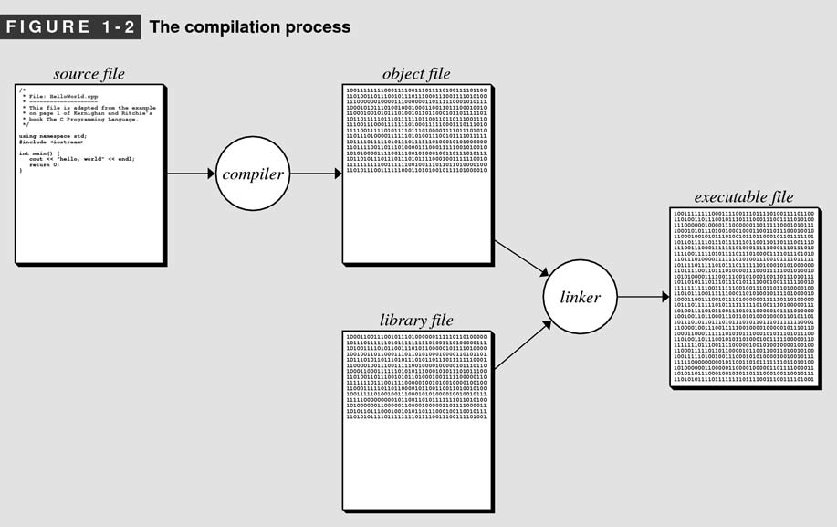
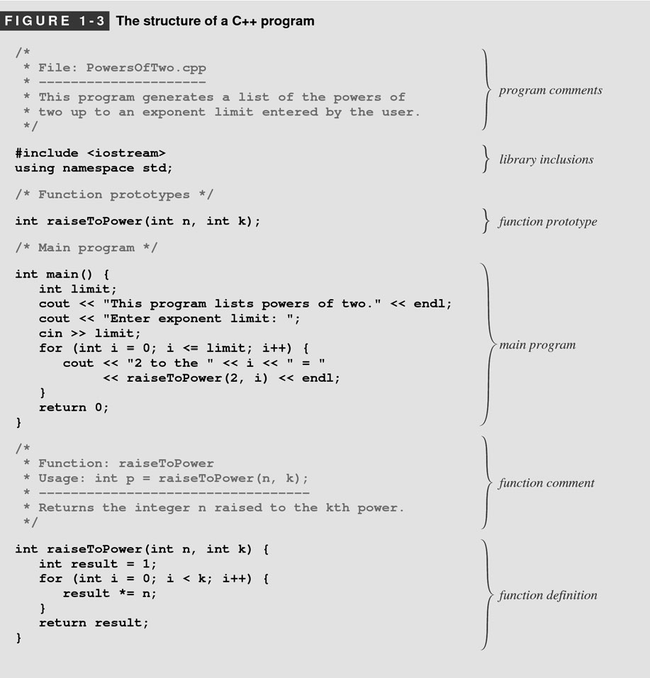
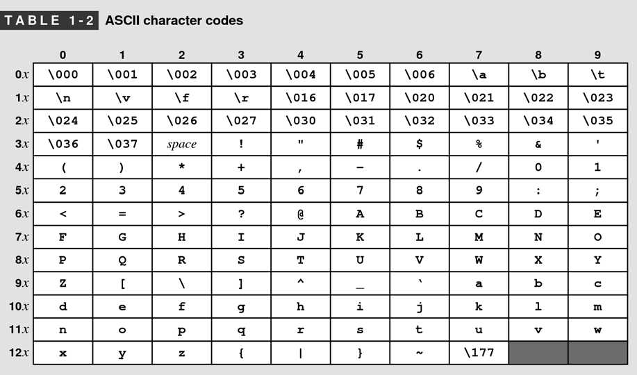
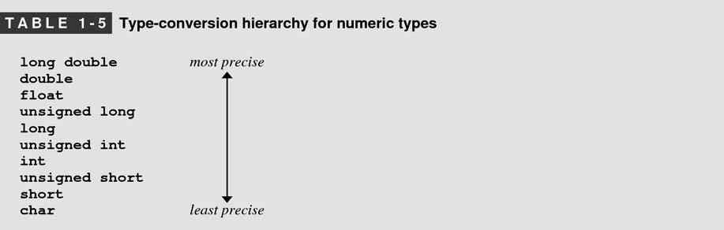

# 1.Overview of C++

## 1.2 The history of C++

**📌Days before C++**

People are using machine language which reflects the design of the hardware rather than the needs of programmers.


**📌High-level programming language**

The first high-level programming language is called FORTRAN(formula translation) which resembles the mathematical formulas into machine language.


**📌Object-oriented paradigm**

Before it, it is **procedural paradigm** represented by C. C++ is built of C and shifts the paradigm.


## 1.3. The compilation process

You should be aware of the following concepts:

- source file
- compiler
- object file
- executable file
- libraries
- linker


<div align="center">
    <figure>
  
</figure>
</div>


## 1.4. The structure of a C++ program

<div align="center">
    <figure>
  
</figure>
</div>


## 1.6. Data Types

**📌Integer types**

If `long int` + `int`, the result is `int` which will promote the precision.


**📌Floating-point types**

Floating-point with scientific notation.

```c++
double num = 2.9979E+8;
```

`E+8` means $10^{8}$


**📌Characters**

ASCII stands for American Standard Code for Information Interchange.

<div align="center">
    <figure>
  
</figure>
</div>

The row stands for 10, col stands for 1. Therefore `A` is 65 = 10 * 6 + 5 * 1


**📌Strings**

The `string` is not a primitive type in C++ while it is, in fact, a library type(history artifact with C). In this book, we uses the `string` library wherever possible.


## 1.7. Expressions

**📌Mixing types in an expression**

The type-conversion is with the following order:

<div align="center">
    <figure>
  
</figure>
</div>

For example:

```c++
double num = 0;
num += 1;
// num now is 1.0
```


**📌Truncation**

It is the operation of discarding a decimal fraction.

```c++
int result = 9 / 4;  //result is 2
```


**📌Type casts**

type cast in C++:

```c++
quotient = double(num) / den;
```

type cast in C#:

```c#
quotient = (double) num / den;
```


**📌Embedded Assignment**

```c++
int x, y, z;
z = (x = 6) + (y = 7);
```

While we don't recommend these kinds of operation which are difficult to understand.


**📌Multiple Assignment**

```c++
int n1, n2, n3;
n1 = n2 = n3 = 0;
```


**📌Increment and Decrement Operator**

The difference between `++x` and `x++`.

```c++
{
    cout << *first << endl;
    *at = *first;
    at++;
    first++;
}
```

is equivalent to the following:

```c++
{
    cout << *first << endl;
    *at++ = *first++;
}
```


## 1.8. Statements

**📌Predicate Functions**

Functions like `isVowel()` or `isAlphabet` are called predicate functions.


# 11.Pointers and Array


**📌NULL/garbage poitner**

```c++
int* p1 = nullptr;
cout << pt << endl;  //0
cout << *pt << endl;  //KABOOM

// testing for nullness
if(p1 == nullptr)  {...}  //true
if(p1)             {...}  //false 👈regular version
if(!p1)            {...}  //true  👈regular version
```


**📌non-pointer and pointer initialization**⭐

I have been confused for a long time why we have 2 different ways of initialization.

```c++
// non-poitner
Date d1;
d1.month = 4;
d1.day = 21;
// pointer
Date* d2;
d2->month = 4;
d2->day = 20;
```

The main difference is that the later one <u>***will not be deleted automatically by the garbage collection***</u>!!

```c++
// non-poitner
void foo1()
{
    Date d1;
    d1.month = 4;
    d1.day = 21;
    ...
    
    // d1 will be thrown away once out of this scope
}

// pointer
void foo2()
{
    Date* d2;
    d2->month = 4;
    d2->day = 20;
    ...
    
    // d2 will NOT be thrown away!
}

```


**📌Fun Fact of `->`**

```c++
// The followings are the same!
d2->month = 4;
(*d2).month = 4;
```

So `->` is a <u>shorthand</u> for **dereference and then access**.


**📌Deep Insight of Linked List**

```c++
struct ListNode
{
	int num;
    ListNode* next;
};
```


**📌Reassigning Pointers**

Suppose you have the following relation:


What should the following look like?

1️⃣

```c++
a->next = b->next;
```


2️⃣

```c++
a = b->next;
```


 3️⃣

```c++
a = b;
```


4️⃣

```c++
a->next->next = b;
```


**📌Incorrect Ways Implementing Linked List**

The `addFront` is the following:

```c++
void addFront(ListNode* front, int value)
{
    ListNode* temp = new ListNode(value);
    temp->next = front;
    front = temp;
}

// the client code
int main()
{
    ListNode* list = ...;
    addFront(list, 10);
}
```

Unfortunately, it does not work that way:


It only update the local variable `front`!🙁🙁Because the pointer is not passed by reference...


**📌Correct Way Implementing Linked List**

And you have to pass by reference:

```c++
void addFront(ListNode*& front, int value)
{
    //...
}
```

So fxxking weird!😱 But that is how it is...


**📌Destroy an Array**

```c++
// constructor
ArrayStack::ArrayStack()
{
    elements = new int[10]();
    size = 0;
    capacity = 10;
}

// destructor
ArrayStack::~ArrayStack()
{
    // 🤚 When you delete an array, you have to => `delete[] `; others are fine
    delete[] elements;
}
```


# 16.Binary Tree


# Stanford Library

```c++
// a header replace cin
#include "simpio.h"

string fullname = getLine("Student name? ");
int age = getInteger("How old are you? ");
double gpa = getReal("What's your GPA? ");
if(getYesOrNo("Destroy the universe?")) { }
```


```c++
#include "strlib.h"

endsWith(str, suffix);
startsWith(str, prefix);

integerToString(int);
realToString(double);
stringToInteger(str);
stringToReal(str);

equalsIgnoreCase(s1, s2);//ignore casing, compare these 2 strings

toLowerCase(str);
toUpperCase(str);

trim(str);               //trim the white space
```


Chapter 5

Abstract Data Type


```c++
#include "vector.h"

Vector<int> nums {42, 17, 6};
Vector<string> names;
names.add("Marty");
names.insert(0, "Martin");
names.remove(1);

// nested vector
// pay attention here!! the space ' ' between `>` and `>`
vector<vector<int> > vv
{
    {1}, {2, 3, 4}, {5, 6, 7, 8}  
};


```


⭐

```c++
#include "grid.h"

Grid<int> matrix1(3,4);
matrix[0][0] = 75;

Grid<int> matrix2 = 
{
    {1, 0, 0},
    {0, 1, 0},
    {0, 0, 1}
};
```


```c++
#include "linkedlist.h"

// init
LinkedList<int> list;
for(int i = 0; i < 8; i++)
{
    list.add(10 * i);
}


```


```c++
#include "stack.h"

// RULE: Last In, First Out ("LIFO")

// push | Add an element to the top
// pop  | Remove the top element
// peek | Examine the top element

// WRONG WAY USING STACK❌
Stack<int> s;
for (int i = 0; i < s.size(); i++)
{
    // do something
}

// COMMON IDIOM
while (!s.isEmpty())
{
    // do something with s.pop()
}


```


```c++
#include "queue.h"

// RULE: FIRST IN FIRST OUT ("FIFO")

// enqueue | add an element to the back
// dequeue | remove the front element
// peek    | examine the front element

Queue<int> q;
q.enqueue(42);
q.enqueue(-3);
q.enqueue(17);
cout << q.dequeue() << endl;
cout << q.peek() << endl;
cout << q.dequeue() << endl;

while(!q.isEmpty())
{
    // do something with q.dequeue();
}
```


```c++
#include "gwindow.h"


```


Exhaustive Search


# -------Code and Assignment-------

# Section 1

**📌Deduplicating**

> ​	The effect should be the following:

```c++
Vector<string> hiddenFigures = {
    "Katherine Johnson",
    "Katherine Johnson",
    "Katherine Johnson",
    "Mary Jackson",
    "Dorothy Vaughan",
    "Dorothy Vaughan"
};

deduplicate(hiddenFigures);
// hiddenFigures = ["Katherine Johnson", "Mary Jackson", "Dorothy Vaughan”]
```

> Error Function❌

```c++
void deduplicate(Vector<string> vec) {
    for (int i = 0; i < vec.size(); i++) {
        if (vec[i] == vec[i + 1]) { 
            vec.remove(i);
        }
    }
}
```

The preceding function is with bugs:

- The input parameter is not pass by reference
- It will access index has been culled


> ​	Fixed Version✔

```c++
void deduplicate(Vector<string> &vec) {
    if (vec.isEmpty())
    {
        return;
    }

    int size = vec.size();
    for (int i = 0; i < size; i++)
    {
        // prevent the index out of range
        while ( (i + 1 < size) && (vec[i] == vec[i + 1]))
        {
            vec.remove(i + 1);
            size = vec.size();  // update the size, so the for loop shrink
        }
    }
}
```


> ​	Fixed Version 1✔

```c++
void deduplicate1(Vector<string> &vec)
{
    // check the size every loop
    for(int i = 0; i < vec.size();)
    {
        if( (i+1<vec.size()) && (vec[i]==vec[i+1]))
        {
            vec.remove(i+1);
        }
        else
        {
            // increment here, not the for loop
            i++;
        }
    }
}
```


> ​	Fixed Version 2✔⭐

```c++
void deduplicate2(Vector<string> &vec)
{
    for(int i = vec.size()-1; i>0; i--)
    {
        if(vec[i] == vec[i-1])
        {
            vec.remove(i);
        }
    }
}
```

The preceding algorithm is kind of smart. It loops from the back and delete from the back. Therefore, you don't need to check at all! This is also the c<u>ommon delete algorithm of linear collection</u>.


# Assignment 1

**📌`PlayingFair.cpp`**

This assignment is the one I think is the most tricky and fun! It is asked to implement a recursive algorithm which can produce the following order. This is the algorithm concerning the "fair", e.g. in Ban-Pick of a League of Legend Game.


The secrect is to make the order in cross reference order. Taking the "Order 2" as an example:


The very smart algorithm is the following:

```c++
string aSequenceOfOrder(int n) {
    if(n == 0)
    {
        return "A";
    }
    else if(n < 0)
    {
        error("Index is smaller than 0!!");
    }
    else
    {
        return aSequenceOfOrder(n-1)+bSequenceOfOrder(n-1);
    }

}

string bSequenceOfOrder(int n) {
    if(n == 0)
    {
        return "B";
    }
    else if(n < 0)
    {
        error("Index is smaller than 0!!");
    }
    else
    {
        return bSequenceOfOrder(n-1)+aSequenceOfOrder(n-1);
    }
}
```


**📌`Sandpiles.cpp`**

From this assignment, I figure out a good idea on implementing recursive function:

- 1️⃣ Think about the base case first!
- 2️⃣ Focous the action on one iteration, that's it! The rest throw in the recursive.

The sandpiles function demands the following behavior:


When a cell is up to 4, its cardinal direction cell increments **1** and itself becomes **0**. If the `row` and `col` is out of bound, never mind.

```c++
void dropSandOn(Grid<int>& world, int row, int col) {
    // out of bounds, return
    if(!world.inBounds(row, col))
    {
        return;
    }
    // in bounds, increment
    world[row][col]++;

    // sum up to 4, spread it!
    if(world[row][col] == 4)
    {
        world[row][col] = 0;
        dropSandOn(world, row+1, col);
        dropSandOn(world, row, col+1);
        dropSandOn(world, row-1, col);
        dropSandOn(world, row, col-1);
    }
    else
    {
        return;
    }
}
```

The test case could be:

```c++
PROVIDED_TEST("Non-chaining topples work.") {
    /* Create a simple source grid. */
    Grid<int> before = {
        { 0, 0, 0 },
        { 1, 3, 1 },
        { 0, 2, 0 }
    };
    Grid<int> after = {
        { 0, 1, 0 },
        { 2, 0, 2 },
        { 0, 3, 0 }
    };

    dropSandOn(before, 1, 1);
    EXPECT_EQUAL(before, after); // The above call changes 'before.'
}
```


# Assignment 2

## **`RisingTides.cpp`**⭐

The assignment is asked to implment an algorithm to mimic the <u>**flooding**</u> of a <u>**terrain**</u>.


The idea here is to adopt <u>***breadth-first search***</u> algorithm! It is fun! *<u>Breadth-first search</u>* is typically implemented by using a <u>**queue**</u>🤘 that will process every <u>*flooded location*</u>. The idea is the following: 

- 1️⃣ we begin by iterating each water sources, enqueuing those flooded regions💧. 
- 2️⃣ we’ll then dequeue the flooded regions, test if *<u>its adjacent cells</u>* in cardinal directions⬆⬇⬅➡ are flooded. If flooded, enqueue in the queue
- 3️⃣ keep iterates until it the queue is empty

The following is the pseudo code:

```
  create an empty queue;
 for (each water source at or below the water level)
 {
     flood that square;
     add that square to the queue;
 }
 while (the queue is not empty) 
 {
     dequeue a position from the front of the queue;
     for (each square adjacent to the position in a cardinal direction) 
     {
         if (that square is at or below the water level and isn't yet flooded) 
         {
             flood that square;
             add that square to the queue;
         }
     }
 }
```

The following is the code:

```c++
Grid<bool> floodedRegionsIn(const Grid<double>& terrain,
                            const Vector<GridLocation>& sources,
                            double height) {

    // output is a Grid of bool indicating if it is flooded or not
    Grid<bool> floodRegion(terrain.numRows(), terrain.numCols(), false);

    // queue for test if its cardinal direction cell is flooded
    Queue<GridLocation> isFloodQueue;

    // enqueue the rain source, if the coord is flooded
    for(const GridLocation& loc : sources)
    {
        if(terrain.get(loc) <= height)
        {
            floodRegion.set(loc, true);
            isFloodQueue.enqueue(loc);
        }
    }

    // cardinal direction => (1,0) (0,1) (-1,0) (0,-1)
    Vector<int> cardinal_direction = {1, 0,-1, 0, 1};
    while(!isFloodQueue.isEmpty())
    {
        GridLocation loc = isFloodQueue.dequeue();
        int row = loc.row;
        int col = loc.col;

        for(int i = 0; i < cardinal_direction.size() - 1; i++)
        {
            // iterate its adjacent cell in its cardinal direction
            int adjacent_row = row + cardinal_direction[i];
            int adjacent_col = col + cardinal_direction[i+1];
            GridLocation adjacent_cell(adjacent_row, adjacent_col);

            // AND 3 criteria for processing a cell is flooded
            if(floodRegion.inBounds(adjacent_cell) &&            // the adjacent cell is in bounds
                    floodRegion.get(adjacent_cell) == false &&   // the adjacent cell is currently unflooded
                    terrain.get(adjacent_cell) <= height)        // the adjacent cell is lower than the height
            {
                floodRegion.set(adjacent_cell, true);
                isFloodQueue.enqueue(adjacent_cell);
            }
        }
    }

    return floodRegion;
}
```

I think there is one more super important thing I want to mention up here....⭐ Which is I used the `for` loop to iterate the cardinal directions.


If we start looking from `(1,0)` counter clockwise, we will find out that the points are:


We can cross reference the coordinate!!⭐⭐⭐ Therefore, I make a `Vector<int>` to iterate.


## **`RosettaStone.cpp`**

Few thing I learned from this exercise. The first thing is about

**📌Trigram**

> ​	What is it?

For the following string

<div align="center">
    A BANANA BANDANA
</div>

The trigram is the following:

```
"ANA": 3        " BA": 2		"A B": 2
"BAN": 2		"AND": 1		"DAN": 1
"NA ": 1		"NAN": 1		"NDA": 1
```

> ​	Comparison between languages using trigram

The following is the trigram of <u>**English**</u>:

```
" th": 667		"the": 616		"he ": 533
" an": 497		"nd ": 492		"and": 470
"ion": 423		" of": 376		" in": 375
"of ": 363		"tio": 333		"ed ": 320
"ing": 318		"man": 289		"ng ": 288
```

The following is the trigram of <u>**Spanish**</u>:

```
" de": 531		"os ": 396		"de ": 374
"ent": 298		" la": 293		"es ": 277
"la ": 239		"el ": 232		" co": 217
" es": 208		"en ": 198		"ien": 198
"nte": 196		"as ": 193		" en": 185
```

> ​	Application of trigram

The trigram is used to detect the similarity among languages. The following is one of the application where you browse the explorer on a foreign website with notification on the language.


**📌UTF-8**

In short, UTF-8 is a historical artifacts which can date back to 1980s when C++ was developed. At the beginning, the memory is scarce and developer can only use a little bit. Therefore the `char` is designed to support only **256** values. But as the world is more and more global, the `char` must not only support English but also other languages. Therefore, the UTF-8 is implemented to support these languages. The following is an example of UTF-8.

```html
\u4e0a\u6d77\u9b54\u5e7b\u75ab\u60c5
上海魔幻疫情
```


**📌Cosine Similarity**

The compare the similarity, we adopt the cosine similarity which does the following:

```
Profile 1			Profile 2

"aaa": 0.333		"bbb": 0.333
"bbb": 0.667		"ccc": 0.667
"ccc": 0.667		"ddd": 0.667
```

We only calculate the similarity between matched trigrams:

```
      (product of "bbb" frequencies) + (product of "ccc" frequencies)
    = (0.667 × 0.333) + (0.667 × 0.667)
    = 0.667
```


**📌Integer Overflow**

Suprisingly, the `.size()` and `.length()` functions return ***<u>unsigned integer</u>***, and therefore it may cause an error if we want to subtract from it.

```c++
// ERROR!!❌
string str = "HELLO";
int offset = 6;
for(int i = 0; i < str.length() - offset; i++)
{
    
}

// CHECK FIRST✅
if(str.length() < offset)
{
    return;
}
for(int i = 0; i < str.length() - offset; i++)
{
 	// running safe here   
}
```


**📌Code**

In general, this assignment is not hard which is credited to Prof and tutor who separated the big puzzle into several functions. Please refer to [here](../code/programming_abstraction_in_cpp/lecture/2021_autumn/Assignment_2/RosettaStone.cpp).


# Assignment 3

## `Sierpinski.cpp`


**📌What is the black and white standing for?**

Every triangle drawn here is black; the white triangles represent places where no triangle was drawn.


**📌Code**

```c++
/*
 * This is a helper function which actually draws the triangle
 */
void drawTriangle(GWindow& window,
                  double x0, double y0,
                  double x1, double y1,
                  double x2, double y2) {
    window.setColor("black");
    window.fillPolygon({ x0, y0, x1, y1, x2, y2 });

}

/*
 * The recursion functions.
 */
void drawSierpinskiTriangle(GWindow& window,
                            double x0, double y0,
                            double x1, double y1,
                            double x2, double y2,
                            int order) {
    // check validity
    if(order < 0)
    {
        return;
    }
    
    // draw a triangle if the order reaches 0
    if(order == 0)
    {
        drawTriangle(window, x0, y0, x1, y1, x2, y2);
    }
    // else keep segmenting...
    else
    {
        drawSierpinskiTriangle(
                    window,
                    x0,         y0,
                    (x0+x1)/2, (y0+y1)/2,
                    (x0+x2)/2, (y0+y2)/2,
                    order - 1);
        drawSierpinskiTriangle(
                    window,
                    x1,         y1,
                    (x0+x1)/2, (y0+y1)/2,
                    (x1+x2)/2, (y1+y2)/2,
                    order - 1);
        drawSierpinskiTriangle(
                    window,
                    x2,         y2,
                    (x2+x1)/2, (y2+y1)/2,
                    (x0+x2)/2, (y0+y2)/2,
                    order - 1);
    }
}
```


## `HumanPyramids.cpp`

**📌Problem Definition**

The problem is asked to calculate the **<u>weight</u>** of a specific person. The weight per person is 160 pounds.


For example, the weight of E is the following:
$$
\begin{align}
E &= \frac{1}{2}(B+\frac{1}{2}A)+\frac{1}{2}(C+\frac{1}{2}A)\\
&= \frac{1}{2}(160+\frac{1}{2}160)+\frac{1}{2}(160+\frac{1}{2}160)\\
&= 80 + 40 + 80 + 40\\
&=240
\end{align}
$$
For simplicity, we use coordinate the identify the person:


**📌Design the Recursion**

- the base case => the top node which has nothing above it, therefore <u>**returns 0**</u>.
- the regular case
  - **left node** => <u>only right parent above it</u>
  - **nodes in between** => <u>both left and right parents above it</u>
  - **right node** => <u>only left parent above it</u>

```c++
double weightOnBackOf(int row, int col, int pyramidHeight) {
    // check validity
    if(row < 0 || col < 0)
    {

        error("Row and Column can't be less than 0.");
    }
    if(row >= pyramidHeight)
    {
        error("Row is out of bound");
    }

    //base case
    if(row == 0)
    {
        return 0;
    }
    else
    {
        int next_row = row - 1;
        int next_col_left = col - 1;
        int next_col_right = col;
        // 🤚Left node
        if(next_col_left < 0)
        {
            return 0.5*(160 + weightOnBackOf(next_row, next_col_right, pyramidHeight));
        }
        // 🤚Right Node
        else if(next_col_right > next_row)
        {
            return 0.5*(160 + weightOnBackOf(next_row, next_col_left, pyramidHeight));
        }
        // 🤚Nodes not in the edge
        else
        {
            return 0.5*(160 + weightOnBackOf(next_row, next_col_left, pyramidHeight)) +
                   0.5*(160 + weightOnBackOf(next_row, next_col_right, pyramidHeight));
        }

    }
}
```


**📌Memorization Implementation**


