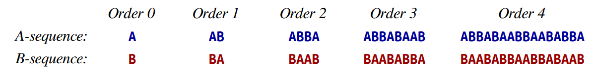
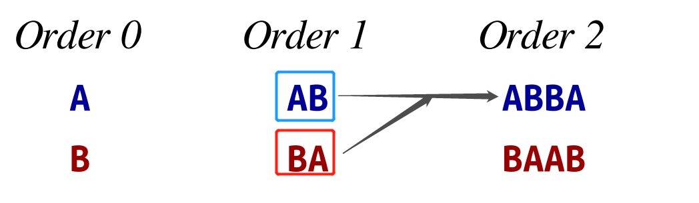
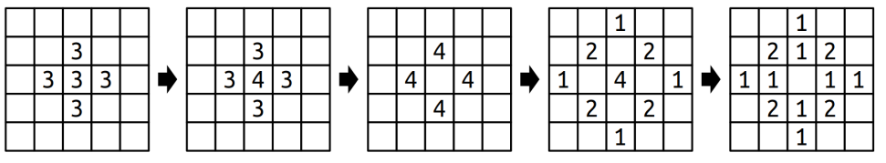

# Stanford Library

```c++
// a header replace cin
#include "simpio.h"

string fullname = getLine("Student name? ");
int age = getInteger("How old are you? ");
double gpa = getReal("What's your GPA? ");
if(getYesOrNo("Destroy the universe?")) { }
```


```c++
#include "strlib.h"

endsWith(str, suffix);
startsWith(str, prefix);

integerToString(int);
realToString(double);
stringToInteger(str);
stringToReal(str);

equalsIgnoreCase(s1, s2);//ignore casing, compare these 2 strings

toLowerCase(str);
toUpperCase(str);

trim(str);               //trim the white space
```


Chapter 5

Abstract Data Type


```c++
#include "vector.h"

Vector<int> nums {42, 17, 6};
Vector<string> names;
names.add("Marty");
names.insert(0, "Martin");
names.remove(1);

// nested vector
// pay attention here!! the space ' ' between `>` and `>`
vector<vector<int> > vv
{
    {1}, {2, 3, 4}, {5, 6, 7, 8}  
};


```


⭐

```c++
#include "grid.h"

Grid<int> matrix1(3,4);
matrix[0][0] = 75;

Grid<int> matrix2 = 
{
    {1, 0, 0},
    {0, 1, 0},
    {0, 0, 1}
};
```


```c++
#include "linkedlist.h"

// init
LinkedList<int> list;
for(int i = 0; i < 8; i++)
{
    list.add(10 * i);
}


```


```c++
#include "stack.h"

// RULE: Last In, First Out ("LIFO")

// push | Add an element to the top
// pop  | Remove the top element
// peek | Examine the top element

// WRONG WAY USING STACK❌
Stack<int> s;
for (int i = 0; i < s.size(); i++)
{
    // do something
}

// COMMON IDIOM
while (!s.isEmpty())
{
    // do something with s.pop()
}


```


```c++
#include "queue.h"

// RULE: FIRST IN FIRST OUT ("FIFO")

// enqueue | add an element to the back
// dequeue | remove the front element
// peek    | examine the front element

Queue<int> q;
q.enqueue(42);
q.enqueue(-3);
q.enqueue(17);
cout << q.dequeue() << endl;
cout << q.peek() << endl;
cout << q.dequeue() << endl;

while(!q.isEmpty())
{
    // do something with q.dequeue();
}
```


```c++
#include "gwindow.h"


```


Exhaustive Search


# Code and Assignment

## Section 1

**📌Deduplicating**

> ​	The effect should be the following:

```c++
Vector<string> hiddenFigures = {
    "Katherine Johnson",
    "Katherine Johnson",
    "Katherine Johnson",
    "Mary Jackson",
    "Dorothy Vaughan",
    "Dorothy Vaughan"
};

deduplicate(hiddenFigures);
// hiddenFigures = ["Katherine Johnson", "Mary Jackson", "Dorothy Vaughan”]
```

> Error Function❌

```c++
void deduplicate(Vector<string> vec) {
    for (int i = 0; i < vec.size(); i++) {
        if (vec[i] == vec[i + 1]) { 
            vec.remove(i);
        }
    }
}
```

The preceding function is with bugs:

- The input parameter is not pass by reference
- It will access index has been culled


> ​	Fixed Version✔

```c++
void deduplicate(Vector<string> &vec) {
    if (vec.isEmpty())
    {
        return;
    }

    int size = vec.size();
    for (int i = 0; i < size; i++)
    {
        // prevent the index out of range
        while ( (i + 1 < size) && (vec[i] == vec[i + 1]))
        {
            vec.remove(i + 1);
            size = vec.size();  // update the size, so the for loop shrink
        }
    }
}
```


> ​	Fixed Version 1✔

```c++
void deduplicate1(Vector<string> &vec)
{
    // check the size every loop
    for(int i = 0; i < vec.size();)
    {
        if( (i+1<vec.size()) && (vec[i]==vec[i+1]))
        {
            vec.remove(i+1);
        }
        else
        {
            // increment here, not the for loop
            i++;
        }
    }
}
```


> ​	Fixed Version 2✔

```c++
void deduplicate2(Vector<string> &vec)
{
    for(int i = vec.size()-1; i>0; i--)
    {
        if(vec[i] == vec[i-1])
        {
            vec.remove(i);
        }
    }
}
```

The preceding algorithm is kind of smart. It loops from the back and delete from the back. Therefore, you don't need to check at all! This is also the c<u>ommon delete algorithm of linear collection</u>.


## Assignment 1

**📌`PlayingFair.cpp`**

This assignment is the one I think is the most tricky and fun! It is asked to implement a recursive algorithm which can produce the following order. This is the algorithm concerning the "fair", e.g. in Ban-Pick of a League of Legend Game.



The secrect is to make the order in cross reference order. Taking the "Order 2" as an example:



The very smart algorithm is the following:

```c++
string aSequenceOfOrder(int n) {
    if(n == 0)
    {
        return "A";
    }
    else if(n < 0)
    {
        error("Index is smaller than 0!!");
    }
    else
    {
        return aSequenceOfOrder(n-1)+bSequenceOfOrder(n-1);
    }

}

string bSequenceOfOrder(int n) {
    if(n == 0)
    {
        return "B";
    }
    else if(n < 0)
    {
        error("Index is smaller than 0!!");
    }
    else
    {
        return bSequenceOfOrder(n-1)+aSequenceOfOrder(n-1);
    }
}
```


**📌`Sandpiles.cpp`**

From this assignment, I figure out a good idea on implementing recursive function:

- 1️⃣ Think about the base case first!
- 2️⃣ Focous the action on one iteration, that's it! The rest throw in the recursive.

The sandpiles function demands the following behavior:



When a cell is up to 4, its cardinal direction cell increments **1** and itself becomes **0**. If the `row` and `col` is out of bound, never mind.

```c++
void dropSandOn(Grid<int>& world, int row, int col) {
    // out of bounds, return
    if(!world.inBounds(row, col))
    {
        return;
    }
    // in bounds, increment
    world[row][col]++;

    // sum up to 4, spread it!
    if(world[row][col] == 4)
    {
        world[row][col] = 0;
        dropSandOn(world, row+1, col);
        dropSandOn(world, row, col+1);
        dropSandOn(world, row-1, col);
        dropSandOn(world, row, col-1);
    }
    else
    {
        return;
    }
}
```

The test case could be:

```c++
PROVIDED_TEST("Non-chaining topples work.") {
    /* Create a simple source grid. */
    Grid<int> before = {
        { 0, 0, 0 },
        { 1, 3, 1 },
        { 0, 2, 0 }
    };
    Grid<int> after = {
        { 0, 1, 0 },
        { 2, 0, 2 },
        { 0, 3, 0 }
    };

    dropSandOn(before, 1, 1);
    EXPECT_EQUAL(before, after); // The above call changes 'before.'
}
```

