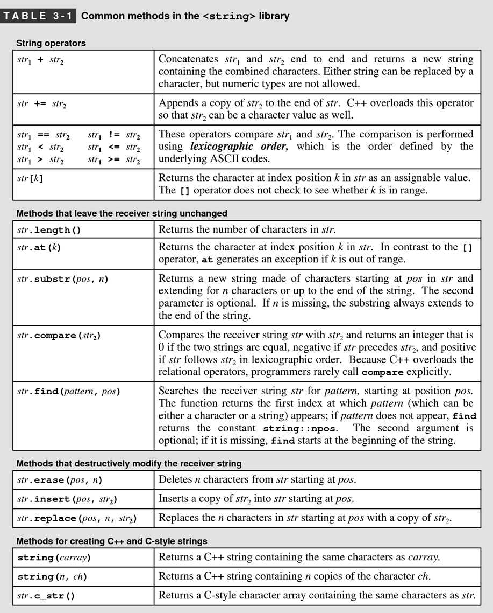
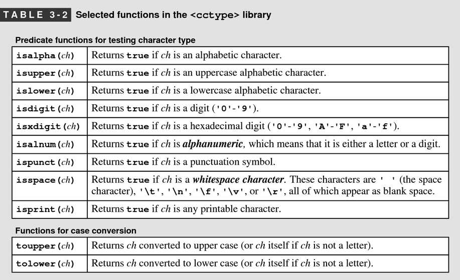
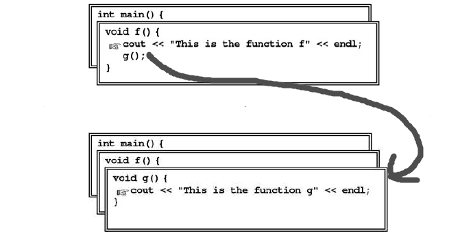
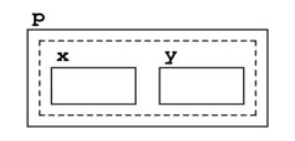

# 1.Overview of C++

## 1.2 The history of C++

**📌Days before C++**

People are using machine language which reflects the design of the hardware rather than the needs of programmers.


**📌High-level programming language**

The first high-level programming language is called FORTRAN(formula translation) which resembles the mathematical formulas into machine language.


**📌Object-oriented paradigm**

Before it, it is **procedural paradigm** represented by C. C++ is built of C and shifts the paradigm.


## 1.3. The compilation process

You should be aware of the following concepts:

- source file
- compiler
- object file
- executable file
- libraries
- linker


<div align="center">
    <figure>
  
</figure>
</div>


## 1.4. The structure of a C++ program

<div align="center">
    <figure>
  
</figure>
</div>


## 1.6. Data Types

**📌Integer types**

If `long int` + `int`, the result is `int` which will promote the precision.


**📌Floating-point types**

Floating-point with scientific notation.

```c++
double num = 2.9979E+8;
```

`E+8` means $10^{8}$


**📌Characters**

ASCII stands for American Standard Code for Information Interchange.

<div align="center">
    <figure>
  
</figure>
</div>

The row stands for 10, col stands for 1. Therefore `A` is 65 = 10 * 6 + 5 * 1


**📌Strings**

The `string` is not a primitive type in C++ while it is, in fact, a library type(history artifact with C). In this book, we uses the `string` library wherever possible.


## 1.7. Expressions

**📌Mixing types in an expression**

The type-conversion is with the following order:

<div align="center">
    <figure>
  
</figure>
</div>

For example:

```c++
double num = 0;
num += 1;
// num now is 1.0
```


**📌Truncation**

It is the operation of discarding a decimal fraction.

```c++
int result = 9 / 4;  //result is 2
```


**📌Type casts**

type cast in C++:

```c++
quotient = double(num) / den;
```

type cast in C#:

```c#
quotient = (double) num / den;
```


**📌Embedded Assignment**

```c++
int x, y, z;
z = (x = 6) + (y = 7);
```

While we don't recommend these kinds of operation which are difficult to understand.


**📌Multiple Assignment**

```c++
int n1, n2, n3;
n1 = n2 = n3 = 0;
```


**📌Increment and Decrement Operator**

The difference between `++x` and `x++`.

```c++
{
    cout << *first << endl;
    *at = *first;
    at++;
    first++;
}
```

is equivalent to the following:

```c++
{
    cout << *first << endl;
    *at++ = *first++;
}
```


## 1.8. Statements

**📌Predicate Functions**

Functions like `isVowel()` or `isAlphabet` are called predicate functions.


# 2.Functions and Libraries

## 2.2. Libraries

**📌Roles of libraries**

- Implementer, who implements a library
- Client, calls functions provided by a library


## 2.3. Defining functions in C++

**📌Procedure**

A function that does not return a value and is instead executed for its effect.


**📌C does not have function overloading**

ew...


## 2.4. The mechanics of function calls

**📌Stack Frame**

A new space created by system for all the local variables required when calling a function. In Visual Studio debug mode, there is a tab called `Local`.


# 3.Strings


## 3.1. Using strings as abstract values

**📌The `cin >>` operator**

It will read the word separated by whitespace.

```c++
cin >> name;
```

When you type:

```cmd
Eric Roberts
```

The name will only store the first word - `Eric`.


**📌`getline` to read entire line**

```c++
getline(cin, str);
```

When you type:

```cmd
Eric Roberts
```

The `str` will store `Eric Roberts`.


## 3.2. String operations

**📌"methods" and "free functions"**

- methods - functions defined in the class.
- free functions - functions defined out of the class.


**📌sender and receiver**

- sender - the object that initiates the method is called the sender
- receiver - the object that is the target of that transmission

```c++
receiver.name(arguments);
```


**📌lexicographic order**

The order defined by the underlying ASCII codes.


**📌`.at()` of `<string>` library**

When you access certain element of a `string` object, you can:

```c++
str[0] = 'x';
str.at(0) = 'x';  ✅
```

The latter is much safer since it will <u>**check**</u> whether the index is valid.


**📌`size_t` in `string` class**

The `string` class complicates matters by using the `size_t`[^1] to represent both index positions and lengths in a string.


📌`str.substr(start, n)` 

It creates a new string by extracting `n` characters from `str` starting at the index position specified by `start`.


📌`str.find(pattern)`

The `find` method will try to find the pattern:

- success - return the 1st index of that pattern
- failed - return `string::npos`

The `find` can also take an optional second argument which indicates the index position at which to start the search.


**📌Exported methods**




## 3.3. The `<cctype>` library⭐

**📌Why learn this?**

Working with legacy C-style code, you have to get familiar with this library.


**📌Exported methods**




## 3.5. The legacy of C-style strings

**📌History of `<string>` library**

In its early years, C++ succeeded in part because it includes all of C as a subset, thereby making it possible to evolve gradually from one language to the other. That design decision, however, means that C++ includes some aspects of C that no longer make sense in a modern object-oriented language, but nonetheless need yo be maintained for compatibility.


**📌`string` in C++ is not a primitive type**

To prove that:

```c++
string str = "Hello world!";                        // VALID✅
string str1 = "hello" + ", " + "world!";            // INVALID❌
string str2 = string("hello") + ", " + "world!";    // VALID✅
```


# 5.Collections

**📌ADT**

A type defined in terms of its <u>**behavior**</u> rather than its representation is called ***abstract data type***, which is often abbreviated to ***ADT***.


**📌STL**

Standard Template Library.


## 5.1. The Vector class

**📌The Con of Array**

- the size is fixed
- The array does not explicitly specify the length of an array. Therefore, we often accompany an integer to track the size.
- does not support insert and remove operation
- array does not have bound-checking


**📌Some Jargon**

```c++
Vector<string> vec;
```

- base type - the type enclosed within the angle brackets is called the ***base type*** for the collection.
- parameterized classes - Classes that include a base-type specification are called ***parameterized classes*** in the object-oriented community.
- template - In C++, parameterized classes are more often called ***templates***.
- generic - In C#, they call it *generic*.


**📌bounds-checking**

The operation of testing whether an index is valid is called ***bounds-checking***.


 **📌Use `Vector` to count letters**

```c++
int main()
{
	Vector<int> letternCounts(26);
    ifstream infile;
    promptUserForFile(infile, "Input File: ");
    while(infile.get(ch))
    {
        if(isalpha(ch))
        {
            letterCounts[toupper(ch) - 'A']++;     //🤚Take a look here
        }
    }
    infile.close();
    for(char ch = 'A'; ch <= 'Z'; ch++)            //🤚Take a look here
    {
        cout << setw(7) << letterCounts[ch - 'A'] << " " << ch << endl;
    }

    return 0;
}
```

The most importance points lie in the following:

```c++
letterCounts[toupper(ch) - 'A']++;
```

It is a very smart move which takes advantage of the ASCII code and converts to integer. For example, `'A'` is the `0` element and therefore `'A' - 'A'` are `65 -65` which is `0`.


## 5.2. The Stack class

**📌Importance of Stack⭐⭐**

The primary reason that stacks are important in programming is that nested function calls behave in a stack-oriented fashion!.



Like the preceding diagram, the function calls are invoked in a stack frame. 


## 5.3. The Queue class

**📌Simulations and models**

Most problems are far too complex to allow for a complete understanding. There are just too many details. The reason to build a model is that, <u>despite the complexity of a particular problem</u>. If you can come up with a reasonable model for a process, you can often translate the dynamics of the model into a program that captures the behavior of that model. Such a program is called a <u>***simulation***</u>.


**📌Poisson Distribution**

**Poisson distribution** is a [discrete probability distribution](https://en.wikipedia.org/wiki/Discrete_probability_distribution) that expresses the probability of a given number of events occurring in a fixed interval of time or space if these events occur with a known constant mean rate and [independently](https://en.wikipedia.org/wiki/Statistical_independence) of the time since the last event.


## 5.4. The Map class

**📌Jargon**

The following 3 are the same.

- symbol tables - in Computer Science
- map - in C++
- dictionary - in C#


**📌Associative arrays**

Arrays implemented using maps as their underlying representation are called **associative arrays**.


## 5.5. The Set class

**📌Lexicon**

A set of words with no associated definitions is called a ***lexicon***[^2].


## 5.6. Iterating over a collection

**📌range-based `for` loop**

The syntax is like the following:

```c++
for(type variable : collection)
{
    body of the loop
}
```

<u>DISCLAIMER⚠</u>, the preceding feature is only supported in and after C++ 11 standard.


**📌`foreach` in Stanford Library**

The Stanford C++ libraries include an interface called `foreach.h` that uses the C++ preprocessor to define a `foreach` macro:

```c++
#include "foreach.h"
foreach(type variable in collection)
{
    body of the loop
}
```


**📌Iteration order**

Each collection class defines its own policy about iteration order, usually based on considerations of efficiency.

- `Vector` - iterate through index
- `Grid` - the default is row-major order
- `Map` - natural order, e.g. `int` as key - ascending order, `string` as key - lexicographic order
- `Set` & `Lexicon` - natural order
- `Stack` & `Queue` - can't be iterated⚠


# 6.Designing Classes

## 6.1. Representing points

**📌field and member**

In structure, the components are called **fields** and **members**.


**📌How should we see `struct`?**

The fundamental characteristic of a structure is that it is possible to view it both as a collection of individual fields and as a single value.

```c++
struct Point
{
    int x;
    int y;
};
```




**📌Instance Variable**

The fields of a class are called instance variables.

```c++
class Point
{
    public:
    	int x;
    	int y;
    private:
    	double a;
    	double b;
}
```

However, `public` instance variables are discouraged in modern object-oriented programming. Therefore, the following is more appropriate:

```c++
class Point
{
    public:
    // ..methods here
    
    private:
    	int x;
    	int y;
};
```


**📌A typical class skeleton**


**📌getter and setter**

Methods that retrieve the values of instance variables are formally called *accessors*, but are more often known as ***getters***.

Methods that set the values of specific instance variables are called *mutators* or ***setters***.

> ​	💡These concepts are the same as in `get` and `set` properties in C#.


**📌immutable**

Before talking about it, I want to introduce you that in history many programmers insist that instance member should not be modified one initialized since it is private. Such class are said to be **immutable**. The preceding diagram of `Point` class is a good example.

> ​	💡However, this is just one of opinion. You are free to choose the strategies.


**📌C++ Class Boilerplate🌟 - separate the interface from the implementation**

This idea results 2 files - header file and source file.

> ​	Header file:

```c++
/*
 * File: point.h
 * -------------
 * This interface exports the Point class, which represents a point on
 * a two-dimensional integer grid.
 */

#ifndef _point_h
#define _point_h

#include <string>

class Point
{

public:

/*
 * Constructor: Point
 * Usage: Point origin;
 *        Point pt(xc, yc);
 * ------------------------
 * Creates a Point object. The default constructor sets the coordinates to 0;
 * the second form sets the coordinates to xc and yc.
 */
    Point();
    Point(int xc, int yc);
    ~Point();

/*
 * Methods: getX, getY
 * Usage: int x = pt.getX();
 *        int y = pt.getY();
 * -------------------------
 * Return the x and y coordinates of the point, respectively.
 */
    int getX();
    int getY();

/*
 * Methods: toString
 * Usage: string str = pt.toString();
 * ----------------------------------
 * Return a string representation of the Point in the form "(x,y)".
 */
    std::string toString();

private:
    int x;                  /* The x-coordinate */
    int y;                  /* The y-coordinate */
};

#endif
```

> ​	Source file:

```c++
/*
 * File: point.cpp
 * ---------------
 * This file implements the point.h interface.
 */

#include "point.h"

/*
 * Implementation notes: Constructors
 * ----------------------------------
 * The constructors initialize the instance variables x and y. In the
 * second form of the constructor, the parameter names are xc and yc
 * to avoid the problem of shadowing the instance variable.
 */

Point::Point()
      :x(0), y(0)
{
}

Point::Point(int xc, int yc)
      :x(xc), y(yc)
{
}

Point::~Point(){}


/*
 * Implementation notes: Getters
 * -----------------------------
 * The getters return the value of the corresponding instance variable.
 * No setters are provided to ensure that Point objects are immutable.
 */

int Point::getX()
{
    return this->x;
}

int Point::getY()
{
    return this->y;
}


/*
 * Implementation notes: toString
 * -----------------------------
 * The implementation of toString uses the std::to_string function from STL.
 */

std::string Point::toString()
{
    std::string output = 
                        "(" + 
                        std::to_string(this->x) + 
                        ", " + 
                        std::to_string(this->y) + 
                        ")";

    return output;
}
```


## 6.2. Operator overloading


# 7.Introduction to Recursion

**📌What is Recursion?**

Recursion is defined as any solution technique in which <u>large problems</u> are solved by <u>reducing them to smaller problems</u> ***of the same form***.


**📌Why Recursion?**

Using recursion makes it possible to solve complex programs in <u>simple and profoundly elegant</u> ways.


**📌How to learn recursion?**

First of all, learning how to use recursion can be difficult🙁. But! you should develop the <u>**intuition**</u> necessary to make recursion seem as natural as all the other control structures.


## 7.1. A simple example of recursion

**📌When should you use recursion?**

When you are faced with a task that exceeds your own capacity, the answer lies in delegating part of the work to others.


**📌Recursive paradigm**

The recursive function is more or less like the following:

```
if (test for simple case)
{
	Compute a simple solution without using recursion.
}
else
{
	Break the problem down into subproblems of the same form.
	Solve each of the subproblems by calling this function recursively.
	Reassemble the subproblem solutions into a solution for the whole.
}
```

Because the solution depends on dividing hard problems into simpler instances of the same problem, recursive solutions of this form are often called <u>**divide-and-conquer**</u> algorithms.


**📌How to judge whether the problem can be solved by recursion?**

1. You must be able to <u>**identify simple cases**</u> for which the answer is easily determined.
2. You must be able to <u>**identify a recursive decomposition**</u> that allows you to break any complex instance of the problem into simpler problems of the same form.


## 7.2. The factorial function

**📌Iterative[^3] and Recursive**

Iterative and recursive strategies are <u>often seen as opposites</u> because they can be used to solve the same problem in rather different ways.

However, sometimes we will use iterative strategy in recursive strategy.


📌


# 8.Recursive Strategies


# 11.Pointers and Array


**📌NULL/garbage poitner**

```c++
int* p1 = nullptr;
cout << pt << endl;  //0
cout << *pt << endl;  //KABOOM

// testing for nullness
if(p1 == nullptr)  {...}  //true
if(p1)             {...}  //false 👈regular version
if(!p1)            {...}  //true  👈regular version
```


**📌non-pointer and pointer initialization**⭐

I have been confused for a long time why we have 2 different ways of initialization.

```c++
// non-poitner
Date d1;
d1.month = 4;
d1.day = 21;
// pointer
Date* d2;
d2->month = 4;
d2->day = 20;
```

The main difference is that the later one <u>***will not be deleted automatically by the garbage collection***</u>!!

```c++
// non-poitner
void foo1()
{
    Date d1;
    d1.month = 4;
    d1.day = 21;
    ...
    
    // d1 will be thrown away once out of this scope
}

// pointer
void foo2()
{
    Date* d2;
    d2->month = 4;
    d2->day = 20;
    ...
    
    // d2 will NOT be thrown away!
}

```


**📌Fun Fact of `->`**

```c++
// The followings are the same!
d2->month = 4;
(*d2).month = 4;
```

So `->` is a <u>shorthand</u> for **dereference and then access**.


**📌Deep Insight of Linked List**

```c++
struct ListNode
{
	int num;
    ListNode* next;
};
```


**📌Reassigning Pointers**

Suppose you have the following relation:


What should the following look like?

1️⃣

```c++
a->next = b->next;
```


2️⃣

```c++
a = b->next;
```


 3️⃣

```c++
a = b;
```


4️⃣

```c++
a->next->next = b;
```


**📌Incorrect Ways Implementing Linked List**

The `addFront` is the following:

```c++
void addFront(ListNode* front, int value)
{
    ListNode* temp = new ListNode(value);
    temp->next = front;
    front = temp;
}

// the client code
int main()
{
    ListNode* list = ...;
    addFront(list, 10);
}
```

Unfortunately, it does not work that way:


It only update the local variable `front`!🙁🙁Because the pointer is not passed by reference...


**📌Correct Way Implementing Linked List**

And you have to pass by reference:

```c++
void addFront(ListNode*& front, int value)
{
    //...
}
```

So fxxking weird!😱 But that is how it is...


**📌Destroy an Array**

```c++
// constructor
ArrayStack::ArrayStack()
{
    elements = new int[10]();
    size = 0;
    capacity = 10;
}

// destructor
ArrayStack::~ArrayStack()
{
    // 🤚 When you delete an array, you have to => `delete[] `; others are fine
    delete[] elements;
}
```


# 12.Dynamic Memory Management


## 12.4. Defining a `CharStack` class

**📌Interface Defined**

The following interfaces are defined:

- constructor
- destructor
- `size()`
- `isEmpty()`
- `clear()`
- `push()`
- `pop()`
- `peek()`


**📌My Implementation**

Before reading the book, I tried to do [it](https://github.com/XingxinHE/CPP_Notes/commit/86f75e7c3d28e94f9f01afdf8195ec867f642c83) by myself. However, there is some code better than my version.

> ​	1.Fewer Variable

```c++
//🤚Can be implemented
void CharStack::resize(bool isIncrement)
{
    if (isIncrement)
    {
        char *pNew = new char[m_capacity * 2];
        for (int i = 0; i < m_capacity; i++)
        {
            pNew[i] = m_pArray[i];
        }
        char *pTemp = m_pArray;
        m_pArray = pNew;
        delete[] pTemp;
        m_capacity *= 2;
    }
    else
    {
        char *pNew = new char[int(0.5 * m_capacity)];
        for (int i = 0; i < m_count; i++)
        {
            pNew[i] = m_pArray[i];
        }
        char *pTemp = m_pArray;
        m_pArray = pNew;
        delete[] pTemp;
        m_capacity = int(0.5 * m_capacity);
    }
}
```

In the `resize()` function, I used 3 variables which is redundant. The following is implemented:

```c++
char *oldPtr = m_pArray;                  //👈I declare an oldPtr which points to what m_pArray points to.
m_pArray = new char[m_capacity * 2];      //👈m_pArray is expanded with new memory
for (int i = 0; i < m_capacity; i++)
{
    m_pArray[i] = oldPtr[i];
}
delete[] oldPtr;                          //👈Just delete the old one is fine
m_capacity *= 2;
```

> ​	2.Modify Capacity Directly

```c++
if (isIncrement)
{
    char *oldPtr = m_pArray;
    m_pArray = new char[m_capacity * 2];
    for (int i = 0; i < m_capacity; i++)
    {
        m_pArray[i] = oldPtr[i];
    }
    delete[] oldPtr;
    m_capacity *= 2;
}
else
{
    char *pNew = new char[int(0.5 * m_capacity)];
    for (int i = 0; i < m_count; i++)
    {
        pNew[i] = m_pArray[i];
    }
    char *pTemp = m_pArray;
    m_pArray = pNew;
    delete[] pTemp;
    m_capacity = int(0.5 * m_capacity);
}
```

> ​	3.Increment the Index

```c++
//🤚Can be implemented
void CharStack::push(char input)
{
    if (m_count == m_capacity)
    {
        resize(true);
    }
    
    m_pArray[m_count] = input;        //👈Can be implemented
    m_count++;						  //👈
}
```

The increment can be done in one sentence.

```c++
void CharStack::push(char input)
{
    if (m_count == m_capacity)
    {
        resize(true);
    }
    m_pArray[m_count++] = input;        //👈Increment right away
}
```

> ​	4.The Array Needn't to Refill Item

```c++
//🤚Can be implemented
char CharStack::pop()
{
    if(!isEmpty())
    {
        char item = m_pArray[m_count-1];     //👈The top-most element is exactly (current index - 1)
        m_pArray[m_count-1] = '\0';
        m_count--;                           //👈
        if (m_count < (0.5 * m_capacity))
        {
            resize(false);
        }
        return item;
    }
    else
    {
        return '\0';
    }
}
```

Can be implemented to:

```c++
if(!isEmpty())
{
    m_count--;
    if (m_count < (0.5 * m_capacity))
    {
        resize(false);
    }
    return m_pArray[m_count];
}
```


## 12.10. LinkedList by myself


```c++
ostream& operator<<(ostream &os, const LinkedIntList &list)
{
    LinkNode *temp = list.start;
    while(temp != nullptr)
    {
        os << temp->value << endl;
        temp = temp->next;
    }

    return os;
}
```

=>

```c++
ostream& operator<<(ostream &os, const LinkedIntList &list)
{
    for(LinkNode *temp = list.start; temp != nullptr; temp = temp->next)
    {
        os << temp->value << endl;
    }

    return os;
}
```


```c++
LinkNode *temp = start;
while(temp->next != nullptr)
{
    temp = temp->next;
}

temp->next = tail;
```

=>

```c++
LinkNode *temp = start;
for(; temp->next != nullptr; temp = temp->next);
temp->next = tail;
```


**📌Implementation of `LinkNode`**

```c++
struct LinkNode
{
    int value;
    LinkNode *next;
};
```

=>

```c++
struct LinkNode
{
    int value;
    LinkNode *next;
	// 🤚add a constructor
    LinkNode(int _value)
            :value(_value), next(nullptr)
    {
    }
};
```


```c++
start = new LinkNode;
start->next = nullptr;
start->value = value;
```

=>

```c++
start = new LinkNode(value);
```


**📌Implementation of `addFront(int )`**🌟

```c++
void LinkedIntList::addFront(const int value)
{
    m_size++;
    if(start != nullptr)
    {
        LinkNode *old = start;
        start = new LinkNode(value);
        start->next = old;
    }
    else
    {
        start = new LinkNode(value);
    }
}
```

=>

```c++
void LinkedIntList::addFront(const int value)
{
    m_size++;

    LinkNode *newNode = new LinkNode(value);
    newNode->next = start;
    start = newNode;
}
```

The implementation doesn't give a shit on whether `start` is a `nullptr` or not. **<u>What really matters is what `start` points to!!</u>**


Like the preceding diagram, the `start` points to either a `nullptr` or a piece new node `FFF000`. It doesn't matter.

When you:

```c++
newNode->next = start;
```


It means what `newNode` will `next` point to is what `start` points to. And the following line of code:

```c++
start = newNode;
```


It literally means that the `start` points to `newNode`.


**📌Implementation of `operator<<`**

The following code is kind of dangerous.

```c++
ostream& operator<<(ostream &os, const LinkedIntList &list)
{
    os << "Start -> ";
    for(LinkNode *temp = list.start; temp != nullptr; temp = temp->next)
    {
        os << temp->value << " ->";
    }
    os << endl;
    return os;
}
```

A check should be a must.

```c++
ostream& operator<<(ostream &os, const LinkedIntList &list)
{
    os << "Start: { -> ";
    if(!list.isEmpty())     //🤚This check is a must.
    {
        for(LinkNode *temp = list.start; temp != nullptr; temp = temp->next)
        {
            os << temp->value << " -> ";
        }
    }
    os << "}" << endl;
    return os;
}
```


**📌Implementation of Traversal Strategy**

Since this linked list is single direction linked list, therefore it is hard to find the previous node. The following are 2 strategies to find matched node. Suppose

> ​	Find the previous node:  [*]-[x]-[ ]

```c++
// suppose 'x' is the value you want to search, then we can both track the previous '*'
// traverse the list to the end, if necessary
ListNode *curr = start;
ListNode *prev = nullptr;

while (curr != nullptr) 
{
    if (curr->data == value) 
    {
        break;
    }
    prev = curr;
    curr = curr->next;
}
```

> ​	Find the current node: [ ]-[x]-[ ]

```c++
// suppose 'x' is the value you want to search, then just search 'x'
// here is an elegant recursive function
LinkNode* LinkedIntList::search(LinkNode *startNode, const int value) const
{
    if (startNode == nullptr)
    {
        return nullptr;
    }
    else if(startNode->value == value)
    {
        return startNode;
    }
    else
    {
        return search(startNode->next, value);
    }
}
```

> ​	Elegant Recursive find the previous node: [*]-[x]-[ ]

```c++
void LinkedIntList::search(LinkNode *&prevNode, LinkNode *&currNode, const int value)
{
    if (currNode == nullptr)
    {
        return;
    }
    else if(currNode->value == value)
    {
        return;
    }
    else
    {
        prevNode = currNode;
        currNode = currNode->next;
        search(prevNode, currNode, value);
    }
}
```


**📌A pointer after `delete`  is not `nullptr`**

The following code how I implement `clear()`, in the end the `start` is not `nullptr`.

```c++
void LinkedIntList::clear()
{
    release(start);
}

void LinkedIntList::release(LinkNode* currNode)
{
    if(currNode->next == nullptr)
    {
        delete currNode;
        return;
    }
    else
    {
        release(currNode->next);
        delete currNode;
    }
}
```

You can either place a `nullptr` after calling `release()`, or you can do the following:

```c++
void LinkedIntList::clear()
{
    while (start != nullptr) 
    {
        LinkNode *temp = start;
        start = start->next;
        delete temp;
    }
}
```

or make the recursive version:

```c++
void LinkedIntList::clear()
{
    release(start);
}

void LinkedIntList::release(LinkNode *&currNode)
{
    if(currNode != nullptr)
    {
        LinkNode *old = currNode;
        currNode = currNode->next;
        release(currNode);
    }
}
```


# 16.Binary Tree


# Review Questions

## Chapter 1

> ​	20.How do you specify a shorthand assignment operation?

The shorthand assignment operation is the following

```c++
x+=3;
```


> ​	26.What for loop control line would you use in each of the following situations?

a.	Counting from 1 to 100

```c++
for (int i = 1; i <= 100; i++)
```

b.	Counting by sevens starting at 0 until the number has more than two digits

```c++
for (int i = 0; i < 100; i += 7)
```

c.	Counting backward by twos from 100 to 0

```c++
for (int i = 100; i >= 0; i -= 2)
```


## Chapter 2


## Chapter 3

> ​	9.What two syntactic forms does this chapter describe for selecting an individual character from a string?  How do these two syntactic forms differ in their implementation?

There are 2 syntatics forms:

- `str[index]`
- `str.at(index)`

The difference is that the `at()` method will check if the index is in bounds which is **safer**.


> ​	14.Describe how the **compare** method uses the return value to indicate the relative ordering of two strings. Why is this method rarely used in practice?

The `compare()` method is like the following:

```c++
int receiver.compare(/* argument */);
```

There are 3 cases:

- `==0`, the length is equal between receiver and sender
- `<0`, the length of receiver is smaller than the length of sender
- `>0`, the length of receiver is greater than the length of sender


> ​	21.What is the result of each of the following calls to the `<cctype>` library:

```c++
bool flag = isdigit(7);    //false
bool flag = isdigit('7');  //true
bool flag = isalnum(7);    //false
int cha = toupper(7);      //7, and this does not throw an error
char cha = toupper('A');   //'A'
char cha = tolower('A');   //'a'
```


> ​	23.How can you convert a primitive string value to a C++ string? How can you specify a conversion in the opposite direction?

```c++
// C => C++
string str = string(cstr);

// C++ => C
str.c_str();
```


## Chapter 5

> ​	2.What three advantages does this chapter cite for separating the behavior of a class from its underlying implementation?

- Simplicity
- Flexibility
- Security


> ​	21.Describe in your own words what is meant by the term *discrete time* in the context of a simulation program.

 The simulation is divided into discrete units which is short enough to work.


## Chapter 6

> ​	8.What does it mean for a class to be *immutable*?

A class whose internal state can't be modified after initialization. It's kind of like `readonly` in C#.


> ​	12.How does C++ differentiate between the prefix and suffix versions of the `++` and `--` operators?

Suffix takes a dummy argument to prevent violating identical declaration. For example:

```c++
// prefix version
Direction operator++(Direction &dir)
{
    dir = Direction(dir + 1);
    return dir;
}

// suffix version
Direction operator++(Direction &dir, int)  // the int is a dummpy argument which will never be used.
{
    Direction old = dir;
    dir = Direction(dir + 1);
    return old;
}
```


> ​	18.What are the 5 steps suggested in this chapter as guidelines for designing a class?

They are:

- Standing in the perspective of clients, thinking about how would they do(behavior and interface)
- Select which kinds of data should be private
- Design a trail of constructors for different circumstances
- Think about the public functions as the methods of the class
- Code and test the implementation


> ​	22.In the `rational.h` file, why is it necessary to designate the operator methods for `+,-,*,/` as `friend` but not the operator method for the `<<` insertion operator?

Because the `<<` operator does not access the private data member.


## Chapter 11

> ​	2.


# Exercises


# Stanford Library

```c++
// a header replace cin
#include "simpio.h"

string fullname = getLine("Student name? ");
int age = getInteger("How old are you? ");
double gpa = getReal("What's your GPA? ");
if(getYesOrNo("Destroy the universe?")) { }
```


```c++
#include "strlib.h"

endsWith(str, suffix);
startsWith(str, prefix);

integerToString(int);
realToString(double);
stringToInteger(str);
stringToReal(str);

equalsIgnoreCase(s1, s2);//ignore casing, compare these 2 strings

toLowerCase(str);
toUpperCase(str);

trim(str);               //trim the white space
```


Chapter 5

Abstract Data Type


```c++
#include "vector.h"

Vector<int> nums {42, 17, 6};
Vector<string> names;
names.add("Marty");
names.insert(0, "Martin");
names.remove(1);

// nested vector
// pay attention here!! the space ' ' between `>` and `>`
vector<vector<int> > vv
{
    {1}, {2, 3, 4}, {5, 6, 7, 8}  
};


```


⭐

```c++
#include "grid.h"

Grid<int> matrix1(3,4);
matrix[0][0] = 75;

Grid<int> matrix2 = 
{
    {1, 0, 0},
    {0, 1, 0},
    {0, 0, 1}
};
```


```c++
#include "linkedlist.h"

// init
LinkedList<int> list;
for(int i = 0; i < 8; i++)
{
    list.add(10 * i);
}


```


```c++
#include "stack.h"

// RULE: Last In, First Out ("LIFO")

// push | Add an element to the top
// pop  | Remove the top element
// peek | Examine the top element

// WRONG WAY USING STACK❌
Stack<int> s;
for (int i = 0; i < s.size(); i++)
{
    // do something
}

// COMMON IDIOM
while (!s.isEmpty())
{
    // do something with s.pop()
}


```


```c++
#include "queue.h"

// RULE: FIRST IN FIRST OUT ("FIFO")

// enqueue | add an element to the back
// dequeue | remove the front element
// peek    | examine the front element

Queue<int> q;
q.enqueue(42);
q.enqueue(-3);
q.enqueue(17);
cout << q.dequeue() << endl;
cout << q.peek() << endl;
cout << q.dequeue() << endl;

while(!q.isEmpty())
{
    // do something with q.dequeue();
}
```


```c++
#include "gwindow.h"


```


Exhaustive Search


# -------Code and Assignment-------

# Section 1

**📌Deduplicating**

> ​	The effect should be the following:

```c++
Vector<string> hiddenFigures = {
    "Katherine Johnson",
    "Katherine Johnson",
    "Katherine Johnson",
    "Mary Jackson",
    "Dorothy Vaughan",
    "Dorothy Vaughan"
};

deduplicate(hiddenFigures);
// hiddenFigures = ["Katherine Johnson", "Mary Jackson", "Dorothy Vaughan”]
```

> Error Function❌

```c++
void deduplicate(Vector<string> vec) {
    for (int i = 0; i < vec.size(); i++) {
        if (vec[i] == vec[i + 1]) { 
            vec.remove(i);
        }
    }
}
```

The preceding function is with bugs:

- The input parameter is not pass by reference
- It will access index has been culled


> ​	Fixed Version✔

```c++
void deduplicate(Vector<string> &vec) {
    if (vec.isEmpty())
    {
        return;
    }

    int size = vec.size();
    for (int i = 0; i < size; i++)
    {
        // prevent the index out of range
        while ( (i + 1 < size) && (vec[i] == vec[i + 1]))
        {
            vec.remove(i + 1);
            size = vec.size();  // update the size, so the for loop shrink
        }
    }
}
```


> ​	Fixed Version 1✔

```c++
void deduplicate1(Vector<string> &vec)
{
    // check the size every loop
    for(int i = 0; i < vec.size();)
    {
        if( (i+1<vec.size()) && (vec[i]==vec[i+1]))
        {
            vec.remove(i+1);
        }
        else
        {
            // increment here, not the for loop
            i++;
        }
    }
}
```


> ​	Fixed Version 2✔⭐

```c++
void deduplicate2(Vector<string> &vec)
{
    for(int i = vec.size()-1; i>0; i--)
    {
        if(vec[i] == vec[i-1])
        {
            vec.remove(i);
        }
    }
}
```

The preceding algorithm is kind of smart. It loops from the back and delete from the back. Therefore, you don't need to check at all! This is also the c<u>ommon delete algorithm of linear collection</u>.


# Assignment 1

**📌`PlayingFair.cpp`**

This assignment is the one I think is the most tricky and fun! It is asked to implement a recursive algorithm which can produce the following order. This is the algorithm concerning the "fair", e.g. in Ban-Pick of a League of Legend Game.


The secrect is to make the order in cross reference order. Taking the "Order 2" as an example:


The very smart algorithm is the following:

```c++
string aSequenceOfOrder(int n) {
    if(n == 0)
    {
        return "A";
    }
    else if(n < 0)
    {
        error("Index is smaller than 0!!");
    }
    else
    {
        return aSequenceOfOrder(n-1)+bSequenceOfOrder(n-1);
    }

}

string bSequenceOfOrder(int n) {
    if(n == 0)
    {
        return "B";
    }
    else if(n < 0)
    {
        error("Index is smaller than 0!!");
    }
    else
    {
        return bSequenceOfOrder(n-1)+aSequenceOfOrder(n-1);
    }
}
```


**📌`Sandpiles.cpp`**

From this assignment, I figure out a good idea on implementing recursive function:

- 1️⃣ Think about the base case first!
- 2️⃣ Focous the action on one iteration, that's it! The rest throw in the recursive.

The sandpiles function demands the following behavior:


When a cell is up to 4, its cardinal direction cell increments **1** and itself becomes **0**. If the `row` and `col` is out of bound, never mind.

```c++
void dropSandOn(Grid<int>& world, int row, int col) {
    // out of bounds, return
    if(!world.inBounds(row, col))
    {
        return;
    }
    // in bounds, increment
    world[row][col]++;

    // sum up to 4, spread it!
    if(world[row][col] == 4)
    {
        world[row][col] = 0;
        dropSandOn(world, row+1, col);
        dropSandOn(world, row, col+1);
        dropSandOn(world, row-1, col);
        dropSandOn(world, row, col-1);
    }
    else
    {
        return;
    }
}
```

The test case could be:

```c++
PROVIDED_TEST("Non-chaining topples work.") {
    /* Create a simple source grid. */
    Grid<int> before = {
        { 0, 0, 0 },
        { 1, 3, 1 },
        { 0, 2, 0 }
    };
    Grid<int> after = {
        { 0, 1, 0 },
        { 2, 0, 2 },
        { 0, 3, 0 }
    };

    dropSandOn(before, 1, 1);
    EXPECT_EQUAL(before, after); // The above call changes 'before.'
}
```


# Assignment 2

## **`RisingTides.cpp`**⭐

The assignment is asked to implment an algorithm to mimic the <u>**flooding**</u> of a <u>**terrain**</u>.


The idea here is to adopt <u>***breadth-first search***</u> algorithm! It is fun! *<u>Breadth-first search</u>* is typically implemented by using a <u>**queue**</u>🤘 that will process every <u>*flooded location*</u>. The idea is the following: 

- 1️⃣ we begin by iterating each water sources, enqueuing those flooded regions💧. 
- 2️⃣ we’ll then dequeue the flooded regions, test if *<u>its adjacent cells</u>* in cardinal directions⬆⬇⬅➡ are flooded. If flooded, enqueue in the queue
- 3️⃣ keep iterates until it the queue is empty

The following is the pseudo code:

```
  create an empty queue;
 for (each water source at or below the water level)
 {
     flood that square;
     add that square to the queue;
 }
 while (the queue is not empty) 
 {
     dequeue a position from the front of the queue;
     for (each square adjacent to the position in a cardinal direction) 
     {
         if (that square is at or below the water level and isn't yet flooded) 
         {
             flood that square;
             add that square to the queue;
         }
     }
 }
```

The following is the code:

```c++
Grid<bool> floodedRegionsIn(const Grid<double>& terrain,
                            const Vector<GridLocation>& sources,
                            double height) {

    // output is a Grid of bool indicating if it is flooded or not
    Grid<bool> floodRegion(terrain.numRows(), terrain.numCols(), false);

    // queue for test if its cardinal direction cell is flooded
    Queue<GridLocation> isFloodQueue;

    // enqueue the rain source, if the coord is flooded
    for(const GridLocation& loc : sources)
    {
        if(terrain.get(loc) <= height)
        {
            floodRegion.set(loc, true);
            isFloodQueue.enqueue(loc);
        }
    }

    // cardinal direction => (1,0) (0,1) (-1,0) (0,-1)
    Vector<int> cardinal_direction = {1, 0,-1, 0, 1};
    while(!isFloodQueue.isEmpty())
    {
        GridLocation loc = isFloodQueue.dequeue();
        int row = loc.row;
        int col = loc.col;

        for(int i = 0; i < cardinal_direction.size() - 1; i++)
        {
            // iterate its adjacent cell in its cardinal direction
            int adjacent_row = row + cardinal_direction[i];
            int adjacent_col = col + cardinal_direction[i+1];
            GridLocation adjacent_cell(adjacent_row, adjacent_col);

            // AND 3 criteria for processing a cell is flooded
            if(floodRegion.inBounds(adjacent_cell) &&            // the adjacent cell is in bounds
                    floodRegion.get(adjacent_cell) == false &&   // the adjacent cell is currently unflooded
                    terrain.get(adjacent_cell) <= height)        // the adjacent cell is lower than the height
            {
                floodRegion.set(adjacent_cell, true);
                isFloodQueue.enqueue(adjacent_cell);
            }
        }
    }

    return floodRegion;
}
```

I think there is one more super important thing I want to mention up here....⭐ Which is I used the `for` loop to iterate the cardinal directions.


If we start looking from `(1,0)` counter clockwise, we will find out that the points are:


We can cross reference the coordinate!!⭐⭐⭐ Therefore, I make a `Vector<int>` to iterate.


## **`RosettaStone.cpp`**

Few thing I learned from this exercise. The first thing is about

**📌Trigram**

> ​	What is it?

For the following string

<div align="center">
    A BANANA BANDANA
</div>

The trigram is the following:

```
"ANA": 3        " BA": 2		"A B": 2
"BAN": 2		"AND": 1		"DAN": 1
"NA ": 1		"NAN": 1		"NDA": 1
```

> ​	Comparison between languages using trigram

The following is the trigram of <u>**English**</u>:

```
" th": 667		"the": 616		"he ": 533
" an": 497		"nd ": 492		"and": 470
"ion": 423		" of": 376		" in": 375
"of ": 363		"tio": 333		"ed ": 320
"ing": 318		"man": 289		"ng ": 288
```

The following is the trigram of <u>**Spanish**</u>:

```
" de": 531		"os ": 396		"de ": 374
"ent": 298		" la": 293		"es ": 277
"la ": 239		"el ": 232		" co": 217
" es": 208		"en ": 198		"ien": 198
"nte": 196		"as ": 193		" en": 185
```

> ​	Application of trigram

The trigram is used to detect the similarity among languages. The following is one of the application where you browse the explorer on a foreign website with notification on the language.


**📌UTF-8**

In short, UTF-8 is a historical artifacts which can date back to 1980s when C++ was developed. At the beginning, the memory is scarce and developer can only use a little bit. Therefore the `char` is designed to support only **256** values. But as the world is more and more global, the `char` must not only support English but also other languages. Therefore, the UTF-8 is implemented to support these languages. The following is an example of UTF-8.

```html
\u4e0a\u6d77\u9b54\u5e7b\u75ab\u60c5
上海魔幻疫情
```


**📌Cosine Similarity**

The compare the similarity, we adopt the cosine similarity which does the following:

```
Profile 1			Profile 2

"aaa": 0.333		"bbb": 0.333
"bbb": 0.667		"ccc": 0.667
"ccc": 0.667		"ddd": 0.667
```

We only calculate the similarity between matched trigrams:

```
      (product of "bbb" frequencies) + (product of "ccc" frequencies)
    = (0.667 × 0.333) + (0.667 × 0.667)
    = 0.667
```


**📌Integer Overflow**

Suprisingly, the `.size()` and `.length()` functions return ***<u>unsigned integer</u>***, and therefore it may cause an error if we want to subtract from it.

```c++
// ERROR!!❌
string str = "HELLO";
int offset = 6;
for(int i = 0; i < str.length() - offset; i++)
{
    
}

// CHECK FIRST✅
if(str.length() < offset)
{
    return;
}
for(int i = 0; i < str.length() - offset; i++)
{
 	// running safe here   
}
```


**📌Code**

In general, this assignment is not hard which is credited to Prof and tutor who separated the big puzzle into several functions. Please refer to [here](../code/programming_abstraction_in_cpp/lecture/2021_autumn/Assignment_2/RosettaStone.cpp).


# Assignment 3

## `Sierpinski.cpp`


**📌What is the black and white standing for?**

Every triangle drawn here is black; the white triangles represent places where no triangle was drawn.


**📌Code**

```c++
/*
 * This is a helper function which actually draws the triangle
 */
void drawTriangle(GWindow& window,
                  double x0, double y0,
                  double x1, double y1,
                  double x2, double y2) {
    window.setColor("black");
    window.fillPolygon({ x0, y0, x1, y1, x2, y2 });

}

/*
 * The recursion functions.
 */
void drawSierpinskiTriangle(GWindow& window,
                            double x0, double y0,
                            double x1, double y1,
                            double x2, double y2,
                            int order) {
    // check validity
    if(order < 0)
    {
        return;
    }
    
    // draw a triangle if the order reaches 0
    if(order == 0)
    {
        drawTriangle(window, x0, y0, x1, y1, x2, y2);
    }
    // else keep segmenting...
    else
    {
        drawSierpinskiTriangle(
                    window,
                    x0,         y0,
                    (x0+x1)/2, (y0+y1)/2,
                    (x0+x2)/2, (y0+y2)/2,
                    order - 1);
        drawSierpinskiTriangle(
                    window,
                    x1,         y1,
                    (x0+x1)/2, (y0+y1)/2,
                    (x1+x2)/2, (y1+y2)/2,
                    order - 1);
        drawSierpinskiTriangle(
                    window,
                    x2,         y2,
                    (x2+x1)/2, (y2+y1)/2,
                    (x0+x2)/2, (y0+y2)/2,
                    order - 1);
    }
}
```


## `HumanPyramids.cpp`

**📌Problem Definition**

The problem is asked to calculate the **<u>weight</u>** of a specific person. The weight per person is 160 pounds.


For example, the weight of E is the following:
$$
\begin{align}
E &= \frac{1}{2}(B+\frac{1}{2}A)+\frac{1}{2}(C+\frac{1}{2}A)\\
&= \frac{1}{2}(160+\frac{1}{2}160)+\frac{1}{2}(160+\frac{1}{2}160)\\
&= 80 + 40 + 80 + 40\\
&=240
\end{align}
$$
For simplicity, we use coordinate the identify the person:


**📌Design the Recursion**

- the base case => the top node which has nothing above it, therefore <u>**returns 0**</u>.
- the regular case
  - **left node** => <u>only right parent above it</u>
  - **nodes in between** => <u>both left and right parents above it</u>
  - **right node** => <u>only left parent above it</u>

```c++
double weightOnBackOf(int row, int col, int pyramidHeight) {
    // check validity
    if(row < 0 || col < 0)
    {

        error("Row and Column can't be less than 0.");
    }
    if(row >= pyramidHeight)
    {
        error("Row is out of bound");
    }

    //base case
    if(row == 0)
    {
        return 0;
    }
    else
    {
        int next_row = row - 1;
        int next_col_left = col - 1;
        int next_col_right = col;
        // 🤚Left node
        if(next_col_left < 0)
        {
            return 0.5*(160 + weightOnBackOf(next_row, next_col_right, pyramidHeight));
        }
        // 🤚Right Node
        else if(next_col_right > next_row)
        {
            return 0.5*(160 + weightOnBackOf(next_row, next_col_left, pyramidHeight));
        }
        // 🤚Nodes not in the edge
        else
        {
            return 0.5*(160 + weightOnBackOf(next_row, next_col_left, pyramidHeight)) +
                   0.5*(160 + weightOnBackOf(next_row, next_col_right, pyramidHeight));
        }

    }
}
```


**📌Memorization Implementation**


# End


[^1]: The actual type of `size_t` is <u>**platform-dependent**</u>; a common mistake is to assume `size_t` is the same as `unsigned int`, which can lead to programming errors, particularly as 64-bit architectures become more prevalent.

[^2]: lexicon被翻译成辞典是不正确的，因为lexicon强调是一串不带释义的英文单词。讲白了就是一个set of English words

[^3]: Implementations that use looping (typically by using `for` and `while` statements) are said to be ***iterative***.

