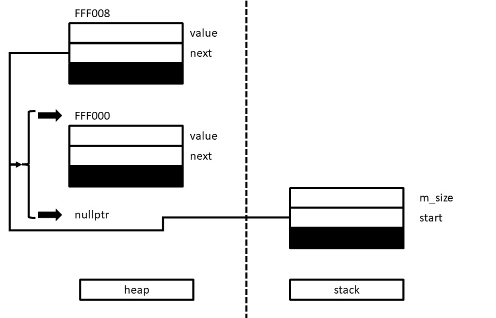

# 5.Collections


## 5.6. Iterating over a collection

**📌range-based `for` loop**

The syntax is like the following:

```c++
for(type variable : collection)
{
    body of the loop
}
```

<u>DISCLAIMER⚠</u>, the preceding feature is only supported in and after C++ 11 standard.


**📌`foreach` in Stanford Library**

The Stanford C++ libraries include an interface called `foreach.h` that uses the C++ preprocessor to define a `foreach` macro:

```c++
#include "foreach.h"
foreach(type variable in collection)
{
    body of the loop
}
```


**📌Iteration order**

Each collection class defines its own policy about iteration order, usually based on considerations of efficiency.

- `Vector` - iterate through index
- `Grid` - the default is row-major order
- `Map` - natural order, e.g. `int` as key - ascending order, `string` as key - lexicographic order
- `Set` & `Lexicon` - natural order
- `Stack` & `Queue` - can't be iterated⚠


# 6.Designing Classes

## 6.1. Representing points


**📌Instance Variable**

The fields of a class are called instance variables.

```c++
class Point
{
    public:
    	int x;
    	int y;
    private:
    	double a;
    	double b;
}
```

However, `public` instance variables are discouraged in modern object-oriented programming. Therefore, the following is more appropriate:

```c++
class Point
{
    public:
    // ..methods here
    
    private:
    	int x;
    	int y;
};
```


**📌A typical class skeleton**


**📌getter and setter**

Methods that retrieve the values of instance variables are formally called *accessors*, but are more often known as ***getters***.

Methods that set the values of specific instance variables are called *mutators* or ***setters***.

> ​	💡These concepts are the same as in `get` and `set` properties in C#.


**📌immutable**

Before talking about it, I want to introduce you that in history many programmers insist that instance member should not be modified one initialized since it is private. Such class are said to be **immutable**. The preceding diagram of `Point` class is a good example.

> ​	💡However, this is just one of opinion. You are free to choose the strategies.


**📌C++ Class Boilerplate🌟🌟🌟 - separate the interface from the implementation**

This idea results 2 files - header file and source file.

> ​	Header file:

```c++
/*
 * File: point.h
 * -------------
 * This interface exports the Point class, which represents a point on
 * a two-dimensional integer grid.
 */

#ifndef _point_h
#define _point_h

#include <iostream>
#include <string>

class Point {

public:

/*
 * Constructor: Point
 * Usage: Point origin;
 *        Point pt(xc, yc);
 * ------------------------
 * Creates a Point object.  The default constructor sets the coordinates
 * to 0; the second form sets the coordinates to xc and yc.
 */

   Point();
   Point(int xc, int yc);

/*
 * Methods: getX, getY
 * Usage: int x = pt.getX();
 *        int y = pt.getY();
 * -------------------------
 * These methods return the x and y coordinates of the point.
 */

   int getX();
   int getY();

/*
 * Method: toString
 * Usage: string str = pt.toString();
 * ----------------------------------
 * Returns a string representation of the Point in the form "(x,y)".
 */

   std::string toString();

/* Private section */

private:

/* Friend declaration */

   friend bool operator==(Point p1, Point p2);

/* Instance variables */

   int x;                    /* The x-coordinate */
   int y;                    /* The y-coordinate */

};

/* ----------------⚠THINGS OUTSIDE OF HEADFILE⚠----------------- */

/*
 * Operator: <<
 * Usage: cout << pt;
 * ------------------
 * Overloads the << operator so that it is able to display Point values.
 */

std::ostream & operator<<(std::ostream & os, Point pt);

/*
 * Operator: ==
 * Usage: p1 == p2
 * ---------------
 * Implements the == operator for points.
 */

bool operator==(Point p1, Point p2);

/*
 * Operator: !=
 * Usage: p1 != p2
 * ---------------
 * Implements the != operator for points.  It is good practice to
 * overload this operator whenever you overload == to ensure that
 * clients can perform either test.
 */

bool operator!=(Point p1, Point p2);

#endif

```

> ​	Source file:

```c++
/*
 * File: point.cpp
 * ---------------
 * This file implements the point.h interface.  The comments have been
 * eliminated from this listing so that the implementation fits on a
 * single page.
 */

#include <string>
#include "point.h"
#include "strlib.h"
using namespace std;

Point::Point() {
   x = 0;
   y = 0;
}

Point::Point(int xc, int yc) {
   x = xc;
   y = yc;
}

int Point::getX() {
   return x;
}

int Point::getY() {
   return y;
}

string Point::toString() {
   return "(" + integerToString(x) + "," + integerToString(y) + ")";
}

bool operator==(Point p1, Point p2) {
   return p1.x == p2.x && p1.y == p2.y;
}

bool operator!=(Point p1, Point p2) {
   return !(p1 == p2);
}

ostream & operator<<(ostream & os, Point pt) {
   return os << pt.toString();
}

```


# 11.Pointers and Array


**📌NULL/garbage poitner**

```c++
int* p1 = nullptr;
cout << pt << endl;  //0
cout << *pt << endl;  //KABOOM

// testing for nullness
if(p1 == nullptr)  {...}  //true
if(p1)             {...}  //false 👈regular version
if(!p1)            {...}  //true  👈regular version
```


**📌non-pointer and pointer initialization**⭐

I have been confused for a long time why we have 2 different ways of initialization.

```c++
// non-poitner
Date d1;
d1.month = 4;
d1.day = 21;
// pointer
Date* d2;
d2->month = 4;
d2->day = 20;
```

The main difference is that the later one <u>***will not be deleted automatically by the garbage collection***</u>!!

```c++
// non-poitner
void foo1()
{
    Date d1;
    d1.month = 4;
    d1.day = 21;
    ...
    
    // d1 will be thrown away once out of this scope
}

// pointer
void foo2()
{
    Date* d2;
    d2->month = 4;
    d2->day = 20;
    ...
    
    // d2 will NOT be thrown away!
}

```


**📌Fun Fact of `->`**

```c++
// The followings are the same!
d2->month = 4;
(*d2).month = 4;
```

So `->` is a <u>shorthand</u> for **dereference and then access**.


**📌Deep Insight of Linked List**

```c++
struct ListNode
{
	int num;
    ListNode* next;
};
```


**📌Reassigning Pointers**

Suppose you have the following relation:


What should the following look like?

1️⃣

```c++
a->next = b->next;
```


2️⃣

```c++
a = b->next;
```


 3️⃣

```c++
a = b;
```


4️⃣

```c++
a->next->next = b;
```


**📌Incorrect Ways Implementing Linked List**

The `addFront` is the following:

```c++
void addFront(ListNode* front, int value)
{
    ListNode* temp = new ListNode(value);
    temp->next = front;
    front = temp;
}

// the client code
int main()
{
    ListNode* list = ...;
    addFront(list, 10);
}
```

Unfortunately, it does not work that way:


It only update the local variable `front`!🙁🙁Because the pointer is not passed by reference...


**📌Correct Way Implementing Linked List**

And you have to pass by reference:

```c++
void addFront(ListNode*& front, int value)
{
    //...
}
```

So fxxking weird!😱 But that is how it is...


**📌Destroy an Array**

```c++
// constructor
ArrayStack::ArrayStack()
{
    elements = new int[10]();
    size = 0;
    capacity = 10;
}

// destructor
ArrayStack::~ArrayStack()
{
    // 🤚 When you delete an array, you have to => `delete[] `; others are fine
    delete[] elements;
}
```


# 12.Dynamic Memory Management


## 12.4. Defining a `CharStack` class

**📌Interface Defined**

The following interfaces are defined:

- constructor
- destructor
- `size()`
- `isEmpty()`
- `clear()`
- `push()`
- `pop()`
- `peek()`


**📌My Implementation**

Before reading the book, I tried to do [it](https://github.com/XingxinHE/CPP_Notes/commit/86f75e7c3d28e94f9f01afdf8195ec867f642c83) by myself. However, there is some code better than my version.

> ​	1.Fewer Variable

```c++
//🤚Can be implemented
void CharStack::resize(bool isIncrement)
{
    if (isIncrement)
    {
        char *pNew = new char[m_capacity * 2];
        for (int i = 0; i < m_capacity; i++)
        {
            pNew[i] = m_pArray[i];
        }
        char *pTemp = m_pArray;
        m_pArray = pNew;
        delete[] pTemp;
        m_capacity *= 2;
    }
    else
    {
        char *pNew = new char[int(0.5 * m_capacity)];
        for (int i = 0; i < m_count; i++)
        {
            pNew[i] = m_pArray[i];
        }
        char *pTemp = m_pArray;
        m_pArray = pNew;
        delete[] pTemp;
        m_capacity = int(0.5 * m_capacity);
    }
}
```

In the `resize()` function, I used 3 variables which is redundant. The following is implemented:

```c++
char *oldPtr = m_pArray;                  //👈I declare an oldPtr which points to what m_pArray points to.
m_pArray = new char[m_capacity * 2];      //👈m_pArray is expanded with new memory
for (int i = 0; i < m_capacity; i++)
{
    m_pArray[i] = oldPtr[i];
}
delete[] oldPtr;                          //👈Just delete the old one is fine
m_capacity *= 2;
```

> ​	2.Modify Capacity Directly

```c++
if (isIncrement)
{
    char *oldPtr = m_pArray;
    m_pArray = new char[m_capacity * 2];
    for (int i = 0; i < m_capacity; i++)
    {
        m_pArray[i] = oldPtr[i];
    }
    delete[] oldPtr;
    m_capacity *= 2;
}
else
{
    char *pNew = new char[int(0.5 * m_capacity)];
    for (int i = 0; i < m_count; i++)
    {
        pNew[i] = m_pArray[i];
    }
    char *pTemp = m_pArray;
    m_pArray = pNew;
    delete[] pTemp;
    m_capacity = int(0.5 * m_capacity);
}
```

> ​	3.Increment the Index

```c++
//🤚Can be implemented
void CharStack::push(char input)
{
    if (m_count == m_capacity)
    {
        resize(true);
    }
    
    m_pArray[m_count] = input;        //👈Can be implemented
    m_count++;						  //👈
}
```

The increment can be done in one sentence.

```c++
void CharStack::push(char input)
{
    if (m_count == m_capacity)
    {
        resize(true);
    }
    m_pArray[m_count++] = input;        //👈Increment right away
}
```

> ​	4.The Array Needn't to Refill Item

```c++
//🤚Can be implemented
char CharStack::pop()
{
    if(!isEmpty())
    {
        char item = m_pArray[m_count-1];     //👈The top-most element is exactly (current index - 1)
        m_pArray[m_count-1] = '\0';
        m_count--;                           //👈
        if (m_count < (0.5 * m_capacity))
        {
            resize(false);
        }
        return item;
    }
    else
    {
        return '\0';
    }
}
```

Can be implemented to:

```c++
if(!isEmpty())
{
    m_count--;
    if (m_count < (0.5 * m_capacity))
    {
        resize(false);
    }
    return m_pArray[m_count];
}
```


## 12.10. LinkedList by myself


```c++
ostream& operator<<(ostream &os, const LinkedIntList &list)
{
    LinkNode *temp = list.start;
    while(temp != nullptr)
    {
        os << temp->value << endl;
        temp = temp->next;
    }

    return os;
}
```

=>

```c++
ostream& operator<<(ostream &os, const LinkedIntList &list)
{
    for(LinkNode *temp = list.start; temp != nullptr; temp = temp->next)
    {
        os << temp->value << endl;
    }

    return os;
}
```


```c++
LinkNode *temp = start;
while(temp->next != nullptr)
{
    temp = temp->next;
}

temp->next = tail;
```

=>

```c++
LinkNode *temp = start;
for(; temp->next != nullptr; temp = temp->next);
temp->next = tail;
```


**📌Implementation of `LinkNode`**

```c++
struct LinkNode
{
    int value;
    LinkNode *next;
};
```

=>

```c++
struct LinkNode
{
    int value;
    LinkNode *next;
	// 🤚add a constructor
    LinkNode(int _value)
            :value(_value), next(nullptr)
    {
    }
};
```


```c++
start = new LinkNode;
start->next = nullptr;
start->value = value;
```

=>

```c++
start = new LinkNode(value);
```


**📌Implementation of `addFront(int )`**🌟

```c++
void LinkedIntList::addFront(const int value)
{
    m_size++;
    if(start != nullptr)
    {
        LinkNode *old = start;
        start = new LinkNode(value);
        start->next = old;
    }
    else
    {
        start = new LinkNode(value);
    }
}
```

=>

```c++
void LinkedIntList::addFront(const int value)
{
    m_size++;

    LinkNode *newNode = new LinkNode(value);
    newNode->next = start;
    start = newNode;
}
```

The implementation doesn't give a shit on whether `start` is a `nullptr` or not. **<u>What really matters is what `start` points to!!</u>**


Like the preceding diagram, the `start` points to either a `nullptr` or a piece new node `FFF000`. It doesn't matter.

When you:

```c++
newNode->next = start;
```



It means what `newNode` will `next` point to is what `start` points to. And the following line of code:

```c++
start = newNode;
```


It literally means that the `start` points to `newNode`.


**📌Implementation of `operator<<`**

The following code is kind of dangerous.

```c++
ostream& operator<<(ostream &os, const LinkedIntList &list)
{
    os << "Start -> ";
    for(LinkNode *temp = list.start; temp != nullptr; temp = temp->next)
    {
        os << temp->value << " ->";
    }
    os << endl;
    return os;
}
```

A check should be a must.

```c++
ostream& operator<<(ostream &os, const LinkedIntList &list)
{
    os << "Start: { -> ";
    if(!list.isEmpty())     //🤚This check is a must.
    {
        for(LinkNode *temp = list.start; temp != nullptr; temp = temp->next)
        {
            os << temp->value << " -> ";
        }
    }
    os << "}" << endl;
    return os;
}
```


**📌Implementation of Traversal Strategy**

Since this linked list is single direction linked list, therefore it is hard to find the previous node. The following are 2 strategies to find matched node. Suppose

> ​	Find the previous node:  [*]-[x]-[ ]

```c++
// suppose 'x' is the value you want to search, then we can both track the previous '*'
// traverse the list to the end, if necessary
ListNode *curr = start;
ListNode *prev = nullptr;

while (curr != nullptr) 
{
    if (curr->data == value) 
    {
        break;
    }
    prev = curr;
    curr = curr->next;
}
```

> ​	Find the current node: [ ]-[x]-[ ]

```c++
// suppose 'x' is the value you want to search, then just search 'x'
// here is an elegant recursive function
LinkNode* LinkedIntList::search(LinkNode *startNode, const int value) const
{
    if (startNode == nullptr)
    {
        return nullptr;
    }
    else if(startNode->value == value)
    {
        return startNode;
    }
    else
    {
        return search(startNode->next, value);
    }
}
```

> ​	Elegant Recursive find the previous node: [*]-[x]-[ ]

```c++
void LinkedIntList::search(LinkNode *&prevNode, LinkNode *&currNode, const int value)
{
    if (currNode == nullptr)
    {
        return;
    }
    else if(currNode->value == value)
    {
        return;
    }
    else
    {
        prevNode = currNode;
        currNode = currNode->next;
        search(prevNode, currNode, value);
    }
}
```


**📌A pointer after `delete`  is not `nullptr`**

The following code how I implement `clear()`, in the end the `start` is not `nullptr`.

```c++
void LinkedIntList::clear()
{
    release(start);
}

void LinkedIntList::release(LinkNode* currNode)
{
    if(currNode->next == nullptr)
    {
        delete currNode;
        return;
    }
    else
    {
        release(currNode->next);
        delete currNode;
    }
}
```

You can either place a `nullptr` after calling `release()`, or you can do the following:

```c++
void LinkedIntList::clear()
{
    while (start != nullptr) 
    {
        LinkNode *temp = start;
        start = start->next;
        delete temp;
    }
}
```

or make the recursive version:

```c++
void LinkedIntList::clear()
{
    release(start);
}

void LinkedIntList::release(LinkNode *&currNode)
{
    if(currNode != nullptr)
    {
        LinkNode *old = currNode;
        currNode = currNode->next;
        release(currNode);
    }
}
```


# Review Questions

## Chapter 1

> ​	20.How do you specify a shorthand assignment operation?

The shorthand assignment operation is the following

```c++
x+=3;
```


> ​	26.What for loop control line would you use in each of the following situations?

a.	Counting from 1 to 100

```c++
for (int i = 1; i <= 100; i++)
```

b.	Counting by sevens starting at 0 until the number has more than two digits

```c++
for (int i = 0; i < 100; i += 7)
```

c.	Counting backward by twos from 100 to 0

```c++
for (int i = 100; i >= 0; i -= 2)
```


## Chapter 2


## Chapter 3

> ​	9.What two syntactic forms does this chapter describe for selecting an individual character from a string?  How do these two syntactic forms differ in their implementation?

There are 2 syntatics forms:

- `str[index]`
- `str.at(index)`

The difference is that the `at()` method will check if the index is in bounds which is **safer**.


> ​	14.Describe how the **compare** method uses the return value to indicate the relative ordering of two strings. Why is this method rarely used in practice?

The `compare()` method is like the following:

```c++
int receiver.compare(/* argument */);
```

There are 3 cases:

- `==0`, the length is equal between receiver and sender
- `<0`, the length of receiver is smaller than the length of sender
- `>0`, the length of receiver is greater than the length of sender


> ​	21.What is the result of each of the following calls to the `<cctype>` library:

```c++
bool flag = isdigit(7);    //false
bool flag = isdigit('7');  //true
bool flag = isalnum(7);    //false
int cha = toupper(7);      //7, and this does not throw an error
char cha = toupper('A');   //'A'
char cha = tolower('A');   //'a'
```


> ​	23.How can you convert a primitive string value to a C++ string? How can you specify a conversion in the opposite direction?

```c++
// C => C++
string str = string(cstr);

// C++ => C
str.c_str();
```


## Chapter 5

> ​	2.What three advantages does this chapter cite for separating the behavior of a class from its underlying implementation?

- Simplicity
- Flexibility
- Security


> ​	21.Describe in your own words what is meant by the term *discrete time* in the context of a simulation program.

 The simulation is divided into discrete units which is short enough to work.


## Chapter 6

> ​	8.What does it mean for a class to be *immutable*?

A class whose internal state can't be modified after initialization. It's kind of like `readonly` in C#.


> ​	12.How does C++ differentiate between the prefix and suffix versions of the `++` and `--` operators?

Suffix takes a dummy argument to prevent violating identical declaration. For example:

```c++
// prefix version
Direction operator++(Direction &dir)
{
    dir = Direction(dir + 1);
    return dir;
}

// suffix version
Direction operator++(Direction &dir, int)  // the int is a dummpy argument which will never be used.
{
    Direction old = dir;
    dir = Direction(dir + 1);
    return old;
}
```


> ​	18.What are the 5 steps suggested in this chapter as guidelines for designing a class?

They are:

- Standing in the perspective of clients, thinking about how would they do(behavior and interface)
- Select which kinds of data should be private
- Design a trail of constructors for different circumstances
- Think about the public functions as the methods of the class
- Code and test the implementation


> ​	22.In the `rational.h` file, why is it necessary to designate the operator methods for `+,-,*,/` as `friend` but not the operator method for the `<<` insertion operator?

Because the `<<` operator does not access the private data member.


## Chapter 11

> ​	2.


# Exercises


# Stanford Library

```c++
// a header replace cin
#include "simpio.h"

string fullname = getLine("Student name? ");
int age = getInteger("How old are you? ");
double gpa = getReal("What's your GPA? ");
if(getYesOrNo("Destroy the universe?")) { }
```


```c++
#include "strlib.h"

endsWith(str, suffix);
startsWith(str, prefix);

integerToString(int);
realToString(double);
stringToInteger(str);
stringToReal(str);

equalsIgnoreCase(s1, s2);//ignore casing, compare these 2 strings

toLowerCase(str);
toUpperCase(str);

trim(str);               //trim the white space
```


Chapter 5

Abstract Data Type


```c++
#include "vector.h"

Vector<int> nums {42, 17, 6};
Vector<string> names;
names.add("Marty");
names.insert(0, "Martin");
names.remove(1);

// nested vector
// pay attention here!! the space ' ' between `>` and `>`
vector<vector<int> > vv
{
    {1}, {2, 3, 4}, {5, 6, 7, 8}  
};


```


⭐

```c++
#include "grid.h"

Grid<int> matrix1(3,4);
matrix[0][0] = 75;

Grid<int> matrix2 = 
{
    {1, 0, 0},
    {0, 1, 0},
    {0, 0, 1}
};
```


```c++
#include "linkedlist.h"

// init
LinkedList<int> list;
for(int i = 0; i < 8; i++)
{
    list.add(10 * i);
}


```


```c++
#include "stack.h"

// RULE: Last In, First Out ("LIFO")

// push | Add an element to the top
// pop  | Remove the top element
// peek | Examine the top element

// WRONG WAY USING STACK❌
Stack<int> s;
for (int i = 0; i < s.size(); i++)
{
    // do something
}

// COMMON IDIOM
while (!s.isEmpty())
{
    // do something with s.pop()
}


```


```c++
#include "queue.h"

// RULE: FIRST IN FIRST OUT ("FIFO")

// enqueue | add an element to the back
// dequeue | remove the front element
// peek    | examine the front element

Queue<int> q;
q.enqueue(42);
q.enqueue(-3);
q.enqueue(17);
cout << q.dequeue() << endl;
cout << q.peek() << endl;
cout << q.dequeue() << endl;

while(!q.isEmpty())
{
    // do something with q.dequeue();
}
```


```c++
#include "gwindow.h"


```


Exhaustive Search


# -------Code and Assignment-------

# Section 1

**📌Deduplicating**

> ​	The effect should be the following:

```c++
Vector<string> hiddenFigures = {
    "Katherine Johnson",
    "Katherine Johnson",
    "Katherine Johnson",
    "Mary Jackson",
    "Dorothy Vaughan",
    "Dorothy Vaughan"
};

deduplicate(hiddenFigures);
// hiddenFigures = ["Katherine Johnson", "Mary Jackson", "Dorothy Vaughan”]
```

> Error Function❌

```c++
void deduplicate(Vector<string> vec) {
    for (int i = 0; i < vec.size(); i++) {
        if (vec[i] == vec[i + 1]) { 
            vec.remove(i);
        }
    }
}
```

The preceding function is with bugs:

- The input parameter is not pass by reference
- It will access index has been culled


> ​	Fixed Version✔

```c++
void deduplicate(Vector<string> &vec) {
    if (vec.isEmpty())
    {
        return;
    }

    int size = vec.size();
    for (int i = 0; i < size; i++)
    {
        // prevent the index out of range
        while ( (i + 1 < size) && (vec[i] == vec[i + 1]))
        {
            vec.remove(i + 1);
            size = vec.size();  // update the size, so the for loop shrink
        }
    }
}
```


> ​	Fixed Version 1✔

```c++
void deduplicate1(Vector<string> &vec)
{
    // check the size every loop
    for(int i = 0; i < vec.size();)
    {
        if( (i+1<vec.size()) && (vec[i]==vec[i+1]))
        {
            vec.remove(i+1);
        }
        else
        {
            // increment here, not the for loop
            i++;
        }
    }
}
```


> ​	Fixed Version 2✔⭐

```c++
void deduplicate2(Vector<string> &vec)
{
    for(int i = vec.size()-1; i>0; i--)
    {
        if(vec[i] == vec[i-1])
        {
            vec.remove(i);
        }
    }
}
```

The preceding algorithm is kind of smart. It loops from the back and delete from the back. Therefore, you don't need to check at all! This is also the c<u>ommon delete algorithm of linear collection</u>.


# Section 7

**📌Inserting into a Linked List**

The comments are the equivalent code. The idea is that <u>**treat the front as a special case**</u>.

```C++
void insert(StringNode*& front, int index, string value) {
    if(index < 0)
    {
        error("The index is negative.");
    }
    if(index == 0)
    {
//        StringNode *node = new StringNode;
//        node->data = value;
//        node->next = front;
//        front = node;

        StringNode *node = new StringNode{value, front};
        front = node;
    }
    else
    {
        StringNode *temp = front;
        for(int i = 1; i < index; i++)
        {
            temp = temp->next;
        }

        temp->next = new StringNode{value, temp->next};
//        StringNode *node = new StringNode;
//        node->data = value;
//        node->next = temp->next;
//        temp->next = node;
    }
}
```


**📌Remove All Threshold**

The algorithm should remove numbers with threshold.

```c++
removeAllThreshold(front, 3.0, .3)
```

From:
$$
\{ 3.0, 9.0, 4.2, 2.1, 3.3, 2.3, 3.4, 4.0, 2.9, 2.7, 3.1, 18.2\}
$$
to:
$$
\{{9.0, 4.2, 2.1, 2.3, 3.4, 4.0, 18.2}\}
$$
I think my algorithm is quite elegant.

```c++
void removeAllThreshold(DoubleNode*& front, double value, double threshold) {
    DoubleNode *prev = nullptr;
    DoubleNode *curr = front;
    while(curr != nullptr)
    {
        if(value-threshold <= curr->data && curr->data <= value+threshold)
        {
            DoubleNode *deleteNode = curr;
            if(curr == front)
            {
                front = front->next;
                curr = curr->next;
            }
            else
            {
                prev->next = curr->next;
                curr = curr->next;
            }
            delete deleteNode;
        }
        else
        {
            prev = curr;
            curr = curr->next;
        }
    }
}
```


**📌Double List**

The double list should convert:
$$
\{{1, 3, 2, 7}\}
$$
to:
$$
\{{1, 3, 2, 7, 1, 3, 2, 7}\}
$$

> ​	👌

```c++
void doubleList(Node*& front)
{
    if(front == nullptr) return;
    Node *prevTail = nullptr;
    Node *tail = front;
    Node *newHead = nullptr;
    Node *newTail = nullptr;
    for(; tail != nullptr; prevTail = tail, tail = tail->next)
    {
        if(newHead == nullptr)
        {
            newHead = new Node{tail->data, nullptr};
            newTail = newHead;
        }
        else
        {
            newTail->next = new Node{tail->data, nullptr};
            newTail = newTail->next;
        }
    }
    prevTail->next = newHead;
}
```

This is quite redundant. The key issue is that:

- I used `for` loop and <u>**iterate the pointer after assign the value⚠**</u>. Therefore require a "previous" node of the last node.

> ​	👌+👍

The following is the much more elegant algorithm. The key step is that <u>**iterate the pointer before assign the value🙌**</u>.

```c++
void doubleList(Node*& front)
{
    if(front == nullptr) return;
    Node *travNode = front;
    Node *copyHead = new Node{front->data, nullptr};
    Node *copyTail = copyHead;
    while(travNode->next != nullptr)
    {
        travNode = travNode->next;
        copyTail->next = new Node{travNode->data, nullptr};
        copyTail = copyTail->next;
    }
    travNode->next = copyHead;
}
```


**📌Braiding a Linked List(weaving)**

It does the following:

<div align="center">
    {1, 4, 2} -> {1, 2, 4, 4, 2, 1}<br>
{3} -> {3, 3}<br>
{1, 3, 6, 10, 15} -> {1, 15, 3, 10, 6, 6, 10, 3, 15, 1}
</div>

> ​	Not recursion version

```c++
void braid(Node*& front)
{
    // make a reverse order one
    Node *reverse = nullptr;
    for (Node *curr = front; curr != nullptr; curr = curr->next) {
        Node *newNode = new Node{curr->data};
        newNode->next = reverse; 
        reverse = newNode;
    }

    // weave it
    for (Node *curr = front; curr != nullptr; curr = curr->next->next) {
        Node *next = reverse->next;
        reverse->next = curr->next;
        curr->next = reverse;
        reverse = next;
    }
}
```

> ​	Recursive version

```c++
void braidHelper(Node *& main, Node *element1, Node *element2)
{
    if(element1 != nullptr && element2 != nullptr)
    {
        main = new Node{element1->data, nullptr};
        main->next = new Node{element2->data, nullptr};
        braidHelper(main->next->next, element1->next, element2->next);
    }
}

void braid(Node*& front)
{
    Node *tail = front;
    Node *head = front;
    
    // make a reverse copy
    Node *revHead = new Node{front->data, nullptr};
    while(tail->next != nullptr)
    {
        tail = tail->next;
        Node *prevHead = revHead;
        revHead = new Node{tail->data, prevHead};
    }
    
    front = nullptr;
    braidHelper(front, head, revHead);
}
```


# Section 8

**📌The height of that tree**

The function prototype is:

```c++
int height(TreeNode* node);
```

Apparently, this should be a recursive function. My code is the following:

> ​	👌

```c++
int height(TreeNode *node) {
    if(node == nullptr)
    {
        return 0;
    }
    else if(node->left == nullptr && node->right != nullptr)
    {
        return 1 + height(node->right);
    }
    else if(node->left != nullptr && node->right == nullptr)
    {
        return 1 + height(node->left);
    }
    else if(node->left != nullptr && node->right != nullptr)
    {
        return 1 + max(height(node->left), height(node->right));
    }
    else
    {
        return 1;
    }
}
```

The idea is to see whether the left or right branch has more depth. However, it has redundancy and it can be optimized as:

> ​	👌+✅+👍

```c++
int height(TreeNode * node)
{
    if (node == nullptr)
    {
        return 0;
    }
    else
    {
        return 1 + max(height(node->left), height(node->right));
    }
}
```

Very elegant!


**📌Tree Equality**

Write a function:

```c++
bool areEqual(TreeNode* one, TreeNode* two);
```

to check the equality of two tree having the exact same <u>shape</u> and <u>contents</u>.

> ​	👌

```c++
bool areEqual(TreeNode* one, TreeNode* two)
{
    // can be combine (1/2)
    if(one == nullptr && two == nullptr)
    {
        return true;
    }
    else if(one != nullptr && two != nullptr)
    {
        // 2 tree are equal meaning both a. shape b. content
        return one->data == two->data &&
               areEqual(one->left, two->left) &&
               areEqual(one->right, two->right);
    }
    // can be combine (2/2)
    else
    {
        return false;
    }
}
```

The preceding code actually has some space to be optimized.

> ​	👌+✅+👍

```c++
bool areEqual(TreeNode* one, TreeNode* two)
{
    if(one == nullptr || two == nullptr)
    {
        return one == two;  //if both are null, they are true, other wise is false
    }
    else //both are not nullptr
    {
        return one->data == two->data &&
               areEqual(one->left, two->left) &&
               areEqual(one->right, two->right);
    }
}
```

This is much more elegant! 


**📌Count Left Nodes**

A left child is a node that appears as the root of a left-hand subtree of another node.

```
     3
    / \
   /   \
  5     2
/      / \
1     4    6
```

For example, the left nodes of the preceding is `5,1,4`.

> ​	👌+👍

```c++
int countLeftNodes(TreeNode *node)
{
    if(node == nullptr) return 0;
    else
    {
        // my strategy is to sum up all the left and right
        // the strategy is straight forward.
        int count = 0;
        if(node->left != nullptr)
        {
            count++;
            count += countLeftNodes(node->left);
        }
        if(node->right != nullptr)
        {
            count += countLeftNodes(node->right);
        }
        return count;
    }
}
```

> ​	👌+👍

```c++
int countLeftNodes(TreeNode *node)
{
    if (node == nullptr)
    {
        return 0;
    }
    // it first tries to look whether its left branch is empty
    else if (node->left == nullptr)
    {
        return countLeftNodes(node->right);
    }
    else
    {
        return 1 + countLeftNodes(node->left) + countLeftNodes(node->right);
    }
}
```


**📌Find out Tree is Balanced**

A tree <u>is balanced</u> if its left and right subtrees are balanced trees whose heights <u>**differ by at most 1**</u>.

For example:


The following algorithm is beautiful and it is a bit hard to understand...

```c++
bool isBalanced(TreeNode *node)
{
    if(node == nullptr) return true;
    // ⭐ the key step (recursive) is designed as followed 
    else if(!isBalanced(node->left) || !isBalanced(node->right))
    {
        return false;
    }
    // ⭐ the key step (count the height) is designed as followed 
    else
    {
        int leftHeight = height(node->left);
        int rightHeight = height(node->right);
        return abs(leftHeight - rightHeight) <= 1;
    }
}
```


**📌Remove Leaves**

This one is pretty simple.


```c++
void removeLeaves(TreeNode*& node) {
    if(node == nullptr) return;
    else if(node->left == nullptr && node->right == nullptr)
    {
        delete node;
        node = nullptr;  //you can do this since node is passed by reference!
        return;
    }
    else
    {
        removeLeaves(node->left);
        removeLeaves(node->right);
        return;
    }
}
```


**📌The Ultimate and Penultimate Values**

That 2 values refer to biggest and second biggest value. For the first one, it is quite easy.

> ​	Biggest(iterative version)

```c++
TreeNode* biggestNodeIn(TreeNode* root) {
    if(root == nullptr) return nullptr;
    else
    {
        TreeNode *node = root;
        for(; node->right != nullptr; node = node->right);
        return node;
    }
}
```

> ​	Biggest(recursive version)

```c++
TreeNode* biggestNodeIn(TreeNode* root) {
    if (root == nullptr) error("Nothing to see here, folks.");
    if (root->right == nullptr) return root;
    return biggestNodeIn(root->right);
}
```

> ​	Second Biggest

For second biggest, there are 2 cases which require a "previous" variable to store that value.

//TODO a diagram here

```c++
TreeNode* secondBiggestNodeIn(TreeNode* root) {
    if(root == nullptr) return nullptr;
    else
    {
        TreeNode *prev = nullptr;
        TreeNode *curr = root;
        for(; curr->right != nullptr; prev = curr, curr = curr->right);
        if(curr->left != nullptr)
        {
            return biggestNodeIn(curr->left);
        }
        else
        {
            return prev;
        }
    }
}
```


**📌Checking BST Validity**

This one is super hard which requires checking every node in "inorder" and ensures they are sorted.

//TODO - digest this one.

```c++
bool isBSTRec(TreeNode* lowBound, TreeNode* root, TreeNode* highBound)
{
    if(root == nullptr) return true;
    else
    {
        if(lowBound != nullptr && lowBound->data >= root->data)
        {
            return false;
        }
        if(highBound != nullptr && highBound->data <= root->data)
        {
            return false;
        }

        return isBSTRec(lowBound, root->left, root)
             &&isBSTRec(root, root->right, highBound);
    }
}

bool isBST(TreeNode* root)
{
    if(root == nullptr) return true;
    else
    {
        return isBSTRec(nullptr, root, nullptr);
    }
}
```


# Assignment 1

**📌`PlayingFair.cpp`**

This assignment is the one I think is the most tricky and fun! It is asked to implement a recursive algorithm which can produce the following order. This is the algorithm concerning the "fair", e.g. in Ban-Pick of a League of Legend Game.


The secrect is to make the order in cross reference order. Taking the "Order 2" as an example:


The very smart algorithm is the following:

```c++
string aSequenceOfOrder(int n) {
    if(n == 0)
    {
        return "A";
    }
    else if(n < 0)
    {
        error("Index is smaller than 0!!");
    }
    else
    {
        return aSequenceOfOrder(n-1)+bSequenceOfOrder(n-1);
    }

}

string bSequenceOfOrder(int n) {
    if(n == 0)
    {
        return "B";
    }
    else if(n < 0)
    {
        error("Index is smaller than 0!!");
    }
    else
    {
        return bSequenceOfOrder(n-1)+aSequenceOfOrder(n-1);
    }
}
```


**📌`Sandpiles.cpp`**

From this assignment, I figure out a good idea on implementing recursive function:

- 1️⃣ Think about the base case first!
- 2️⃣ Focous the action on one iteration, that's it! The rest throw in the recursive.

The sandpiles function demands the following behavior:


When a cell is up to 4, its cardinal direction cell increments **1** and itself becomes **0**. If the `row` and `col` is out of bound, never mind.

```c++
void dropSandOn(Grid<int>& world, int row, int col) {
    // out of bounds, return
    if(!world.inBounds(row, col))
    {
        return;
    }
    // in bounds, increment
    world[row][col]++;

    // sum up to 4, spread it!
    if(world[row][col] == 4)
    {
        world[row][col] = 0;
        dropSandOn(world, row+1, col);
        dropSandOn(world, row, col+1);
        dropSandOn(world, row-1, col);
        dropSandOn(world, row, col-1);
    }
    else
    {
        return;
    }
}
```

The test case could be:

```c++
PROVIDED_TEST("Non-chaining topples work.") {
    /* Create a simple source grid. */
    Grid<int> before = {
        { 0, 0, 0 },
        { 1, 3, 1 },
        { 0, 2, 0 }
    };
    Grid<int> after = {
        { 0, 1, 0 },
        { 2, 0, 2 },
        { 0, 3, 0 }
    };

    dropSandOn(before, 1, 1);
    EXPECT_EQUAL(before, after); // The above call changes 'before.'
}
```


# Assignment 2

## **`RisingTides.cpp`**⭐

The assignment is asked to implment an algorithm to mimic the <u>**flooding**</u> of a <u>**terrain**</u>.


The idea here is to adopt <u>***breadth-first search***</u> algorithm! It is fun! *<u>Breadth-first search</u>* is typically implemented by using a <u>**queue**</u>🤘 that will process every <u>*flooded location*</u>. The idea is the following: 

- 1️⃣ we begin by iterating each water sources, enqueuing those flooded regions💧. 
- 2️⃣ we’ll then dequeue the flooded regions, test if *<u>its adjacent cells</u>* in cardinal directions⬆⬇⬅➡ are flooded. If flooded, enqueue in the queue
- 3️⃣ keep iterates until it the queue is empty

The following is the pseudo code:

```
  create an empty queue;
 for (each water source at or below the water level)
 {
     flood that square;
     add that square to the queue;
 }
 while (the queue is not empty) 
 {
     dequeue a position from the front of the queue;
     for (each square adjacent to the position in a cardinal direction) 
     {
         if (that square is at or below the water level and isn't yet flooded) 
         {
             flood that square;
             add that square to the queue;
         }
     }
 }
```

The following is the code:

```c++
Grid<bool> floodedRegionsIn(const Grid<double>& terrain,
                            const Vector<GridLocation>& sources,
                            double height) {

    // output is a Grid of bool indicating if it is flooded or not
    Grid<bool> floodRegion(terrain.numRows(), terrain.numCols(), false);

    // queue for test if its cardinal direction cell is flooded
    Queue<GridLocation> isFloodQueue;

    // enqueue the rain source, if the coord is flooded
    for(const GridLocation& loc : sources)
    {
        if(terrain.get(loc) <= height)
        {
            floodRegion.set(loc, true);
            isFloodQueue.enqueue(loc);
        }
    }

    // cardinal direction => (1,0) (0,1) (-1,0) (0,-1)
    Vector<int> cardinal_direction = {1, 0,-1, 0, 1};
    while(!isFloodQueue.isEmpty())
    {
        GridLocation loc = isFloodQueue.dequeue();
        int row = loc.row;
        int col = loc.col;

        for(int i = 0; i < cardinal_direction.size() - 1; i++)
        {
            // iterate its adjacent cell in its cardinal direction
            int adjacent_row = row + cardinal_direction[i];
            int adjacent_col = col + cardinal_direction[i+1];
            GridLocation adjacent_cell(adjacent_row, adjacent_col);

            // AND 3 criteria for processing a cell is flooded
            if(floodRegion.inBounds(adjacent_cell) &&            // the adjacent cell is in bounds
                    floodRegion.get(adjacent_cell) == false &&   // the adjacent cell is currently unflooded
                    terrain.get(adjacent_cell) <= height)        // the adjacent cell is lower than the height
            {
                floodRegion.set(adjacent_cell, true);
                isFloodQueue.enqueue(adjacent_cell);
            }
        }
    }

    return floodRegion;
}
```

I think there is one more super important thing I want to mention up here....⭐ Which is I used the `for` loop to iterate the cardinal directions.


If we start looking from `(1,0)` counter clockwise, we will find out that the points are:


We can cross reference the coordinate!!⭐⭐⭐ Therefore, I make a `Vector<int>` to iterate.


## **`RosettaStone.cpp`**

Few thing I learned from this exercise. The first thing is about

**📌Trigram**

> ​	What is it?

For the following string

<div align="center">
    A BANANA BANDANA
</div>

The trigram is the following:

```
"ANA": 3        " BA": 2		"A B": 2
"BAN": 2		"AND": 1		"DAN": 1
"NA ": 1		"NAN": 1		"NDA": 1
```

> ​	Comparison between languages using trigram

The following is the trigram of <u>**English**</u>:

```
" th": 667		"the": 616		"he ": 533
" an": 497		"nd ": 492		"and": 470
"ion": 423		" of": 376		" in": 375
"of ": 363		"tio": 333		"ed ": 320
"ing": 318		"man": 289		"ng ": 288
```

The following is the trigram of <u>**Spanish**</u>:

```
" de": 531		"os ": 396		"de ": 374
"ent": 298		" la": 293		"es ": 277
"la ": 239		"el ": 232		" co": 217
" es": 208		"en ": 198		"ien": 198
"nte": 196		"as ": 193		" en": 185
```

> ​	Application of trigram

The trigram is used to detect the similarity among languages. The following is one of the application where you browse the explorer on a foreign website with notification on the language.


**📌UTF-8**

In short, UTF-8 is a historical artifacts which can date back to 1980s when C++ was developed. At the beginning, the memory is scarce and developer can only use a little bit. Therefore the `char` is designed to support only **256** values. But as the world is more and more global, the `char` must not only support English but also other languages. Therefore, the UTF-8 is implemented to support these languages. The following is an example of UTF-8.

```html
\u4e0a\u6d77\u9b54\u5e7b\u75ab\u60c5
上海魔幻疫情
```


**📌Cosine Similarity**

The compare the similarity, we adopt the cosine similarity which does the following:

```
Profile 1			Profile 2

"aaa": 0.333		"bbb": 0.333
"bbb": 0.667		"ccc": 0.667
"ccc": 0.667		"ddd": 0.667
```

We only calculate the similarity between matched trigrams:

```
      (product of "bbb" frequencies) + (product of "ccc" frequencies)
    = (0.667 × 0.333) + (0.667 × 0.667)
    = 0.667
```


**📌Integer Overflow**

Suprisingly, the `.size()` and `.length()` functions return ***<u>unsigned integer</u>***, and therefore it may cause an error if we want to subtract from it.

```c++
// ERROR!!❌
string str = "HELLO";
int offset = 6;
for(int i = 0; i < str.length() - offset; i++)
{
    
}

// CHECK FIRST✅
if(str.length() < offset)
{
    return;
}
for(int i = 0; i < str.length() - offset; i++)
{
 	// running safe here   
}
```


**📌Code**

In general, this assignment is not hard which is credited to Prof and tutor who separated the big puzzle into several functions. Please refer to [here](../code/programming_abstraction_in_cpp/lecture/2021_autumn/Assignment_2/RosettaStone.cpp).


# Assignment 3

## `Sierpinski.cpp`


**📌What is the black and white standing for?**

Every triangle drawn here is black; the white triangles represent places where no triangle was drawn.


**📌Code**

```c++
/*
 * This is a helper function which actually draws the triangle
 */
void drawTriangle(GWindow& window,
                  double x0, double y0,
                  double x1, double y1,
                  double x2, double y2) {
    window.setColor("black");
    window.fillPolygon({ x0, y0, x1, y1, x2, y2 });

}

/*
 * The recursion functions.
 */
void drawSierpinskiTriangle(GWindow& window,
                            double x0, double y0,
                            double x1, double y1,
                            double x2, double y2,
                            int order) {
    // check validity
    if(order < 0)
    {
        return;
    }
    
    // draw a triangle if the order reaches 0
    if(order == 0)
    {
        drawTriangle(window, x0, y0, x1, y1, x2, y2);
    }
    // else keep segmenting...
    else
    {
        drawSierpinskiTriangle(
                    window,
                    x0,         y0,
                    (x0+x1)/2, (y0+y1)/2,
                    (x0+x2)/2, (y0+y2)/2,
                    order - 1);
        drawSierpinskiTriangle(
                    window,
                    x1,         y1,
                    (x0+x1)/2, (y0+y1)/2,
                    (x1+x2)/2, (y1+y2)/2,
                    order - 1);
        drawSierpinskiTriangle(
                    window,
                    x2,         y2,
                    (x2+x1)/2, (y2+y1)/2,
                    (x0+x2)/2, (y0+y2)/2,
                    order - 1);
    }
}
```


## `HumanPyramids.cpp`

**📌Problem Definition**

The problem is asked to calculate the **<u>weight</u>** of a specific person. The weight per person is 160 pounds.


For example, the weight of E is the following:
$$
\begin{align}
E &= \frac{1}{2}(B+\frac{1}{2}A)+\frac{1}{2}(C+\frac{1}{2}A)\\
&= \frac{1}{2}(160+\frac{1}{2}160)+\frac{1}{2}(160+\frac{1}{2}160)\\
&= 80 + 40 + 80 + 40\\
&=240
\end{align}
$$
For simplicity, we use coordinate the identify the person:


**📌Design the Recursion**

- the base case => the top node which has nothing above it, therefore <u>**returns 0**</u>.
- the regular case
  - **left node** => <u>only right parent above it</u>
  - **nodes in between** => <u>both left and right parents above it</u>
  - **right node** => <u>only left parent above it</u>

```c++
double weightOnBackOf(int row, int col, int pyramidHeight) {
    // check validity
    if(row < 0 || col < 0)
    {

        error("Row and Column can't be less than 0.");
    }
    if(row >= pyramidHeight)
    {
        error("Row is out of bound");
    }

    //base case
    if(row == 0)
    {
        return 0;
    }
    else
    {
        int next_row = row - 1;
        int next_col_left = col - 1;
        int next_col_right = col;
        // 🤚Left node
        if(next_col_left < 0)
        {
            return 0.5*(160 + weightOnBackOf(next_row, next_col_right, pyramidHeight));
        }
        // 🤚Right Node
        else if(next_col_right > next_row)
        {
            return 0.5*(160 + weightOnBackOf(next_row, next_col_left, pyramidHeight));
        }
        // 🤚Nodes not in the edge
        else
        {
            return 0.5*(160 + weightOnBackOf(next_row, next_col_left, pyramidHeight)) +
                   0.5*(160 + weightOnBackOf(next_row, next_col_right, pyramidHeight));
        }

    }
}
```


**📌Memorization Implementation**


# Assignment 6

**📌Heap Priority Queue**

Very interesting assignment. But I am not sure `PROVIDED_TEST("Insert duplicate elements.")` in `HeapPQueue.cpp` does make sense in light of the diagram they drew...


**📌Apportion**

This is super fun since I can learn about the <u>the Huntington-Hill Method</u> which is algorithm to determine how many seats in the House of Representatives will be allocated to each state in the U.S. !


# Assignment 8

> ​	Another interesting assignment! WOW!


## Part One: The Labyrinth!


## Part Two: Splicing and Dicing


```c++
/* Helper Function to cout the address of the pointer*/
string address_list = "";
for(Nucleotide* node = dna; node != nullptr; node = node->next)
{
    const void * address = static_cast<const void*>(node);
    std::stringstream ss;
    ss << address;
    std::string name = ss.str();
    address_list += name;
    address_list += "\n";
}
```


# End


[^1]: The actual type of `size_t` is <u>**platform-dependent**</u>; a common mistake is to assume `size_t` is the same as `unsigned int`, which can lead to programming errors, particularly as 64-bit architectures become more prevalent.

[^2]: lexicon被翻译成辞典是不正确的，因为lexicon强调是一串不带释义的英文单词。讲白了就是一个set of English words

[^3]: Implementations that use looping (typically by using `for` and `while` statements) are said to be ***iterative***.

