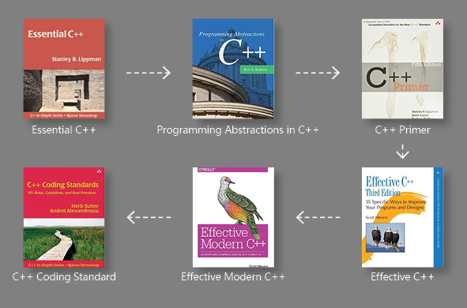

# C++ 📔 Notes Overview

The notes when I learned C++. It could also be a reference manual applied to daily basis.

# Table of Content

- Overview
- Learning Path

- Notes
  - [Simple C++][simple_cpp]
  - [Essential C++][essential_cpp]
  - [Programming Abstraction in C++][programming_abstraction_cpp]
  - [C++ Primer][cpp_primer]
  - [Effective C++][effective_cpp]
  - [Effective Modern C++][effective_modern_cpp]
  - [C++ Coding Standard][cpp_coding_standard]

[simple_cpp]:./0_simple_cpp/README.md
[essential_cpp]:./1_essential_cpp/README.md
[programming_abstraction_cpp]:./2_programming_abstraction_in_cpp/README.md
[cpp_primer]:./3_cpp_primer/README.md
[effective_cpp]:./4_effective_cpp/README.md
[effective_modern_cpp]:./5_effective_modern_cpp/README.md
[cpp_coding_standard]:./6_cpp_coding_standard/README.md
